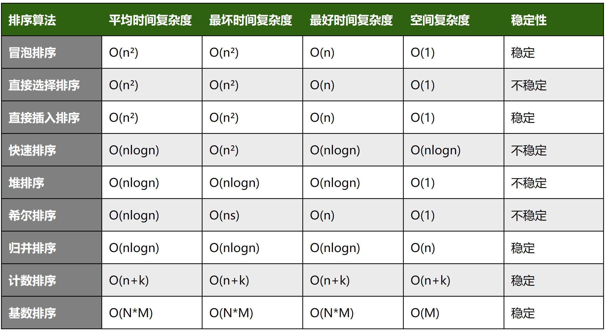
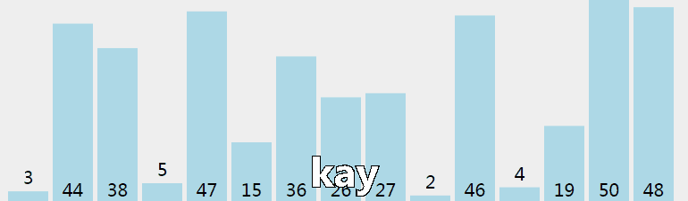
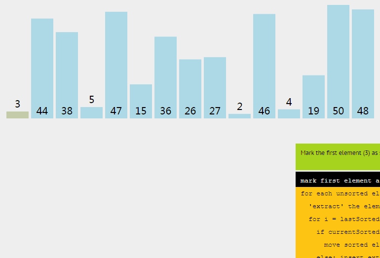

<!--
 * @Author: your name
 * @Date: 2020-06-20 18:59:52
 * @LastEditTime: 2020-07-09 09:02:31
 * @LastEditors: Please set LastEditors
 * @Description: In User Settings Edit
 * @FilePath: \undefinedc:\Users\conan\Desktop\LongTime\StupidBirdFliesFirst\Algorithm\sort.md
--> 


- [排序算法](#排序算法)
- [冒泡排序](#冒泡排序)
- [直接选择排序](#直接选择排序)
- [直接插入排序](#直接插入排序)
- [快速排序](#快速排序)
- [堆排序](#堆排序)
- [希尔排序](#希尔排序)
- [归并排序](#归并排序)
- [计数排序](#计数排序)
- [桶排序](#桶排序)
- [基数排序](#基数排序)
- [稳定性](#稳定性)

# 排序算法

排序算法一直是所有考察的重点，总计九种：

# 冒泡排序
冒泡排序从小到大排序：一开始交换的区间为0\~N-1，将第1个数和第2个数进行比较，前面大于后面，交换两个数，否则不交换。再比较第2个数和第三个数，前面大于后面，交换两个数否则不交换。依次进行，最大的数会放在数组最后的位置。然后将范围变为0\~N-2，数组第二大的数会放在数组倒数第二的位置。依次进行整个交换过程，最后范围只剩一个数时数组即为有序。

其外层循环执行 N - 1次。内层循环最多的时候执行N次，最少的时候执行1次，平均执行 (N+1)/2次。所以最坏的复杂度是n²，最好是n


```c++
void BubbleSort(int array[], int n)
{
    int i, j, k;
    for(i=0; i<n-1; i++)
        for(j=0; j<n-1-i; j++)
        {
            if(array[j]>array[j+1])
            {
                k=array[j];
                array[j]=array[j+1];
                array[j+1]=k;
            }
        }
}
```
```c++
//单链表排序版本
struct ListNode{
    int val;
    ListNode *next;
    ListNode(int val):val(val), next(nullptr){};
};

void bubblesort(ListNode *head){
    ListNode *cur1=head;
    ListNode *cur2=head;
    while(cur1){
        while(cur2 && cur2->next){
            if(cur2->val > cur2->next->val){
                int t = cur2->next->val;
                cur2->next->val=cur2->val;
                cur2->val=t;
            }
            cur2=cur2->next;
        }
        cur2=head;
        cur1=cur1->next;
    }
}
int main(){
    ListNode *cur1=new ListNode(3);
    cur1->next=new ListNode(1);
    cur1->next->next=new ListNode(2);
    cur1->next->next->next=new ListNode(5);
    cur1->next->next->next->next=new ListNode(6);

    bubblesort(cur1);
}
```

# 直接选择排序
选择排序从小到大排序：一开始从0~n-1区间上选择一个最小值，将其放在位置0上，然后在1~n-1范围上选取最小值放在位置1上。重复过程直到剩下最后一个元素，数组即为有序。

```c++
void selectSort(int array[], int n)
{
    int i, j ,min ,k;
    for( i=0; i<n-1; i++)
    {
        min=i; //每趟排序最小值先等于第一个数，遍历剩下的数
        for( j=i+1; j<n; j++) //从i下一个数开始检查
        {
            if(array[min]>array[j])
            {
                min=j;
            }
        }
        if(min!=i)
        {
            k=array[min];
            array[min]=array[i];
            array[i]=k;
        }
    }
}
```

# 直接插入排序
插入排序从小到大排序：首先位置1上的数和位置0上的数进行比较，如果位置1上的数大于位置0上的数，将位置0上的数向后移一位，将1插入到0位置，否则不处理。位置k上的数和之前的数依次进行比较，如果位置K上的数更大，将之前的数向后移位，最后将位置k上的数插入不满足条件点，反之不处理。



```c++
//a[]为待排序数组，n为数组长度
void InsertSort(int a[], int n)
{
    for (int j = 1; j < n; j++)
    {
        int key = a[j]; //待排序第一个元素
        int i = j - 1;  //代表已经排过序的元素最后一个索引数
        while (i >= 0 && key < a[i])
        {
            //从后向前逐个比较已经排序过数组，如果比它小，则把后者用前者代替，
            //其实说白了就是数组逐个后移动一位,为找到合适的位置时候便于Key的插入
            a[i + 1] = a[i];
            i--;
        }
        a[i + 1] = key;//找到合适的位置了，赋值,在i索引的后面设置key值。
    }
}
```

```c++
/**
 * Definition for singly-linked list.
 * struct ListNode {
 *     int val;
 *     ListNode *next;
 *     ListNode(int x) : val(x), next(NULL) {}
 * };
 */
class Solution {
public:
    ListNode* insertionSortList(ListNode* head) {

        if(head==NULL||head->next==NULL) return head;
        ListNode* newhead = new ListNode(INT_MIN);
        newhead->next = head;
        head = newhead;
        ListNode *rear = head->next;//有序链表最后一个节点
        ListNode *p = rear->next;//待排序插入节点
        while(p!=NULL){
            //将p节点移除
            rear->next = p->next;
            p->next = NULL;
            //确定位置
            ListNode *pre = head;//保存插入位置的前一个节点
            ListNode *temp = head->next;
            while(temp->val <= p->val && temp != rear){
                pre = temp;
                temp = temp->next;
            }
            if(temp->val > p->val){
                p->next = temp;
                pre->next = p;
            }else{
                p->next = temp->next;
                temp->next = p;
                rear = p;
            }
            p = rear->next;
        }
        return head->next;

    }
};
```

如果原序列基本上是有序的，此时选用插入排序比较的次数会比较少

# 快速排序
快速排序从小到大排序：在数组中随机选一个数（默认数组首个元素），数组中小于等于此数的放在左边部分，大于此数的放在右边部分，这个操作确保了这个数是处于正确位置的，再对左边部分数组和右边部分数组递归调用快速排序，重复这个过程。


```c++
void quicksort(vector<int> &nums, int left, int right){
    if(left>=right) return;
    int i=left, j=right;
    int pivot=nums[i];
    while(i<j){
        while(pivot<nums[j] && i<j) j--;
        nums[i]=nums[j];
        while(pivot>=nums[i] && i<j) i++;
        nums[j]=nums[i];
    }
    nums[i]=pivot;
    quicksort(nums, left, i-1);
    quicksort(nums, i+1, right);
}

int main(){
    vector<int> nums={10,11,13,14,16,18,15,17,12,19};
    quicksort(nums, 0, nums.size()-1);
}
```

这里注意一下，每一次都是使用开头的数作为pivot，这时开始遍历必须从结尾开始（也就是上述代码中的顺序，必须j开始）。这是因为假如现在从左边i开始的话，那当遇到一个大于pivot的值，就应该放到nums[j]那去，但是nums[i]有pivot记着，最后还能还原回去，这nums[j]可就没人记着了，原来的nums[j]就丢失了。因此只能先从j哪一端开始。假如一开始pivot就选的是j那一端的，那就可以先从i开始了。总而言之就是必须先从pivot的对端开始。

在最优情况下，每次都划分得很均匀，如果排序n个关键字，其递归树的深度就为log2n+1，也就是要递归log2n+1次，同时每次递归都要比较当前区间所有的数，所以复杂度是nlogn。如果每一次划分后分区比较平衡，则递归次数少；如果划分后分区不平衡，则递归次数多。但快速排序的递归次数与分区处理顺序无关，即先处理较长的分区或先处理较短的分区都不影响递归次数。

此外，可以形象地把快速排序的递归调用过程用一个二叉树描述，先处理较长或较短分区，可以想象为交换某一递归结点处的左右子树，这并不会影响树中的分支数。

# 堆排序
堆排序从小到大排序：首先将数组元素建成大小为n的大顶堆，堆顶（数组第一个元素）是所有元素中的最大值，将堆顶元素和数组最后一个元素进行交换，再将除了最后一个数的n-1个元素   建立成大顶堆，再将最大元素和数组倒数第二个元素进行交换，重复直至堆大小减为1。

- 大顶堆是具有以下性质的完全二叉树：每个节点的值都大于或等于其左右孩子节点的值。 
即，根节点是堆中最大的值。


实际的程序中并没有用数据结构建立一个树，而是用更抽象的方法用数组中的序号来表示树。步骤如下：
1. 构建一个初始堆，在程序中其实不用某个数据结构来构建树，仅仅是抽象理解，例如下图中{4，6，8，5，9}这个数组，由他们从0到4的序号可以抽象地建立一个树，0是根节点，然后从左向右从上到下依次排。

2. 将给定无序序列构造成一个大顶堆（一般升序采用大顶堆，降序采用小顶堆)。
   
   这时一般从最下面的非叶子节点开始，也就是下图中的1号节点（数据为6），经过观察可知在数组中，用数组长度length/2-1=i得到地值即为最下最右地非叶子节点地序号，例如上图，数组长度为5，i=5/2-1=1，也就是我们想要的1号节点。而它的子节点的序号则是i×2+1和i×2+2，这时就可以比较整个这个子树的节点情况，并使之称为一个大顶堆。从这个节点开始，从右向左，从下到上（即从length/2-1开始不断减小序号）地调整整个树，最终让整个树变为一个大顶堆。
3. 将堆顶元素与末尾元素进行交换，使末尾元素最大。然后继续调整堆，再将堆顶元素与末尾元素交换，得到第二大元素。如此反复进行交换、重建、交换，最终得到排序结果。

```c++
void HeapAdjust (int data[], int length, int k)
{
	int tmp = data[k];
	int i=2*k+1;
	while (i<length) {
		if (i+1<length && data[i]>data[i+1]) //选取最小的结点位置
			++i;
		if (tmp < data[i]) //不用交换
			break;
		data[k] = data[i]; //交换值
		k = i; //继续查找
		i = 2*k+1;
	}
	data[k] = tmp;
}
 
void HeapSort (int data[], int length)
{
	if (data == NULL || length <= 0)
		return;
	for (int i=length/2-1; i>=0; --i) {
		HeapAdjust(data, length, i); //从第二层开始建堆
	}
 
	for (int i=length-1; i>=0; --i) {
		std::swap(data[0], data[i]);
		HeapAdjust(data, i, 0); //从顶点开始建堆, 忽略最后一个
	}
 
	return;
}
```

建立一个堆：
```c++
template<class T>
class Heap{
public:
    Heap(vector<int> &nums):nums(nums){
        sortList();//生成一个大顶堆
    };
    /*这个函数可以从小到大排序，即先排成一个大顶堆，再把头尾交换
    void sortListVec(){
        int parent=nums.size()/2-1;
        for(int i=parent;i>=0;i--){
            AjustFromUp(i, nums.size()-1);
        }
        for(int i=nums.size()-1;i>=0;i--){
            swap(nums[0],nums[i]);
            AjustFromUp(0, i-1);
        }
    }
    */
    void sortList(){
        int parent=nums.size()/2-1;//第一个非叶节点
        for(int i=parent;i>=0;i--){
            AjustFromUp(i, nums.size()-1);
        }
    }
    void pop(){
        nums.erase(nums.begin());
        sortList();
    }
    void AjustFromUp(int parent, int bottom){
        while(parent<bottom && parent*2+1<=bottom){
            int child=parent*2+1;
            if(nums[child]<nums[child+1] && child<bottom) child++;
            if(nums[parent]<nums[child]){
                swap(nums[child], nums[parent]);
                parent=child;
            }
            else break;
        }
        return;
    }
private:
    vector<int> nums;
};
```

# 希尔排序
希尔排序是插入排序改良的算法，希尔排序步长从大到小调整，第一次循环后面元素逐个和前面元素按间隔步长进行比较并交换，直至步长为1，步长选择是关键。
```c++
void SheelSort( int array[], int n)
{
    int i,j,temp;
    int gap=n; //~~~~~~~~~~~~~~~~~~~~~
    do{
        gap=gap/3+1;  //~~~~~~~~~~~~~~~~~~
        for( i=gap;i<n;i++ )
        {
            if(array[i]<array[i-gap])
            {
                temp=array[i];
                for( j=i-gap;array[j]>temp;j-=gap)
                {
                    array[j+gap]=array[j];
                }
                array[j+gap]=temp;
            }
        }
    }while(gap>1);  //~~~~~~~~~~~~~~~~~~~~~~
 
}
```

# 归并排序
归并排序从小到大排序：首先让数组中的每一个数单独成为长度为1的区间，然后两两一组有序合并，得到长度为2的有序区间，依次进行，直到合成整个区间。


```c++
////实现归并，并把数据都放在list1里面 
void merge(vector<int> &nums, int left ,int mid, int right){
    vector<int> t;
    int i=left,j=mid;
    while(i<mid && j<right){
        if(nums[i]<nums[j]){
            t.push_back(nums[i]);
            i++;
        }
        else{
            t.push_back(nums[j]);
            j++;
        }
    }
    while(i<mid){
        t.push_back(nums[i]);
        i++;
    }
    while(j<right){
        t.push_back(nums[j]);
        j++;
    }
    for(int m=left;m<right;m++) nums[m]=t[m-left];
}
//如果有剩下的，那么说明就是它是比前面的数组都大的，直接加入就可以了 
void mergeSort(vector<int> &nums, int left, int right){
    if(right-left>1){
        int mid=(left+right)/2;
        mergeSort(nums, left, mid);
        mergeSort(nums, mid, right);

        merge(nums, left, mid, right);
    }
}
//归并排序复杂度分析：一趟归并需要将待排序列中的所有记录  
//扫描一遍，因此耗费时间为O(n),而由完全二叉树的深度可知，  
//整个归并排序需要进行[log2n],因此，总的时间复杂度为  
//O(nlogn),而且这是归并排序算法中平均的时间性能  
//空间复杂度：由于归并过程中需要与原始记录序列同样数量级的  
//存储空间去存放归并结果及递归深度为log2N的栈空间，因此空间  
//复杂度为O(n+logN)  
//也就是说，归并排序是一种比较占内存，但却效率高且稳定的算法 
```

```c++
void merge(vector<int> &nums, int left ,int mid, int right){
    vector<int> t;
    int i=left,j=mid;
    while(i<mid && j<right){
        if(nums[i]<nums[j]){
            t.push_back(nums[i]);
            i++;
        }
        else{
            t.push_back(nums[j]);
            j++;
        }
    }
    while(i<mid){
        t.push_back(nums[i]);
        i++;
    }
    while(j<right){
        t.push_back(nums[j]);
        j++;
    }
    for(int m=left;m<right;m++) nums[m]=t[m-left];
}

void mergeSort(vector<int> &nums){
    int size=1;
    int left=0;
    int mid,right;
    while(size<=nums.size()/2+1){
        left=0;mid=left+size;right=mid+size;
        if(right>nums.size()) right=nums.size();
        while(right<=nums.size()){
            merge(nums, left, mid, right);
            left=right;
            mid=left+size;
            right=mid+size;
        }
        size*=2;
    }
    
}

//非递归的方法，避免了递归时深度为log2N的栈空间，
//空间只是用到归并临时申请的跟原来数组一样大小的空间，并且在时间性能上也有一定的提升，
//因此，使用归并排序是，尽量考虑用非递归的方法。
```

```c++
//链表版本
ListNode* merge(ListNode* list1, ListNode* list2){
    ListNode* ret=new ListNode(0);
    ListNode* cur=ret;
    while(list1 && list2){
        if(list1->val>list2->val){
            cur->next=new ListNode(list2->val);
            cur=cur->next;
            list2=list2->next;
        }
        else{
            cur->next=new ListNode(list1->val);
            cur=cur->next;
            list1=list1->next;
        }
    }
    while(list1){
        cur->next=new ListNode(list1->val);
        cur=cur->next;
        list1=list1->next;
    }
    while(list2){
        cur->next=new ListNode(list2->val);
        cur=cur->next;
        list2=list2->next;
    }
    return ret->next;
}
ListNode* sortList(ListNode* head) {
    if(head && head->next){
        ListNode* slow=head;
        ListNode* fast=head;
        while(fast && fast->next && fast->next->next){
            slow=slow->next;
            fast=fast->next->next;
        }
        ListNode* list2=slow->next;
        slow->next=nullptr;
        return merge(sortList(head), sortList(list2));
    }
    else return head;
}
```

# 计数排序
算法的步骤如下： 
- 找出待排序的数组中最大和最小的元素 
- 统计数组中每个值为i的元素出现的次数，存入数组C的第i项 
- 对所有的计数累加（从C中的第一个元素开始，每一项和前一项相加） 
- 反向填充目标数组：将每个元素i放在新数组的第C(i)项，每放一个元素就将C(i)减去1

```c++
void counting_sort(int *ini_arr, int *sorted_arr, int n)  //所需空间为 2*n+k
{  
       int *count_arr = (int *)malloc(sizeof(int) * NUM_RANGE);  
       int i, j, k;  
 
       //初始化统计数组元素为值为零 
       for(k=0; k<NUM_RANGE; k++){  
               count_arr[k] = 0;  
       }  
       //统计数组中，每个元素出现的次数    
       for(i=0; i<n; i++){  
               count_arr[ini_arr[i]]++;  
       }  
 
       //统计数组计数，每项存前N项和，这实质为排序过程
       for(k=1; k<NUM_RANGE; k++){  
               count_arr[k] += count_arr[k-1];  
       }  
 
       //将计数排序结果转化为数组元素的真实排序结果
       for(j=n-1 ; j>=0; j--){  
           int elem = ini_arr[j];          //取待排序元素
           int index = count_arr[elem]-1;  //待排序元素在有序数组中的序号
           sorted_arr[index] = elem;       //将待排序元素存入结果数组中
           count_arr[elem]--;              //修正排序结果，其实是针对算得元素的修正
       }  
       free(count_arr);  
}
```

# 桶排序
桶排序是计数排序的升级版。它利用了函数的映射关系，高效与否的关键就在于这个映射函数的确定。桶排序 (Bucket sort)的工作的原理：假设输入数据服从均匀分布，将数据分到有限数量的桶里，每个桶再分别排序（有可能再使用别的排序算法或是以递归方式继续使用桶排序进行排）。

- 设置一个定量的数组当作空桶；
- 遍历输入数据，并且把数据一个一个放到对应的桶里去；
- 对每个不是空的桶进行排序；
- 从不是空的桶里把排好序的数据拼接起来。


# 基数排序
基数排序是按照低位先排序，然后收集；再按照高位排序，然后再收集；依次类推，直到最高位。有时候有些属性是有优先级顺序的，先按低优先级排序，再按高优先级排序。最后的次序就是高优先级高的在前，高优先级相同的低优先级高的在前。

- 取得数组中的最大数，并取得位数；
- arr为原始数组，从最低位开始取每个位组成radix数组；
- 对radix进行计数排序（利用计数排序适用于小范围数的特点）；


```c++
void countSort(vector<int>& vec,int exp)
{//计数排序
	vector<int> range(10,0);
 
	int length=vec.size();
	vector<int> tmpVec(length,0);
 
	for(int i=0;i<length;++i)
	{
		range[(vec[i]/exp)%10]++;
	}
 
	for(int i=1;i<range.size();++i)
	{
		range[i]+=range[i-1];//统计本应该出现的位置
	}
 
	for(int i=length-1;i>=0;--i)
	{
		tmpVec[range[(vec[i]/exp)%10]-1]=vec[i];
		range[(vec[i]/exp)%10]--;
	}
	vec=tmpVec;
}
 
void radixSort(vector<int>& vec)
{
	int length=vec.size();
	int max=-1;
	for(int i=0;i<length;++i)
	{//提取出最大值
		if(vec[i]>max)
			max=vec[i];
	}
	
	//提取每一位并进行比较，位数不足的高位补0
	for(int exp=1;max/exp>0;exp*=10)
		countSort(vec,exp);
}
/*
radixSort(a, n)的作用是对数组a进行排序。
1. 首先获取最大值,目的是计算出数组a的最大指数。获取到数组a中的最大指数之后，再从指数1开始，根据位数对数组a中的元素进行排序。排序的时候采用了计数排序。

2.countSort(vec, exp)的作用是对数组a按照指数exp进行排序。
*/
```

# 稳定性
所谓稳定性指的是原本数组中有两个数值相同的数，其中一个在另一个前面，如果排序之后他俩的顺序跟之前一样，那就是稳定的，如果排完以后有可能原来在前面的跑到后面去了，那就是不稳定。

稳定性的意义在于，如果被排序的不只是一个数，而是一个类，这个类中有很多数据成员，且他们原本的顺序是有意义的，这时候如果我们依据其中的某一个数据成员排序，那么我们自然希望在此数据成员数值相同的情况下还能保持过去的相对顺序。