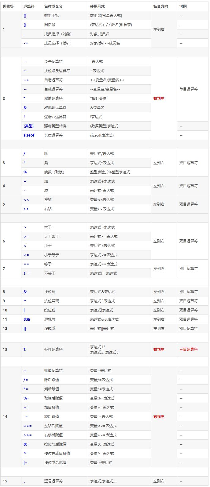
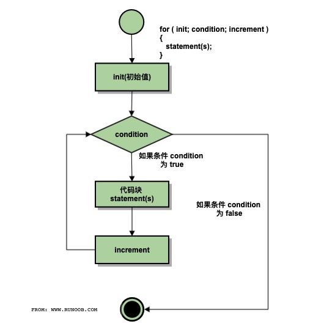
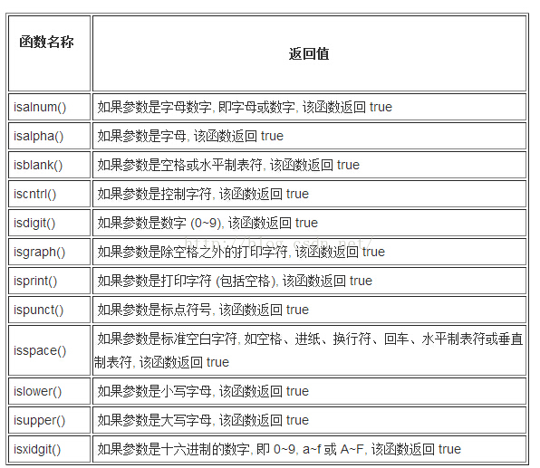

<!--
 * @Author: your name
 * @Date: 2020-05-04 21:58:09
 * @LastEditTime: 2020-05-19 21:28:42
 * @LastEditors: Please set LastEditors
 * @Description: In User Settings Edit
 * @FilePath: \StupidBirdFliesFirst\C++Fundamental\C++Fundamental.md
 -->

# C++基础知识

## C++与C语言的不同
- C++是面向对象语言，C语言是面向过程语言
- C++比C语言多了类、模板等部分
- C++有87个标准库，C有29个标准库

## C++的程序创建过程（linux）
1. 编写源代码，使用各种文本编辑器编写；
2. 预处理，处理源代码文件中的宏定义、条件编译文件、头文件等，最终生成一个没有宏定义，没有编译指令，头文件均被展开的文件；
    ```
    gcc -E hello.c -o hello.i
    ```
3. 编译，检测语法的规范性，检测有无语法错误，然后将源码生成汇编代码；
    ```
    gcc -S hello.i -o hello.s
    ```
4. 汇编，将汇编文件生成机器指令文件，即目标文件；
    ```
    gcc -c hello.s -o hello.o
    ```
5. 链接，将目标文件与其他代码链接起来，例如各种库或者启动代码，最终生成可执行文件，
   ```
   gcc hello.o -o hello
   ```
   库分为动态链接库和静态链接库两种：
   - 静态库是在链接过程中把库文件全部加入到可执行文件中，在运行时就不再需要库文件了，后缀为.a
   - 动态库在编译链接时并没有把全部代码都加入到可执行文件中去，在程序执行时再加载库，后缀为.so

    使用以上两种库时在gcc命令中刚加入-L表示查找路径，加入-l表示库名，之后将生成可执行文件。

gcc和g++其实都是可以编译c和cpp文件，但是gcc会把文件内容当成c语言，g++会把内容当成C++语言，所以这里同样需要注意。

## 内存的基本单位
&emsp;&emsp;计算机内存的基本单位是位（bit）。字节通常指的是8位的内存单元，不过在C++中有不同的定义，C++的字节表示能够容纳基本字符集的相邻位，在基本的ASCII和EBCDIC字符集中，一个字节为8位，但是也有更大的，但是一般来说还是认为一个字节有8位。

&emsp;&emsp;字是字节之上的另一个单位，通常是由CPU决定的，例如8位的CPU的话1字=1字节，16位的CPU就是1字=2字节。

## 整型数据
### 整型数据
&emsp;&emsp;整型数据包含short、int、long和long long，为了满足各种计算机的需求，C++本身不规定每一种类型的绝对长度，而是只确保最小长度：
- short至少16位
- int至少和short一样长
- long至少32位，且至少和int一样长（这意味着int可以为16位，24位，32位）
- long long至少64位，且至少和long一样长

检测长度时可以用sizeof命令，或者在头文件climits中查询。

&emsp;&emsp;C++中还包含无符号类型，只要在上述类型前加unsigned即可。其表示范围的大小没变，只是全部都是正数。

**注意，当整型数据溢出时，在数值上回在范围的另一端取值，比如无符号的整数设为0再减去1时，数值就会变为当前类型的最大值**

### 整型数据的字面值
&emsp;&emsp;整型数据在程序中写值的时候，可以有三种写法，分别表示10进制数、8进制数和16进制数：
- 10进制就直接写就行
- 8进制就是第一位先写0，然后写后面的数字，例如042，就表示十进制的34
- 16进制时先写0x或者0X，然后再写16进制的数字

&emsp;&emsp;当程序中出现常数值时，如果不带后缀的十进制数，使用int、long和long long中最小能够存储的类型存储；如果时不带后缀的八或者十六进制数，则用int、unsigned int、long、unsigned long、long long或unsigned long long表示（一般十六进制都会被存成unsigned int，因为十六进制一般用来表示地址），如果带了后缀（例如22022L就会被存成long）

### char类型
&emsp;&emsp;char比short更小，用来存储最基本的每个字符，所以其长度依据字符集中的最小单位来定（一般只要字符集里的所有符号不超过128个，就都能用一个字节来表示）。char的字面值就是字符集中表示某个字符的数字，如果直接用cout输出时即可输出其表示的字符。若是将char强制转换成int就能输出数字。在程序中给char赋值时可以用单引号包含单个字符，也可以直接赋值数字。

&emsp;&emsp;如果还需要更大的字符集，可以使用wchar_t和c++11新增的char16_t和char32_t。

### 布尔类型
&emsp;&emsp;没啥可说的，就是true和false，唯一需要注意的就是true和false都可以被提升为int类型，会变成1和0：
```
int a=true //a=1
int b=false //b=0
```
同时任何数字或者指针都可以被隐式转换成bool值，任何非零值都被转换为true，零值被转换位false

## const限定符
&emsp;&emsp;const限定符加在变量定义之前就无法在之后的程序只修改：
```
const int Months=12
```
注意最好不要先声明一个const变量，然后再定义，这样常量值一开始就不确定，也无法修改，最好就跟上面的一样，声明定义一起来。

&emsp;&emsp;const相比#define好在可以指定类型，同时可以使用c++的作用域规则将定义限制在特定区域中，而且还能将const用于结构体等更复杂的类型。

## 浮点数
&emsp;&emsp;浮点数之所以叫浮点数是因为计算机将其分为两部分存储，一部分时基准值（0到1）和缩放因子，基准值根据缩放因子移动小数点的位置，所以叫浮点数。

### 浮点数表示法
```
+5.36E+16
```

### 浮点类型
&emsp;&emsp;浮点数一般包含float，double和long double。float至少32位，其位数的表示方法是第1位表示符号；2到9表示指数（8位，所以可以表示-127到128）；10到32表示尾数（具体的数值，因为有23位，所以可以表示6到7位数字）。double也是同样的构成，1+11+52。

### 浮点常量
&emsp;&emsp;一般的浮点常量都会默认为double，需要将常量设计为其他浮点类型时需要加上f（float）或者l（long double）后缀。

### 浮点数的优缺点
优点：
- 也可以表示整数值
- 表示的范围更大（有缩放因子）
缺点：
- 计算更慢
- 精度比整型降低（因为int可以表示32位，float的尾数是23位，能表示的有效数字更少）

## 运算符
&emsp;&emsp;加减乘除求余数
### 运算符优先级问题


&emsp;&emsp;优先级1级最高，15级最低，表示在一个运算中的顺序。其中的结合性指的是如果出现同一级别的运算时，到底先算谁的问题，例如：
```
float f=120/4*5
```
其中出现了除法和乘法，可以看到都是同一优先级，且结合方向为从左到右，意思就是对于两个同优先级运算符中间的数来说（比如这里就是4），应该先和左边的运算符号结合（即除法），计算出结果后再和右边结合（即算出30以后再乘5）。

&emsp;&emsp;需要注意的是前置加减和后置加减的问题（即++和--），如果是对于一个变量来说，a++和++a就是一个意思，但如果把它用在一个运算的算式中就不一样了。前置运算是变量的值先加1或减1, 然后将改变后的变量值参与其他运算, 如x=5; y=8; c=++\*y；运算后，c的值是48，x的值是6，y的值是8。而后置运算是变量的值先参与有关运算，然后将变量本身的值加1减1，即参加运算的是该变量变化前的值。如x=5；y=8； c=x++\*y；运算后，c的值是40，x的值是6，y的值是8。另外前置、后置运算只能用于变量，不能用于常量和表达式，且结合方向是从右至左。如当i=6 时，求-i++的值和i的值。由于“-”(负号) “++”为同一个优先级，故应理解为-(i++)，又因是后置加，所以先有-i++的值为-6, 然后i增值1为7，即i=7。如果是单独出现一个i++或者++i（比如循环语句中），这时表达的意义都是一样的。

### 除法分支
&emsp;&emsp;假如一个除法中的两个值都是整数，则最后得数也一定是个整数，小数部分会被丢弃；只要有一个是浮点数，则得数也是浮点数
### 类型转换的问题
&emsp;&emsp;C++中一般有以下三种情况会执行特定的类型转换
1. 将一种类型赋值给另一种类型

&emsp;&emsp;一般来说将取值范围小的类型传递给更大的类型是不会出问题的，大的整型传递给小的整型会造成精度下降，由于是直接截取二进制数右边的字节，所以传递之后的结果是不确定的。将浮点数转化为整数时会造成小数部分的丢失，超出取值范围时结果不确定。浮点数同上。

2. 以{}方式初始化

&emsp;&emsp;以{}方式进行初始化时不允许缩窄，变量的类型可能无法表示赋给它的值。

3. 表达式中的转换
   
&emsp;&emsp;表达式中小于int的整型会先全部提升到整型，计算出结果之后再依据结果定义的类型转换回去；其余的是全部转换为最大的类型进行计算。

4. 将参数传递给函数

&emsp;&emsp;由函数原型控制（也可以取消原型对参数的控制）。

5. 强制类型转换
```
long(thorn) //c++风格
(long)thorn //c风格

static_cast<long>(thorn) //比传统强制类型转换更严格
```
以上这几种其实都没有改变原本的数值，而是创建了一个新的值。

## 数组
### 数组的初始化
&emsp;&emsp;数组在初始化时必须包括数组类型、数组名和元素数，有以下几种初始化方式：
```
int card[4]={1,2,3,4};
int hand[4];
```
第一种是最普通的初始化方式，第二种只初始化了元素数，接下来想要赋值时只能挨个每个元素赋值。另外以下这种赋值时不允许的
```
hand=card;
```
因为等于号没有关于数组进行重载。如果在初始化时只对一部分元素设定了值，那么剩下的元素都将变为0，所以如果就是想把所有的值都设定为0的话，那就初值给一个0就行：
```
int total[100]={0};//这一种会把所有的值都设定成0
int total[100]={1,2};//这一种除了第一个和第二个数被设定成1和2以外，其他的都是0
```
也可以不直接指定元素数：
```
int j[]={1,2,3,4};
int num=sizeof j/sizeof(int);//计算元素数
```
C++11也可以直接使用大括号赋值（看上去就像上面的方法省略了等号）。

## 字符串
&emsp;&emsp;字符串就是一系列的字符，c++中可以用char[]和string。字符串均以'\0'结尾，如果没有这个空字符那就不叫字符串，就只是个字符数组。赋值的时候可以用双引号括起一串单词字母来赋值。

**注意，'s'和"s"看起来是一样的，但是's'表示的仅仅是一个字符，而"s"表示的是s的字符和一个空符号\0。另外字符串常量表示的是一个地址，所以如果真的写出一个char s="s"的命令的话，那char s中存的就是"s"的地址**

鉴于char[]（来自C）运用起来比较麻烦，一般还是会用string类（来自c++），而且赋值、拼接等操作都更加直接。（char需要strcat等命令）

### 其他形式的字符串
```
wchar_t title[]=L"wells";
char16_t name[]=u"wells";
char32_t car[]=U"wells";
```

### 原始字符串
&emsp;&emsp;C++11新增的另一种类型是原始字符串raw。原始字符串中的字符表示的就是自己。例如"\n"表示的不是换行符，而是两个字符：斜杠和n。原始字符串不用""来限定开头和末尾，而是用"(和)"用作定界符，并使用前缀R来标识原始字符串。
```
cout<<R"(hello,"Bob".)"<<endl; //打印hello,"Bob".
```
原始字符串还可以自定义定界符，默认定界符是"(和)"。因此若想要在字符串中允许)"，则必须自定义定界符。如：
```
cout<<R"+*("(Who is it?)")+*"<<endl;//打印"(Who is it?)"
```
自定义定界符的方法就是在"和(之间添加字符，当然在末尾的定界符应保持一致。以上例子自定义的定界符是"+\*(，则末尾定界符是)+\*"。自定义定界符时，在默认定界符之间添加任意数量的基本字符，但空格，左括号，右括号，斜杠和控制字符等除外。

## 结构
&emsp;&emsp;结构是C++中类的基石
```
struct inflatable{
    char name[10];
    float volume;
    double price;
};
```
初始化时有很多选择
```
struct inflatable wells{"wells",0.12,9.98};//前面的struct可以省略，大括号前也可以加上等号
inflatable maya{};//这时所有的成员都会被设置为0
//当然也可以单独给实例的每个成员单独赋值，也可以在声明的时候后面直接跟一个实例。
```
两个相同的结构之间可以直接赋值

### 结构数组
&emsp;&emsp;结构本身可以构成一个数组：
```
inflatable wells[11];
inflatable guests[2]={
    {"jack",1.0,1.0},
    {"jake",1.0,1.0}
};
```

### 结构中的位字段
指定占用特定位数的结构成员，通常用在低级编程中。

## 共用体
&emsp;&emsp;union是一种数据格式，可以存储不同的数据类型，但同一时间只能存储一种类型，如果重新定义了原本的就没了：
```
union one{
    int int_val;
    long long_val;
    double double_val;
};

one pail;
pail.int_val=10;
pail.doublr_val=1.0;//此时前面的int_val就没了
```
共用体在存储时只占有一段内存（即定义时最长的那个类型的长度），所以这一段存的内容也只能有一个。适用于不同时使用的几个类型（可以节省一点空间）。

&emsp;&emsp;共用体用在结构中的时有两种情况：
```
struct wells{
	char name[20];  //姓名
	int num;    //编号
	char sex;   //性别
	char profession;  //职业
	union   //定义联合体
	{
		float score;   //学生的成绩
		char course[20];  //教室所教课程
	}sc;
};
wells w;
cin>>w.sc.course;//前面将结构体中的共同体实例化为sc，所以这里在实际使用的时候也要有sc

struct wells{
	char name[20];  //姓名
	int num;    //编号
	char sex;   //性别
	char profession;  //职业
	union   //定义联合体
	{
		float score;   //学生的成绩
		char course[20];  //教室所教课程
	};
};
wells w;
cin>>w.course;//前面将结构体中的共同体没有实例化，称为匿名共用体，这时就可以直接用
```

## 枚举
```
enum DAY{
      MON, TUE, WED, THU, FRI, SAT, SUN
};
```
&emsp;&emsp;枚举可以定义多个符号常量，有时可以代替const。通常如果在枚举中没有指定每个成员的值，就将从0开始自动赋值，例如以上的成员就自动被赋值为了0到7。

&emsp;&emsp;枚举实例化以后再赋值只能被赋给声明时的成员：
```
DAY day=MON;
int mon=day;//相当于int mon=1
```
但是要注意，直接写DAY day=1是不行的，枚举的成员之间也不能做运算再赋给枚举的实例，但是这种情况是可行的：
```
int ssd=MON+TUE;//这时ssd=0+1=1
```
所以枚举值确实代表了一个数字，但是数字所能进行的运算只能在转化为int之后，在枚举的实例化中不能把它当成数字。但是强制转化后也是可以的：
```
DAY day=DAY(1);//相当于赋值了TUE，但是如果数字超过了枚举值能表达的值，可能不会报错，但会有意想不到的结果
```
&emsp;&emsp;枚举的取值范围，即通过强制转换增加了枚举可接受的合法值

## 指针
### 基本知识
- 在变量前面加&可以打印出地址
- 指针在定义时需要加上*，*称为间接值或者解除引用，在指针前面加上\*可以得到存在该处的值
- 打印出的地址其实时每个变量所占的第一个字节的地址。因为内存中每个地址存一个字节，一个字节8位，例如int要占32位，那么一个int变量就要占4个字节，应该有4个连续的地址，但是打印出来的只是第一个。
- 指针的类型表明“当前指针指的值是一个某某类型的值”，例如一个int*的指针指的就是一个int类型的值，这种定义的意义在于能知道这个指针指的数据应该要占几个内存。
- 一定要在对指针应用解除引用*（即给这个指针指的地方赋值时）之前将指针定义为一个确定且适当的地址，否则很可能把值存到不该存的地方。
- 最好别直接拿一个16进制数给指针赋值，要赋也得强制转化：
  ```
  int* pt;
  pt=(int*)0xB8000000;//这样才知道存的是个int
  ```
- 通常内存在编译阶段就已经确定好了，但是面向对象的特点就是在运行阶段做决策，所以可以用new在运行时开辟空间
  
### new指令
&emsp;&emsp;new可以在没有存东西的情况下开辟一个存特定数据对象的空间：
```
int a=1000;
int *pa=&pa;//此时pa指向的内存中已经有值了
int* pt=new int;//这时只是开辟了空间，还没有值
*pt=1000;//现在有了
```
以上命令看上去似乎效果差不过，但是还有有很大区别，**new分配的内存是在堆里，而a是存在栈里**。

### delete指令
&emsp;&emsp;每次new一个指令，必须跟一个delete去释放内存：
```
int* pt=new int;
......
delete pt;
```
这时必须的，因为存在栈里的变量会随着函数的结束而自动释放，但是new的内存存在堆里，不会自动释放，如果不加delete就会一直在内存里，这样长此以往会造成内存的浪费，称为**内存泄漏**。

&emsp;&emsp;但是已经释放的内存就不要再去释放了，会出意想不到的问题（对空指针用delete是安全的）。也不要让两个指针指向同一个地址。

&emsp;&emsp;delete会释放指向的空间，但是那个指针本身不会消失，也就是说它仍然指着那个地址，只是那个地址没东西了。这时删除后最好将指针定为空指针（pt=ptrnull），一否则此指针将称为不受控的野指针，因为指针在delete之后，如果再新建一个指针很有可能还会指向同一个内存块，这是很危险的。

### 使用new创建动态数组
```
int* ps=new int[10];
delete [] ps
```
&emsp;&emsp;给数组new内存时可以这么写，这时返回的也是第一个字节的地址，记得跟delete配对使用。

### 使用动态数组
&emsp;&emsp;可以将指针当成数组名那样用，但是他们还是有本质区别：
```
double* p=new double [2];
p[0]=1.0;
p[1]=1.2;//类似数组名的用法
p=p+1;//这里将指针下移，即之前指向的是p[0]的第一个字节，现在指向的是p[1]的第一个字节，这也是指针和数组名的本质区别，数组名没有这种用法
p=p-1;
delete [] p;//如果上面没有p=p-1的话那么delete就是从p[1]开始delete了，这就不对了，所以一定要再把指针移回来
```
其实C++在多数情况下也是把数组名解释为指针的，但是跟真的由new创建的数组还有有区别，new数组的指针指向第一个地址得首字节，当进行加减法时会移动一个指定类型所占用得长度（就像上面定义了一个double类型的指针，double要占64位，8字节，所以加一的时候会向后移动8位，这时在地址的值上就能看出时+8了）。在数组名中，数组名也被解释成指向第一个地址的指针，在表示的时候，例如a[2]就相当于是*(a+1)，但是数组名不能直接做加减法（不能直接a=a+1），只能有a[0]=a[0]+1，这也跟指针没关系，仅仅是表示当前的值+1。

还有个区别就是，对数组用sizeof时会得到数组长度，对指针会得到指针长度（当前类型的长度），也就是说这时候C++不把数组名解释为指针。

数组名还有一点问题：
```
short t[10];
cout<<t<<endl;//这时数组名被解释为指向第一个元素的指针，就相当于&t[0]
cout<<&t<<endl;//这时就不一样了，这时取得的地址是整个数组的地址（主要体现在长度上）
```
从数字上来说确实两次打印出来的都是一样的，但是他们所代表的长度不一样。如果打印的时候来个+1的话，t+1将把地址加2（因为short占用2个字节），&t+1就是把地址加20（10*2），这种区别主要就是c++在不同时候对于数组名的解释不一样。

如果想用指针表现出数组名的效果，可以这么写：
```
short t[10];
short (*p) [10]=&t;
```
这时p+1的地址就会移动20了。

### 指针与字符串
&emsp;&emsp;尽管向上面一样直接来一个cout<<t<<endl可以直接打印出t的第一个元素的地址，但是假如是一个字符串，那么不管是数组形式还是指针形式都会直接把整个字符串打印出来：
```
char f[10]="rose";
cout<<f<<endl;//打印rose
char* fp="violet";
cout<<fp<<endl;//打印violet
```
效果上是这样的，但是实际上它还是把这个字符串的首字母的地址传给了指针，只是在cout的时候处理不同，它会一直打到\n为止，也就把整个字符串全打出来了。如果一定要打印出char的地址可以做一个强制转化（int*）。另外字符串的数组名形式在初始化以后就不能再用等号直接赋值了，必须用strcpy。指针形式的字符串初始化以后可以再用等号赋值，但是由于用双引号括起来的字符串常量在C++中也是以地址形式存的，所以再用等号其实就是把一个新地址赋给了当前这个指针，这样的话看起来是改变了字符，但是原本的那个字符串还在，但是就找不到了；不仅赋值，用==来做判断也是不行的，因为这时C++对于其不像cout那样做特别的处理，所以其实就是在判断地址是否相等（数组名形式和指针形式都不行，数组名可以用strcmp）而且直接用字符串常量赋值给char指针是无法修改的（字符串常量默认为const char），想要修改只能老老实实new一个char数组并且一个一个把单个字母输进去，还不能忘了最后的\n，这才能修改每个值。

### 使用new创建动态结构
&emsp;&emsp;建立一个结构体的指针：
```
struct inflatable{
    char name[10];
    float volume;
    double price;
};

inflatable* ps=new inflatable;
ps->volume=10.0;
(*ps).price=12.0;
```
这就是新建了一个指向inflatable结构的指针，这时要访问结构成员的时候就要用->代替原来的.，或者也可以用*ps来指代当前这个结构。

## for循环
&emsp;&emsp;for的基本用途都知道，这里不再细说。for的基本构成如下所示：
```
for ( init; condition; increment )
{
   statement(s);
}
```
其中for括号中的语句的执行顺序如下图所示：



注意for 语句中的三个表达式可部分或全部省略，但两个分号不能省略。

&emsp;&emsp;另外C++11新增了基于范围的for循环：
```
for( atuo& r : v){//这里的r前面的&表示接下来的语句可以对数组v中的元素进行修改，如果不加&那就不能修改原数组
  r *= 2;
}

```
这里面可以遍历的对象包括：
- 数组（不包括指针）
- 定义了begin()和end()方法，且返回该方法返回迭代器的类对象（STL 中所有容器都可以）。

要通过范围for 改变序列元素的值必须将元素声明成引用&（如果不是，则相当于一个局部变量，只是序列元素的副本），另外不能通过for循环增加或则删除序列元素，因为序列的end 已经被保存，增删会使end迭代器失效。

## while和dowhile
&emsp;&emsp;基本也没什么好说的，这俩的区别在于while在进入循环之前进行判断，dowhile是先做一轮，然后再判断。

## 逻辑运算符
- && 与
- || 或
- ! 非

## 字符函数库
这个库来自C语言，是一个与字符相关的非常方便的函数软件包，定义在cctype.h中：


## ?:运算符
```
3==9?25:34;\\问好前面用来判断，若为true则表达式为25，若为false则表达式为34
```

## 分支语句
### if else
### switch case
switch语句本身不为了取值范围而设计，每一个case就是一个单独的标签，可以是一个具体值，也可以是枚举。
### break continue

## 函数
### 基本知识
&emsp;&emsp;在C++中使用函数时必须包含以下这些要素：
- 提供函数定义
- 提供函数原型
- 调用函数

&emsp;&emsp;其中函数的定义即函数的各个组成部分俱全的函数定义（函数名，参数，返回值，函数体等）。其中有返回值的函数必须有相应的返回语句，如果返回类型不一致将会强制转换。基本上任何类型都可以返回，数组除外（但是可以将数组作为结构或者对象的组成部分返回）。

&emsp;&emsp;函数的原型就像函数的声明（只有返回类型，函数名和参数，后面加个分号），一般是写在调用这个函数的代码之前（假如这个函数的定义就在调用之前，那就不用非得单独声明了）。

&emsp;&emsp;之所以一定需要原型是因为原型描述了函数到编译器的接口，换句话说就是它把函数的基本信息都告诉了编译器，这样编译器就不用在一串代码编译到一半的时候去满文件找函数定义了。而不去找的原因一是因为这样速度更慢，另一个是因为编译器可以分文件编译，有时一个函数的定义可能在另一个文件中，但是还没编译到它，这时原型的意义其实就是先让编译器知道有这么个东西，让编译先顺利过去，然后等编译到它的定义时再补上定义。

&emsp;&emsp;函数原型最大的意义还就是在于帮助编译器检查，以及在返回类型不一致的时候帮助进行强制转化（但也不是所有的都能转，比如变量转结构之类的，而且精度变化时会有warning）

### 参数按值传递
&emsp;&emsp;C++使用参量（argument）来表示实参，使用参数（parameter）来表示形参。形参可以看做是一个占位符，它没有数据，只能等到函数被调用时接收传递进来的数据；实参是函数被调用时给出的参数，包含了实实在在的数据，会被函数内部的代码使用。

&emsp;&emsp;按值传递就是最普通的那种函数参数。这种传递会使用参数的副本，无论怎么修改都不会影响原函数中的变量。

### 函数对于数组的处理
&emsp;&emsp;C++可以在将数组作为参数（c不可以），但是仍然有一定缺陷。我们都知道数组与指针最大的区别在于，尽管数组名也是一个指向第一个值的指针，但是可以记录整个数组的长度（使用&时取到的地址代表着整个数组，+1时会移动整个数组的长度）。而在函数的参数中，如果传入一个数组，那么函数直接就把它当成指针来看待，这样就没有整个数组的长度信息了。所以如果一定要用的话，还要一起传递数组的长度。
```
double avg(int arrays[],int sizes)
```
这种情况的原因应该与参数的按值传递有关。因为两个数组之间没法直接赋值，所以就直接以指针形式赋值，也就因此失去了数组长度。从这个角度来说，数组在函数中是直接以原值被处理的，并没有生成副本。这时如果不想在函数中让数组中的值被修改，可以使用const
```
double avg(const int arrays[],int sizes)
```
这种改动最大的意义在于不能再使用指针来修改数据。

### const和指针
&emsp;&emsp;例如以下程序：
```
int age=20;
const int * pt=&age;
```
这个程序意味着pt是一个const int，也就说程序不能通过指针来修改这个age值，但是仅仅是不能用指针pt修改而已，程序还是可以用age来修改自己的值，另外这个指针pt虽然不能修改所指向的值，但是还是可以指向别的地址。

&emsp;&emsp;从另一个角度来说，如果将const int的变量赋值给指针呢？C++本身是禁止这种行为的，所以C++中不可能将一个const的变量的地址赋值给非const的指针，也禁止一个const的指针赋值给一个非const的指针，只有都是const才行（但是const的普通变量赋给非const的变量还是可以的）。

&emsp;&emsp;顺着这个思路，如果将一个函数的参数中声明的数组名（其实就是指针）不是const的话，那么就不能把一个const的数组代入函数。

所以一般而言将参数中的指针设置为const是有好处的：
- 避免无意间修改数据
- 可以处理const和非const

&emsp;&emsp;但是假如出现以下这种写法：
```
int sloth=3;
const int * ps=&sloth;
int * const f=&sloth;
```
这种把const写在int*后面的表示f只能指向sloth的地址，但是允许修改数值，跟前面的相反，甚至可以写成这样：
```
const double * const s=&age;
```
这就表示s只能指向age的地址且不能修改。

### 函数和二维数组
&emsp;&emsp;一般如果需要将二维数组作为参数，则必须这么写：
```
int data[3][4]={......};
int sum(int (*ar)[4],int size);
```
这里的括号是必不可少的，它表示的意思是**由4个int组成的数组的指针**。
```
int * ar[4];
```
这种写法的意思是**由4个指向int的指针组成的数组**。

### 函数和c风格字符串
&emsp;&emsp;c风格的字符串一般有三种形式：
- char数组
- 双引号的字符串常量
- char指针

以上这几种在函数中都会变成指向第一个字符的指针，但是因为字符串最后有一个结束字符，所以可以不用传递长度。

### 函数指针
#### 函数指针的用途
&emsp;&emsp;函数指针指向一个函数在内存中的地址，在程序中可以把一个函数的地址作为参数给另一个函数，这样能在另一个函数中运行它。
#### 获取一个函数的地址
&emsp;&emsp;函数的地址其实就是函数名，比如定义了一个叫think的函数，那么think就是此函数的地址，而think()就是运行这个函数并得到返回值：
```
//这里的think和process分别是两个函数
process(think)//将think这个函数的地址作为参数给process
process(think())//将think运行之后的返回值作为参数给process
```
#### 声明函数指针
&emsp;&emsp;就像
```
int i;
i=0;
```
这样先声明一个int类型的i再给i赋值一样，函数指针也可以先声明后赋值：
```
double pam(int); //函数原型
double (*pt)(int);//声明一个函数指针
pf=pam;//将pam赋值给pf
```
以上的第二行就是声明函数指针的语句，注意\*pt是必须加括号的，因为如果不加括号的话就变成了声明一个返回double\*的函数。另外给函数指针赋值就不需要用&了，因为函数名本身就是一个地址。

&emsp;&emsp;不过实话讲，如果只是要一个函数指针的话还有更偷懒的方法：
```
const double * f1(const double *, int);
auto pt = f1;
```
不管你服不服，我是服了。
#### 使用指针来调用函数
&emsp;&emsp;在一个函数中，如果将函数指针作为参数传入之后，如果想要使用它需要这样写：
```
double y=(*pt)(5);//这种就很好理解，因为给指针加上解除引用以后就代表这开始使用它指向的值，即函数本身
double y=pt(5);//这种好像不太符合常理，不过也是允许的。
```
这里的第一种形式非常清晰，就是说现在要使用一个指针所指向的函数了，但是第二种也是允许的，这是一种历史遗留问题，因为前面也说了函数名本身就是个地址，函数指针也是个地址，所以pt其实就是原函数的别名，这俩应该是一样的（苦笑），所以c++允许这两种操作。

#### 其他骚操作
&emsp;&emsp;对于几个有同样的特征标的函数可以写成一个函数指针数组：
```
const double * (*pa[3])(const double*,int)={f1,f2,f3};
const double * x=pa[0](av,3);
const double * x=(*pa[0])(av,3);
```

## 内联函数
&emsp;&emsp;普通的函数在调用时会直接跳到函数起点的内存单元再执行，执行完了再跳回来，这需要一定的时间和空间上的开销。这时如果使用内联函数则可以不用进行跳转，直接把函数的代码内联在需要运行的地方，在那种需要频繁调用函数的地方可以节省一些开销，但是占用的内存就更大了。例如在多个地方调用了同一个内联函数，则一个函数的代码就有多个副本。

&emsp;&emsp;使用内联函数是需要加上inline，在声明和定义前面都要加。

&emsp;&emsp;注意，并不是写上inline以后就是个内敛函数了，首先编译器不一定会满足这种要求，例如该函数过大的情况。同时**内联函数不能递归**，假如出现以上情况编译器就不会把它当作内联函数。

## 引用变量
&emsp;&emsp;引用变量就像是一个变量的别名：
```
int rat=0;
int& mouse=rat;
```
如果去看rat和mouse的地址的话会发现他们都在同一个地址，更改某一个变量会让两个变量都产生变化。需要注意的是**引用变量必须在声明的同时定义（与const相似）**，以及引用变量一旦初始化后就与当前这个变量完全绑定，今后如果再对它进行赋值也只会改变当前地址的值，不会指向新的地址：
```
int rat=0;
int& mouse=rat;
int cat=9;
mouse=cat;//这时并不会让mouse变成cat的别名，他们依然指向不同的位置，mouse和rat仍然指向同一位置，这种做法只会同时把cat的值赋给rat和mouse
```

&emsp;&emsp;将引用用在函数参数中时就不会再创建副本，而是直接使用原值，当数据比较大时（例如结构和类）这样的引用参数能够节省很多时间。但是假如不希望在函数中修改参数的话，则应该在声明和定义时加上const。

&emsp;&emsp;关于const还有一些问题，比如当在一个有引用参数的函数中使用常量时：
```
double s(const double & a);
double res=s(1.0);
```
在这种情况下，如果前面声明时没有在引用参数前加上const的话，就不能直接使用常量。只有加上const以后，才能将常量生成一个临时变量，并让a去代表它

&emsp;&emsp;另外返回值也可以是是引用：
```
const int & s(const int & y);
```
但是返回的值不能是函数中的局部变量，必须跟参数中的某一个相同，或者使用new来分配新的空间，总之就是一定要保证函数在结束以后这个返回的变量还能存在：
```
const free_throws & clone(free_throws & ft){
    free_throws * pt;
    *pt=ft;//这个新的pt指向了ft，ft是个引用变量，所以函数结束之后这个地址存的东西还是存在的
    return *pt;
}
```
&emsp;&emsp;返回引用时其实是左值，也就是它作为一个函数也是可以赋值的：
```
clone(ft)=st//这种语句是可以的，前提是定义时返回值前面不加const，加了const这就是不行的，不能再改了
```

&emsp;&emsp;针对何时使用引用的问题：
- 提高运行速度，直接引用原值
- 需要返回多个返回值
- 传递类对象的标准就是方式是按引用传递（一般还要有const）
  
一般来讲，引用不要单独用，如果真的是要改变参数的值的话，就应该用指针，否则一般来说还是应该用上const，主要因为在使用时引用语法看起来和值语法一样，不利于理解代码。

## 默认参数
&emsp;&emsp;所谓默认参数就是在定义的时候直接把某个参数的值给写上，这样就不用在使用时写入参数了，但是也有限制，必须从右向左设置默认值，也就说只要有一个参数被赋了默认参数，那他右边也必须都有默认参数

## 函数重载（函数多态）
&emsp;&emsp;C++面向对象编程的三大特性：封装，继承，多态。函数重载也是一种多态，重载主要需要函数名相同，但是特征标必须不一样。

&emsp;&emsp;同时不能让编译器在选择函数时产生多种选择。例如：
```
double cube(double x);
double cube(double & c);
```
这两种在实际使用函数的时候形式都是一样的，这就会让编译器产生多种选择，这时候是一定会报错的，同时还有那种需要类型转换的，假如出现了多种都可以的转换形式，那是一定会报错的。

&emsp;&emsp;返回值可以不同，同时特征标必须不同。

&emsp;&emsp;重载也可以是给某个参数加个const，这种时候有const的变量就会去找有const参数的函数，普通的变量会去找普通参数的函数。

## 函数模板
&emsp;&emsp;函数模板使用泛型来定义函数，泛型在具体使用中可以用不同的具体类型来替换。具体写法为：
```
template <typename T>
void swap(T &a, T &b){
    T tmp;
    tmp=a;
    a=b;
    b=tmp;
}
```
其中的关键字template是必须的，它表明了这是一个模板；typename也是必须的，它表明在函数中需要的模板类，但是也可以用class代替；T表示这个模板类型的名字，按照命名规则随便起就行。模板本身并不是一个函数，它只是告诉编译器如何去定义一个函数。

&emsp;&emsp;函数模板也是可以重载的，与函数重载一样，函数名必须相同，特征标必须不同，这里由于本身就可以代替大部分变量类型，所以特征标的不同基本体现在参数数量上或者改为指针上，例如：
```
template <typename T>
void swap(T &a, T &b);

template <typename T>
void swap(T *a, T *b, int i);//这里重载时特征标的不同就体现在由引用改为指针以及新增了一个参数。
```
### 显式具体化
&emsp;&emsp;很明显，函数模板也不可能完成所有的任务，例如上面的交换函数，如果是一个普通的变量还好说，万一输入一个结构体那就没法交换了，为了适应这种情况，可以使用显式具体化来提供一个函数模板的特殊版本来处理特殊的输入：
```
template <typename T>
void swap(T &a, T &b);

template <> void swap<job>(job &j1, job &j2){
    ......
}
```
以上的job表示一个结构体，因为原先的模板是没法处理结构体的，所以就特殊规定一个能处理的，这就是显式具体化

### 一个函数名可以有几种函数情况
&emsp;&emsp;对于一个函数名，可以给它定义出普通函数、模板函数和显式具体化的模板函数以及它们的重载。但是在使用过程中，编译器看到一个函数名时会先看它有没有普通函数，没有的话再看显式具体化，再没有就看模板函数。

### 实例化
&emsp;&emsp;所谓的实例化就是编译器在编译过程中，依据输入情况给函数模板生成一个实例。例如上面的交换函数，如果输入两个int变量，则将整个函数实例化一个int参数的函数。这种自动的实例化叫**隐式实例化**。但是c++还有一种**显式实例化**，就是提前声明一种函数模板可用的类型：
```
template <typename T>
void swap(T &a, T &b);

template void swap<int>(int,int);//显式实例化
```
这种显式实例化只需要有声明即可，它的好处在于可以提前告知编译器生成这样的一个实例，不用在调用函数的时候才生成。

### 重载解析
&emsp;&emsp;就目前看来，对于同一个函数名，可以给他定义出普通函数、模板函数和显式具体化的模板函数以及它们的重载等多种形式，这时c++有一种策略来选择当前到底应该用哪个函数定义，这个过程就是重载解析，解析过程如下：
1. 依据函数名创建函数列表，就是把所有名字一样的函数都找出来
2. 在函数列表中再创建一个可行列表，也就是在把特征标能对的上的给挑出来（包括隐式转换）
3. 先看有没有普通的非模板函数能够完全匹配，有的话就用
4. 没有能完全匹配的话就做提升转换，看看有没有非模板函数能够匹配
5. 再没有就做标准转换，看看有没有非模板函数能够匹配
6. 还没有就做用户定义转换，看看有没有非模板函数能够匹配
7. 以上都没有就看显式具体化的模板函数有没有能完全匹配的，没有的话类型转换的检查顺序与上面4到6相同
8. 再没有就看函数模板有没有能完全匹配的，没有的话类型转换的检查顺序与上面4到6相同
9. 这要是还没有就得报错了。

&emsp;&emsp;关于完全匹配，也并不是说得特征标完全一样才行，c++中有一些无关紧要的转换，如果出现的话也可以被认为是完全匹配：

一般来说一个函数名出了两个完全匹配的就应该报错了，但是如果一个是特征标完全一样，一个是这种无关紧要的转换，则还是优先匹配完全一样的。

&emsp;&emsp;在实际使用中也可以自己来选，比如：
```
swap<>(m.n);
swap<int>(m.n);
```
当有了这个尖括号以后就表示会优先使用模板，如果像第二句一样再加上类型的话则是强制转化并使用模板。

### 函数模板中的其他情况
&emsp;&emsp;有时候会出现这种情况：
```
template<class T1,class T2>
void f(T1 x,T2 y){
    ......
    ?? xpy=x+y;
    ......
}
```
如上所示，由于并不知道T1和T2应该是什么类型（只有编译时才知道），所以这个xpy的类型也是没法定义的。这时候可以使用decltype语句：
```
decltype(x+y) xpy=x+y;
```
decltype函数的标准形式为decltype(e) var，大意就是推导e的类型，但是e的不同情况也会得出不一样的结果，推导规则为：
1. 如果e是一个没有带括号的标记符表达式或者类成员访问表达式，那么var就是e所命名的实体的类型
2. 如果e是一个函数调用，则var与函数返回类型相同
3. 如果e是左值，则var为e的引用类型（形象的看就是e外面有两层括号）
4. 前面都不满足的，var与e相同

&emsp;&emsp;假如出现这种情况：
```
template<class T1,class T2>
?? f(T1 x,T2 y){
    ......
    return x+y;
```
这时候要定义返回值，但是同样不知道返回的类型。这时也不可以用decltype(x+y)，因为这时x和y还不在作用域里。这时可以这样写：
```
template<class T1,class T2>
auto f(T1 x,T2 y) -> decltype(x+y)
{
    ......
    return x+y;
```

## 单独编译
&emsp;&emsp;C++的单独编译指的就是编译成链接库，这样如果有修改也不用一次性全部改了。然而一般来说有链接库就要有一个头文件，头文件与源代码文件是配合出现的。

### 头文件
&emsp;&emsp;一般来说，头文件中包含了以下几项内容：
- 函数原型
- 使用#define和const定义的符号常量
- 结构声明
- 类声明
- 模板声明
- 内联函数
其他的内容都要放到源代码文件中。主要原因是c++不允许重复定义，如果一个头文件中有定义，还被多个文件包含，这时就造成了重定义，所以头文件中基本只放声明。

&emsp;&emsp;同一个源文件中只能包含一个头文件一次。但是有时候一个头文件A可能包含了另一个头文件B，假如这时候一个源代码文件同时包含了A和B那就是不允许的了。为了避免这种情况可以使用预处理器编译指令#ifndef
```
//b.h
 
#include<stdio.h>
#ifndef _B_H
#define _B_H
 
int A;
 
#endif;
```
这里在开头加上了#ifndef _B_H和#define _B_H，意思是假如整个项目中还没有定义_B_H的话，就定义一个_B_H然后再执行下面的语句；如果已经定义过了，就直接到#endif结束。这种方式主要就是防止包含已经包含过的头文件。因为一旦包含过一次，那么就会产生一个#define，这时再包含就直接结束，就不会重复定义了。

&emsp;&emsp;当然这种方式可以保证不重复包含，但是还不能保证不重复定义，因为这种做法只能保证在一次编译中不重复，各种头文件及源代码如果分开编译，那么最后在一个main里时还是会重复定义。所以最好就是不要在头文件里定义，只在头文件里声明。

## 不同的内存持续性
&emsp;&emsp;内存的持续性性其实就是在一个程序运行过程中的几种不同的存储数据方案，他们最主要的区别就是数据保留在内存中的时间：
- 自动存储：函数中的变量和参数，执行完毕后自动释放。
- 静态存储：在函数外定义的变量和使用static定义的变量，整个程序运行中都存在。
- 线程存储：使用thread_local声明的变量的生命周期与当前线程的一样长
- 动态存储：用new声明的内训将一直存在，直到delete

## 不同的作用域和链接
&emsp;&emsp;作用域就是一个变量能够可见的范围，例如一个函数中的变量仅在函数中可见。链接表示变量在不同范围内的共享。

- 函数中的参数和变量都是自动存储，作用域局部，无链接性。代码块中也是。如果代码块内外定义了同名的变量则外部变量不会作用域代码块内
- 静态变量有三种链接性：
  - 外部链接性：可在其他文件中访问，在代码块外部声明即可。在使用时，在原本的文件中只要在代码块外普通定义即可，在使用这个变量的文件中需要使用extern再声明一遍，否则没法用（extern可以置于变量或者函数前，以标示变量或者函数的定义在别的文件中，提示编译器遇到此变量和函数时在其他模块中寻找其定义）。
    - extern对于变量而言：如果你想在本源文件(例如文件名A)中使用另一个源文件(例如文件名B)的变量，方法有2种：(1)在A文件中必须用extern声明在B文件中定义的变量(当然是全局变量)；(2)在A文件中添加B文件对应的头文件，当然这个头文件包含B文件中的变量声明，也即在这个头文件中必须用extern声明该变量，否则，该变量又被定义一次。

        这里比较令人费解，可以再多解释一下：
        ```
        extern int a; // 声明一个全局变量 a
        int a; // 定义一个全局变量 a，下面会说，因为所有的静态变量如果没有被初始化的话就会被自动定为0
        extern int a =0 ; // 定义一个全局变量 a 并给初值。
        int a =0;    // 定义一个全局变量 a, 并给初值，
        ```
        以上这几种其实能看出来，后三种都是定义，所以整个项目中只能出现一次，像int a这种，如果一个头文件只是被一个文件调用还好，要是被多次调用就变成重复定义了，所以在头文件中声明变量时必须要加上extern
    - extern对于函数而言：如果你想在本源文件(例如文件名A)中使用另一个源文件(例如文件名B)的函数，方法有2种：(1)在A文件中用extern声明在B文件中定义的函数(其实，也可省略extern，只需在A文件中出现B文件定义函数原型即可)；(2)在A文件中添加B文件对应的头文件，当然这个头文件包含B文件中的函数原型，在头文件中函数可以不用加extern。
  - 内部链接性：文件内部访问，需要在代码块外声明并用上static限定符
  - 无链接性：函数或代码块内部，需要在代码块内声明并用上static限定符
  这三种链接性的区别就在于定义位置上，但是会一直存在，所以存储于固定的内存块里。静态变量未被初始化时所有位都是0。

## 限定符
- const 内存被初始化之后就不能对其进行修改。另外const对象默认为内部链接性，如果要有外部链接性的话需要加上extern（https://blog.csdn.net/audio_algorithm/article/details/79420067/）
- volatile 用它声明的类型变量表示可以被某些编译器未知的因素更改。遇到这个关键字声明的变量，编译器对访问该变量的代码就不再进行优化，从而可以提供对特殊地址的稳定访问。

## 说明符
- auto 在c++中表示类型自动推断
- register 显示地指出变量是自动地
- static 表示静态，用于内部链接性和无链接性
- extern 应用声明
- thread_local 指出变量的持续性与所在线程的持续性相同
- mutable 根据const来解释，在结构定义时对某个成员使用mutable以后，如果这个成员的实例被定义成了const，那么这个mutable的值依然是可以被修改的。

## new的定位
&emsp;&emsp;如果只是使用new来开辟空间的话，那就不一定存到哪去了，但是可以指定new开辟的位置：
```
char addr1[100];
int *p = nullptr;

p = new(addr1)int;//定位到了addr1的位置
```

## 名称空间
&emsp;&emsp;c++中通过定义声明区域来创建名称空间，这样即使两个名称空间中的函数或者变量名重复了也没关系。
```
namespace Jack{
    double pill;
    void fertch();
}
namespace Wells{
    double pill;
    void fertch();
}
```
这样的函数或者变量在使用时必须加上前面的名称：
```
Jack::pill=1.0;
Wells::fetch();
```
也可以在使用之前就加上using声明：
```
using Wells::pill;
cin>>pill;//这时就可以直接用了
```
这种做法本质上就是把一个单独的名称空间加到了当前所属的生命区域中。如果恰好有一个全局变量跟名称空间中的变量相同的话，那可以这样：
```
char pill;
int main(){
    using Wells::pill;
    cin>>pill;
    cin>::pill;//这时用的就是上面全局变量的pill
}
```
还有一劳永逸的做法：
```
using namespace Wells;
```
这时在当前区域内就所有的Wells的函数和变量都可以直接用了，这using就是using编译指令。

&emsp;&emsp;需要注意的是，如果在一个函数中使用了using编译指令，也并不是说函数内就不能声明相同名字的变量了，因为全局名称空间的作用域还是全局，所以就算在函数中using namespace以后也还是全局作用域，所以这时如果在函数局部声明了一个同名变量，就会隐藏全局的变量，也就是只能用局部的这个不能用名称空间中的（当然老老实实写成Wells::pill还是能用的）。