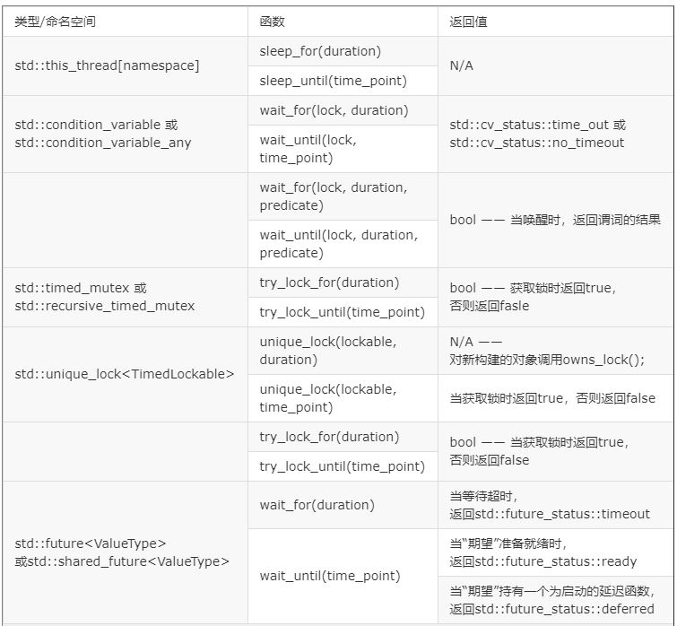

<!-- TOC -->

- [1. 线程管理基础](#1-线程管理基础)
  - [1.1. 启动线程](#11-启动线程)
  - [1.2. 线程的等待与否](#12-线程的等待与否)
    - [1.2.1. 不等待](#121-不等待)
    - [1.2.2. 等待](#122-等待)
    - [1.2.3. 特殊情况下的等待](#123-特殊情况下的等待)
  - [1.3. 向线程函数传递参数](#13-向线程函数传递参数)
  - [1.4. 转移线程所有权](#14-转移线程所有权)
  - [1.5. 运行时决定线程数量](#15-运行时决定线程数量)
  - [1.6. 识别线程](#16-识别线程)
- [2. 共享数据](#2-共享数据)
  - [2.1. C++中使用互斥量](#21-c中使用互斥量)
  - [2.2. 接口内的条件竞争问题](#22-接口内的条件竞争问题)
  - [2.3. 死锁](#23-死锁)
  - [2.4. 层次锁](#24-层次锁)
  - [2.5. 互斥量的传递](#25-互斥量的传递)
  - [2.6. 保护共享数据的方式](#26-保护共享数据的方式)
    - [2.6.1. 保护共享数据的初始化](#261-保护共享数据的初始化)
    - [2.6.2. 保护不常更新的数据](#262-保护不常更新的数据)
    - [2.6.3. 嵌套锁](#263-嵌套锁)
  - [2.7. 线程池](#27-线程池)
- [3. 同步并发操作](#3-同步并发操作)
  - [3.1. 等待一个事件或其他条件](#31-等待一个事件或其他条件)
    - [3.1.1. 等待条件达成](#311-等待条件达成)
    - [3.1.2. 使用条件变量构建线程安全队列](#312-使用条件变量构建线程安全队列)
  - [3.2. 使用期望等待一次性事件](#32-使用期望等待一次性事件)
    - [3.2.1. 带返回值的后台任务](#321-带返回值的后台任务)
    - [3.2.2. 任务与期望](#322-任务与期望)
    - [3.2.3. 使用std::promises](#323-使用stdpromises)
    - [3.2.4. 为“期望”存储“异常”](#324-为期望存储异常)
    - [3.2.5. 多个线程的等待](#325-多个线程的等待)
  - [3.3. 限定等待时间](#33-限定等待时间)
- [4. 基于锁的并发数据结构设计](#4-基于锁的并发数据结构设计)
  - [4.1. 为并发设计的意义](#41-为并发设计的意义)
    - [4.1.1. 数据结构并发设计的指导与建议](#411-数据结构并发设计的指导与建议)
  - [4.2. 基于锁的并发数据结构](#42-基于锁的并发数据结构)
    - [4.2.1. 线程安全的栈](#421-线程安全的栈)
    - [4.2.2. 线程安全队列](#422-线程安全队列)

<!-- /TOC -->

所有的多线程编程基本都通过c++11 stl中的std:thread
# 1. 线程管理基础
## 1.1. 启动线程
使用C++线程库启动线程，可以归结为构造std::thread对象：
```
void do_some_work();
std::thread my_thread(do_some_work);
```
为了让编译器识别std::thread类，这个简单的例子也要包含\<thread\>头文件。如同大多数C++标准库一样，std::thread可以用可调用类型构造，将带有函数调用符类型的实例传入std::thread类中，替换默认的构造函数。
```
class background_task
{
public:
  void operator()() const
  {
    do_something();
    do_something_else();
  }
};

background_task f;
std::thread my_thread(f);
```
有件事需要注意，当把函数对象传入到线程构造函数中时，需要避免“最令人头痛的语法解析”。如果你传递了一个临时变量，而不是一个命名的变量；C++编译器会将其解析为函数声明，而不是类型对象的定义。

例如：
```
std::thread my_thread(background_task());
```
这里相当与声明了一个名为my_thread的函数，这个函数带有一个参数(函数指针指向没有参数并返回background_task对象的函数)，返回一个std::thread对象的函数，而非启动了一个线程。

使用在前面命名函数对象的方式，或使用多组括号①，或使用新统一的初始化语法②，可以避免这个问题。

如下所示：
```
std::thread my_thread((background_task()));  // 1
std::thread my_thread{background_task()};    // 2
```

## 1.2. 线程的等待与否
线程在建立之后需要明确主线程（也就是main或者调用线程的函数）是否要等待线程结束。这个是必须的，因为如果在std::thread对象销毁之前不做决定的话，thread的析构函数会把整个程序都停了。

等待线程执行使用join命令，让其自主运行使用detach命令。

### 1.2.1. 不等待
使用detach()会让线程在后台运行，这就意味着主线程不能与之产生直接交互。也就是说，不会等待这个线程结束；如果线程分离，那么就不可能有std::thread对象能引用它，分离线程的确在后台运行，所以分离线程不能被加入。不过C++运行库保证，当线程退出时，相关资源的能够正确回收，后台线程的归属和控制C++运行库都会处理。

通常称分离线程为守护线程(daemon threads),UNIX中守护线程是指，没有任何显式的用户接口，并在后台运行的线程。这种线程的特点就是长时间运行；线程的生命周期可能会从某一个应用起始到结束，可能会在后台监视文件系统，还有可能对缓存进行清理，亦或对数据结构进行优化。另一方面，分离线程的另一方面只能确定线程什么时候结束，发后即忘(fire and forget)的任务就使用到线程的这种方式。

如2.1.2节所示，调用std::thread成员函数detach()来分离一个线程。之后，相应的std::thread对象就与实际执行的线程无关了，并且这个线程也无法加入：
```
std::thread t(do_background_work);
t.detach();
assert(!t.joinable());
```
为了从std::thread对象中分离线程(前提是有可进行分离的线程),不能对没有执行线程的std::thread对象使用detach(),也是join()的使用条件，并且要用同样的方式进行检查——当std::thread对象使用t.joinable()返回的是true，就可以使用t.detach()。

试想如何能让一个文字处理应用同时编辑多个文档。无论是用户界面，还是在内部应用内部进行，都有很多的解决方法。虽然，这些窗口看起来是完全独立的，每个窗口都有自己独立的菜单选项，但他们却运行在同一个应用实例中。一种内部处理方式是，让每个文档处理窗口拥有自己的线程；每个线程运行同样的的代码，并隔离不同窗口处理的数据。如此这般，打开一个文档就要启动一个新线程。因为是对独立的文档进行操作，所以没有必要等待其他线程完成。因此，这里就可以让文档处理窗口运行在分离的线程上。

下面代码简要的展示了这种方法：

清单2.4 使用分离线程去处理其他文档
```
void edit_document(std::string const& filename)
{
  open_document_and_display_gui(filename);
  while(!done_editing())
  {
    user_command cmd=get_user_input();
    if(cmd.type==open_new_document)
    {
      std::string const new_name=get_filename_from_user();
      std::thread t(edit_document,new_name);  // 1
      t.detach();  // 2
    }
    else
    {
       process_user_input(cmd);
    }
  }
}
```
如果用户选择打开一个新文档，需要启动一个新线程去打开新文档①，并分离线程②。与当前线程做出的操作一样，新线程只不过是打开另一个文件而已。所以，edit_document函数可以复用，通过传参的形式打开新的文件。

这个例子也展示了传参启动线程的方法：不仅可以向std::thread构造函数①传递函数名，还可以传递函数所需的参数(实参)。C++线程库的方式也不是很复杂。当然，也有其他方法完成这项功能，比如:使用一个带有数据成员的成员函数，代替一个需要传参的普通函数。

如果不等待线程，就必须保证线程结束之前，可访问的数据得有效性。这不是一个新问题——单线程代码中，对象销毁之后再去访问，也会产生未定义行为——不过，线程的生命周期增加了这个问题发生的几率。

这种情况很可能发生在线程还没结束，函数已经退出的时候，这时线程函数还持有函数局部变量的指针或引用。下面的清单中就展示了这样的一种情况。

函数已经结束，线程依旧访问局部变量：
```
//这种写法就是仿函数的写法，能够让一个类看起来就像是运行了一个函数一样
struct func
{
  int& i;
  func(int& i_) : i(i_) {}
  void operator() ()
  {
    for (unsigned j=0 ; j<1000000 ; ++j)
    {
      do_something(i);           // 1. 潜在访问隐患：悬空引用
    }
  }
};

void oops()
{
  int some_local_state=0;
  func my_func(some_local_state);
  std::thread my_thread(my_func);
  my_thread.detach();          // 2. 不等待线程结束
}                              // 3. 新线程可能还在运行
```
这个例子中，已经决定不等待线程结束(使用了detach()②)，所以当oops()函数执行完成时③，新线程中的函数可能还在运行。如果线程还在运行，它就会去调用do_something(i)函数①，这时就会访问已经销毁的变量。如同一个单线程程序——允许在函数完成后继续持有局部变量的指针或引用；当然，这从来就不是一个好主意——这种情况发生时，错误并不明显，会使多线程更容易出错。

处理这种情况的常规方法：使线程函数的功能齐全，将数据复制到线程中，而非复制到共享数据中。如果使用一个可调用的对象作为线程函数，这个对象就会复制到线程中，而后原始对象就会立即销毁。但对于对象中包含的指针和引用还需谨慎，例子所示。使用一个能访问局部变量的函数去创建线程是一个糟糕的主意(除非十分确定线程会在函数完成前结束)。此外，可以通过join()函数来确保线程在函数完成前结束。

*另外注意这个仿函数的写法*

### 1.2.2. 等待
如果需要等待线程，相关的std::thread实例需要使用join()。上述例子中，将my_thread.detach()替换为my_thread.join()，就可以确保局部变量在线程完成后，才被销毁。在这种情况下，因为原始线程在其生命周期中并没有做什么事，使得用一个独立的线程去执行函数变得收益甚微，但在实际编程中，原始线程要么有自己的工作要做；要么会启动多个子线程来做一些有用的工作，并等待这些线程结束。

join()是简单粗暴的等待线程完成或不等待。当你需要对等待中的线程有更灵活的控制时，比如，看一下某个线程是否结束，或者只等待一段时间(超过时间就判定为超时)。想要做到这些，你需要使用其他机制来完成，比如条件变量和期待(futures)。

调用join()的行为，还清理了线程相关的存储部分，这样std::thread对象将不再与已经完成的线程有任何关联。这意味着，只能对一个线程使用一次join();一旦已经使用过join()，std::thread对象就不能再次加入了，当对其使用joinable()时，将返回false。

### 1.2.3. 特殊情况下的等待
如果打算等待对应线程，则需要细心挑选调用join()的位置。当在线程运行之后产生异常，在join()调用之前抛出，就意味着这次调用会被跳过。

避免应用被抛出的异常所终止，就需要作出一个决定。通常，当倾向于在无异常的情况下使用join()时，需要在异常处理过程中调用join()，从而避免生命周期的问题。下面的程序清单是一个例子。
```c++
struct func
{
  int& i;
  func(int& i_) : i(i_) {}
  void operator() ()
  {
    for (unsigned j=0 ; j<1000000 ; ++j)
    {
      do_something(i);           // 1. 潜在访问隐患：悬空引用
    }
  }
};

void f()
{
  int some_local_state=0;
  func my_func(some_local_state);
  std::thread t(my_func);
  try
  {
    do_something_in_current_thread();
  }
  catch(...)
  {
    t.join();  // 1
    throw;
  }
  t.join();  // 2
}
```
代码使用了try/catch块确保访问本地状态的线程退出后，函数才结束。当函数正常退出时，会执行到②处；当函数执行过程中抛出异常，程序会执行到①处。try/catch块能轻易的捕获轻量级错误，所以这种情况，并非放之四海而皆准。

一种方式是使用“资源获取即初始化方式”(RAII，Resource Acquisition Is Initialization)，并且提供一个类，在析构函数中使用join()，如同下面清单中的代码。看它如何简化f()函数。
```c++
class thread_guard
{
  std::thread& t;
public:
  explicit thread_guard(std::thread& t_):
    t(t_)
  {}
  ~thread_guard()
  {
    if(t.joinable()) // 1
    {
      t.join();      // 2
    }
  }
  thread_guard(thread_guard const&)=delete;   // 3
  thread_guard& operator=(thread_guard const&)=delete;
};

struct func
{
  int& i;
  func(int& i_) : i(i_) {}
  void operator() ()
  {
    for (unsigned j=0 ; j<1000000 ; ++j)
    {
      do_something(i);           // 1. 潜在访问隐患：悬空引用
    }
  }
};

void f()
{
  int some_local_state=0;
  func my_func(some_local_state);
  std::thread t(my_func);
  thread_guard g(t);
  do_something_in_current_thread();
}    // 4
```
当线程执行到④处时，局部对象就要被逆序销毁了。因此，thread_guard对象g是第一个被销毁的，这时线程在析构函数中被加入②到原始线程中。即使do_something_in_current_thread抛出一个异常，这个销毁依旧会发生。

在thread_guard的析构函数的测试中，首先判断线程是否已加入①，如果没有会调用join()②进行加入。这很重要，因为join()只能对给定的对象调用一次，所以对给已加入的线程再次进行加入操作时，将会导致错误。

拷贝构造函数和拷贝赋值操作被标记为=delete③，是为了不让编译器自动生成它们。直接对一个对象进行拷贝或赋值是危险的，因为这可能会弄丢已经加入的线程。通过删除声明，任何尝试给thread_guard对象赋值的操作都会引发一个编译错误。想要了解删除函数的更多知识，请参阅附录A的A.2节。

如果不想等待线程结束，可以分离(_detaching)线程，从而避免_异常安全*(exception-safety)问题。不过，这就打破了线程与std::thread对象的联系，即使线程仍然在后台运行着，分离操作也能确保std::terminate()在std::thread对象销毁才被调用。

## 1.3. 向线程函数传递参数
正常的向线程函数输入参数的方法如下：
```c++
void f(int i, std::string const& s);
std::thread t(f, 3, "hello");
```
如果是传递指针一般情况下是可行的，线程会对传入的指针进行浅拷贝，主线程和新建线程共享当前指针。需要特别要注意下：
```c++
void f(int i,std::string const& s);
void oops(int some_param)
{
  char buffer[1024]; // 1
  sprintf(buffer, "%i",some_param);
  std::thread t(f,3,buffer); // 2
  t.detach();
}
```
这里在子线程的函数参数中使用的是const string的引用，这样就首先在函数中将char*隐式转换为string，然后将string传送到子线程中进行操作

但是如果使用detach函数，还是有可能会产生问题，因为不确定什么时候进行隐式转换，可能在主线程结束后，隐式转换还没有开始，buffer就已经失效了，这样依然会产生不可预料的结果。

解决方法：

在主线程中进行显示转换，这样可以保证一定可以在主线程中进行显示转换：
```c++
void f(int i,std::string const& s);
void not_oops(int some_param)
{
  char buffer[1024];
  sprintf(buffer,"%i",some_param);
  std::thread t(f,3,std::string(buffer));  // 使用std::string，避免悬垂指针
  t.detach();
}
```

还可能遇到相反的情况：期望传递一个引用，但整个对象被复制了。当线程更新一个引用传递的数据结构时，这种情况就可能发生，比如：
```c++
void update_data_for_widget(widget_id w,widget_data& data); // 1
void oops_again(widget_id w)
{
  widget_data data;
  std::thread t(update_data_for_widget,w,data); // 2
  display_status();
  t.join();
  process_widget_data(data); // 3
}
```
虽然update_data_for_widget①的第二个参数期待传入一个引用，但是std::thread的构造函数②并不知晓；构造函数无视函数期待的参数类型，并盲目的拷贝已提供的变量。当线程调用update_data_for_widget函数时，传递给函数的参数是data变量内部拷贝的引用，而非数据本身的引用。因此，当线程结束时，内部拷贝数据将会在数据更新阶段被销毁，且process_widget_data将会接收到没有修改的data变量③。可以使用std::ref将参数转换成引用的形式，从而可将线程的调用改为以下形式：
```c++
std::thread t(update_data_for_widget,w,std::ref(data));
```
还可以传递一个成员函数指针作为线程函数，并提供一个合适的对象指针作为第一个参数：
```c++
class X
{
public:
  void do_lengthy_work();
};
X my_x;
std::thread t(&X::do_lengthy_work,&my_x); // 1
```
这段代码中，新线程将my_x.do_lengthy_work()作为线程函数；my_x的地址①作为指针对象提供给函数。也可以为成员函数提供参数：std::thread构造函数的第三个参数就是成员函数的第一个参数，以此类推。
```c++
class X
{
public:
  void do_lengthy_work(int);
};
X my_x;
int num(0);
std::thread t(&X::do_lengthy_work, &my_x, num);
```

## 1.4. 转移线程所有权
假设要写一个在后台启动线程的函数，想通过新线程返回的所有权去调用这个函数，而不是等待线程结束再去调用；或完全与之相反的想法：创建一个线程，并在函数中转移所有权，都必须要等待线程结束。总之，新线程的所有权都需要转移。

这就是移动引入std::thread的原因，C++标准库中有很多资源占有(resource-owning)类型，比如std::ifstream,std::unique_ptr还有std::thread都是可移动，但不可拷贝。这就说明执行线程的所有权可以在std::thread实例中移动，下面将展示一个例子。例子中，创建了两个执行线程，并且在std::thread实例之间(t1,t2和t3)转移所有权：
```c++
void some_function();
void some_other_function();
std::thread t1(some_function);            // 1
std::thread t2=std::move(t1);            // 2
t1=std::thread(some_other_function);    // 3
std::thread t3;                            // 4
t3=std::move(t2);                        // 5
t1=std::move(t3);                        // 6 赋值操作将使程序崩溃
```
当显式使用std::move()创建t2后②，t1的所有权就转移给了t2。之后，t1和执行线程已经没有关联了；执行some_function的函数现在与t2关联。

然后，与一个临时std::thread对象相关的线程启动了③。为什么不显式调用std::move()转移所有权呢？因为，所有者是一个临时对象——移动操作将会隐式的调用。

t3使用默认构造方式创建④，与任何执行线程都没有关联。调用std::move()将与t2关联线程的所有权转移到t3中⑤。因为t2是一个命名对象，需要显式的调用std::move()。移动操作⑤完成后，t1与执行some_other_function的线程相关联，t2与任何线程都无关联，t3与执行some_function的线程相关联。

最后一个移动操作，将some_function线程的所有权转移⑥给t1。不过，t1已经有了一个关联的线程(执行some_other_function的线程)，所以这里系统直接调用std::terminate()终止程序继续运行。这样做（不抛出异常，std::terminate()是noexcept函数)是为了保证与std::thread的析构函数的行为一致。

std::thread支持移动，因此在thread_guard中可能会产生一些问题，当thread_guard对象所持有的线程已经被转移了线程的所有权后，thread_guard就不能对线程进行加入或分离。为了确保线程程序退出前完成，下面的代码里定义了scoped_thread类。现在，我们来看一下这段代码：
```c++
class scoped_thread
{
  std::thread t;
public:
  explicit scoped_thread(std::thread t_):                 // 1
    t(std::move(t_))
  {
    if(!t.joinable())                                     // 2
      throw std::logic_error(“No thread”);
  }
  ~scoped_thread()
  {
    t.join();                                            // 3
  }
  scoped_thread(scoped_thread const&)=delete;
  scoped_thread& operator=(scoped_thread const&)=delete;
};

struct func; // 定义在清单2.1中

void f()
{
  int some_local_state;
  scoped_thread t(std::thread(func(some_local_state)));    // 4
  do_something_in_current_thread();
}                                  
```
不过这里新线程是直接传递到scoped_thread中④，而非创建一个独立的命名变量。当主线程到达f()函数的末尾时，scoped_thread对象将会销毁，然后加入③到的构造函数①创建的线程对象中去。而在清单2.3中的thread_guard类，就要在析构的时候检查线程是否"可加入"。这里把检查放在了构造函数中②，并且当线程不可加入时，抛出异常。

std::thread对象的容器，如果这个容器是移动敏感的(比如，标准中的std::vector<>)，那么移动操作同样适用于这些容器。了解这些后，就可以写出类似清单2.7中的代码，代码量产了一些线程，并且等待它们结束。
```c++
void do_work(unsigned id);

void f()
{
  std::vector<std::thread> threads;
  for(unsigned i=0; i < 20; ++i)
  {
    threads.push_back(std::thread(do_work,i)); // 产生线程
  } 
  std::for_each(threads.begin(),threads.end(),
                  std::mem_fn(&std::thread::join)); // 对每个线程调用join()
}
```
我们经常需要线程去分割一个算法的总工作量，所以在算法结束的之前，所有的线程必须结束。清单2.7说明线程所做的工作都是独立的，并且结果仅会受到共享数据的影响。如果f()有返回值，这个返回值就依赖于线程得到的结果。在写入返回值之前，程序会检查使用共享数据的线程是否终止。操作结果在不同线程中转移的替代方案，我们会在第4章中再次讨论。

将std::thread放入std::vector是向线程自动化管理迈出的第一步：并非为这些线程创建独立的变量，并且将他们直接加入，可以把它们当做一个组。创建一组线程(数量在运行时确定)，可使得这一步迈的更大，而非像清单2.7那样创建固定数量的线程。

## 1.5. 运行时决定线程数量
std::thread::hardware_concurrency()在新版C++标准库中是一个很有用的函数。这个函数将返回能同时并发在一个程序中的线程数量。例如，多核系统中，返回值可以是CPU核芯的数量。返回值也仅仅是一个提示，当系统信息无法获取时，函数也会返回0。

以下程序实现了一个并行版的std::accumulate（累加求和）。代码中将整体工作拆分成小任务交给每个线程去做，其中设置最小任务数，是为了避免产生太多的线程。程序可能会在操作数量为0的时候抛出异常。比如，std::thread构造函数无法启动一个执行线程，就会抛出一个异常：
```c++
template<typename Iterator,typename T>
struct accumulate_block
{
  void operator()(Iterator first,Iterator last,T& result)
  {
    result=std::accumulate(first,last,result);
  }
};

template<typename Iterator,typename T>
T parallel_accumulate(Iterator first,Iterator last,T init)
{
  unsigned long const length=std::distance(first,last);

  if(!length) // 1
    return init;

  unsigned long const min_per_thread=25;
  unsigned long const max_threads=
      (length+min_per_thread-1)/min_per_thread; // 2

  unsigned long const hardware_threads=
      std::thread::hardware_concurrency();

  unsigned long const num_threads=  // 3
      std::min(hardware_threads != 0 ? hardware_threads : 2, max_threads);

  unsigned long const block_size=length/num_threads; // 4

  std::vector<T> results(num_threads);
  std::vector<std::thread> threads(num_threads-1);  // 5

  Iterator block_start=first;
  for(unsigned long i=0; i < (num_threads-1); ++i)
  {
    Iterator block_end=block_start;
    std::advance(block_end,block_size);  // 6
    threads[i]=std::thread(     // 7
        accumulate_block<Iterator,T>(),
        block_start,block_end,std::ref(results[i]));
    block_start=block_end;  // 8
  }
  accumulate_block<Iterator,T>()(
      block_start,last,results[num_threads-1]); // 9
  std::for_each(threads.begin(),threads.end(),
       std::mem_fn(&std::thread::join));  // 10

  return std::accumulate(results.begin(),results.end(),init); // 11
}
```
函数看起来很长，但不复杂。如果输入的范围为空①，就会得到init的值。反之，如果范围内多于一个元素时，都需要用范围内元素的总数量除以线程(块)中最小任务数，从而确定启动线程的最大数量②，这样能避免无谓的计算资源的浪费。比如，一台32芯的机器上，只有5个数需要计算，却启动了32个线程。

计算量的最大值和硬件支持线程数中，较小的值为启动线程的数量③。因为上下文频繁的切换会降低线程的性能，所以你肯定不想启动的线程数多于硬件支持的线程数量。当std::thread::hardware_concurrency()返回0，你可以选择一个合适的数作为你的选择；在本例中,我选择了"2"。你也不想在一台单核机器上启动太多的线程，因为这样反而会降低性能，有可能最终让你放弃使用并发。

每个线程中处理的元素数量,是范围中元素的总量除以线程的个数得出的④。对于分配是否得当，我们会在后面讨论。

现在，确定了线程个数，通过创建一个std::vector<T>容器存放中间结果，并为线程创建一个std::vector<std::thread>容器⑤。这里需要注意的是，启动的线程数必须比num_threads少1个，因为在启动之前已经有了一个线程(主线程)。

使用简单的循环来启动线程：block_end迭代器指向当前块的末尾⑥，并启动一个新线程为当前块累加结果⑦。当迭代器指向当前块的末尾时，启动下一个块⑧。

启动所有线程后，⑨中的线程会处理最终块的结果。对于分配不均，因为知道最终块是哪一个，那么这个块中有多少个元素就无所谓了。

当累加最终块的结果后，可以等待std::for_each⑩创建线程的完成(如同在清单2.7中做的那样)，之后使用std::accumulate将所有结果进行累加⑪。

结束这个例子之前，需要明确：T类型的加法运算不满足结合律(比如，对于float型或double型，在进行加法操作时，系统很可能会做截断操作)，因为对范围中元素的分组，会导致parallel_accumulate得到的结果可能与std::accumulate得到的结果不同。同样的，这里对迭代器的要求更加严格：必须都是向前迭代器，而std::accumulate可以在只传入迭代器的情况下工作。对于创建出results容器，需要保证T有默认构造函数。对于算法并行，通常都要这样的修改；不过，需要根据算法本身的特性，选择不同的并行方式。算法并行会在第8章有更加深入的讨论。需要注意的：因为不能直接从一个线程中返回一个值，所以需要传递results容器的引用到线程中去。另一个办法，通过地址来获取线程执行的结果；第4章中，我们将使用期望(futures)完成这种方案。

当线程运行时，所有必要的信息都需要传入到线程中去，包括存储计算结果的位置。不过，并非总需如此：有时候这是识别线程的可行方案，可以传递一个标识数，例如清单2.7中的i。不过，当需要标识的函数在调用栈的深层，同时其他线程也可调用该函数，那么标识数就会变的捉襟见肘。好消息是在设计C++的线程库时，就有预见了这种情况，在之后的实现中就给每个线程附加了唯一标识符。

## 1.6. 识别线程
线程标识类型是std::thread::id，可以通过两种方式进行检索。第一种，可以通过调用std::thread对象的成员函数get_id()来直接获取。如果std::thread对象没有与任何执行线程相关联，get_id()将返回std::thread::type默认构造值，这个值表示“没有线程”。第二种，当前线程中调用std::this_thread::get_id()(这个函数定义在\<thread\>头文件中)也可以获得线程标识。

std::thread::id对象可以自由的拷贝和对比,因为标识符就可以复用。如果两个对象的std::thread::id相等，那它们就是同一个线程，或者都“没有线程”。如果不等，那么就代表了两个不同线程，或者一个有线程，另一没有。

线程库不会限制你去检查线程标识是否一样，std::thread::id类型对象提供相当丰富的对比操作；比如，提供为不同的值进行排序。这意味着允许程序员将其当做为容器的键值，做排序，或做其他方式的比较。按默认顺序比较不同值的std::thread::id，所以这个行为可预见的：当a<b，b<c时，得a<c，等等。标准库也提供std::hash<std::thread::id>容器，所以std::thread::id也可以作为无序容器的键值。

std::thread::id实例常用作检测线程是否需要进行一些操作，比如：当用线程来分割一项工作(如下)，主线程可能要做一些与其他线程不同的工作。这种情况下，启动其他线程前，它可以将自己的线程ID通过std::this_thread::get_id()得到，并进行存储。就是算法核心部分(所有线程都一样的),每个线程都要检查一下，其拥有的线程ID是否与初始线程的ID相同。
```c++
std::thread::id master_thread;
void some_core_part_of_algorithm()
{
  if(std::this_thread::get_id()==master_thread)
  {
    do_master_thread_work();
  }
  do_common_work();
}
```
另外，当前线程的std::thread::id将存储到一个数据结构中。之后在这个结构体中对当前线程的ID与存储的线程ID做对比，来决定操作是被“允许”，还是“需要”(permitted/required)。

同样，作为线程和本地存储不适配的替代方案，线程ID在容器中可作为键值。例如，容器可以存储其掌控下每个线程的信息，或在多个线程中互传信息。

std::thread::id可以作为一个线程的通用标识符，当标识符只与语义相关(比如，数组的索引)时，就需要这个方案了。也可以使用输出流(std::cout)来记录一个std::thread::id对象的值。
```c++
std::cout<<std::this_thread::get_id();
```
具体的输出结果是严格依赖于具体实现的，C++标准的唯一要求就是要保证ID比较结果相等的线程，必须有相同的输出。

# 2. 共享数据
当线程在访问共享数据的时候，必须定一些规矩，用来限定线程可访问的数据位。还有，一个线程更新了共享数据，需要对其他线程进行通知。从易用性的角度，同一进程中的多个线程进行数据共享，有利有弊。错误的共享数据使用是产生并发bug的一个主要原因

## 2.1. C++中使用互斥量
C++中通过实例化std::mutex创建互斥量。一般来说要建立在所有要在线程中使用的函数的可见区域（比如代码块外，类内定义成成员变量等）。mutex的作用并不是给某一个或某几个变量上锁，而是当我使用mutex.lock()的时候，就会去检查是不是有其他的线程函数内已经用过mutex.lock()了，如果发现有人已经用过，即mutex已经被锁住了，那么当前的mutex变量所在的线程就会阻塞，停止活动，直到刚才那个上锁的人解锁了（mutex.unlock()），那么本线程才重新开始。也就是说可以把我们想要上锁的操作放在mutex.lock()和mutex.unlock()之间，这样就能保证永远只有一个线程在进行操作。

不过，不推荐实践中直接去调用lock和unlock成员函数，因为调用成员函数就意味着，必须记住在每个函数出口都要去调用unlock()，也包括异常的情况。C++标准库为互斥量提供了一个RAII语法的模板类std::lock_guard，其会在构造的时候提供已锁的互斥量，并在析构的时候进行解锁，从而保证了一个已锁的互斥量总是会被正确的解锁。下面的程序清单中，展示了如何在多线程程序中，使用std::mutex构造的std::lock_guard实例，对一个列表进行访问保护。std::mutex和std::lock_guard都在<mutex>头文件中声明。
```c++
#include <list>
#include <mutex>
#include <algorithm>

std::list<int> some_list;    // 1
std::mutex some_mutex;    // 2

void add_to_list(int new_value)
{
  std::lock_guard<std::mutex> guard(some_mutex);    // 3
  some_list.push_back(new_value);
}

bool list_contains(int value_to_find)
{
  std::lock_guard<std::mutex> guard(some_mutex);    // 4
  return std::find(some_list.begin(),some_list.end(),value_to_find) != some_list.end();
}

int main ()
{
  std::thread threads[10];
  // spawn 10 threads:
  for (int i=0; i<10; ++i)
    threads[i] = std::thread(add_to_list,i+1);

  for (auto& th : threads) th.join();

  return 0;
}
```
程序中有一个全局变量①，这个全局变量被一个全局的互斥量保护②。add_to_list()③和list_contains()④函数中使用std::lock_guard\<std::mutex\>，使得这两个函数中对数据的访问是互斥的：list_contains()不可能看到正在被add_to_list()修改的列表。

简单总结一些std::mutex：
1. 对于std::mutex对象，任意时刻最多允许一个线程对其进行上锁
2. mtx.lock()：调用该函数的线程尝试加锁。如果上锁不成功，即：其它线程已经上锁且未释放，则当前线程block。如果上锁成功，则执行后面的操作，操作完成后要调用mtx.unlock()释放锁，否则会导致死锁的产生
3. mtx.unlock()：释放锁
4. std::mutex还有一个操作：mtx.try_lock()，字面意思就是：“尝试上锁”，与mtx.lock()的不同点在于：如果上锁不成功，当前线程不阻塞。

lock_guard是非常典型的RAII风格：
```c++
template<typename _Mutex>
    class lock_guard
    {
    public:
      typedef _Mutex mutex_type;

      explicit lock_guard(mutex_type& __m) : _M_device(__m)
      { _M_device.lock(); }//作者注:构造对象时加锁(申请资源),构造函数结束，就可以正常使用资源了

      lock_guard(mutex_type& __m, adopt_lock_t) : _M_device(__m)
      { } // calling thread owns mutex

      ~lock_guard()
      { _M_device.unlock(); }//作者注:析构对象时解锁(释放资源)
      // 作者注:禁用拷贝构造函数
      lock_guard(const lock_guard&) = delete;
      // 作者注:禁用赋值操作符
      lock_guard& operator=(const lock_guard&) = delete;

    private:
      mutex_type&  _M_device;
    };
```

虽然某些情况下，使用全局变量没问题，但在大多数情况下，互斥量通常会与保护的数据放在同一个类中，而不是定义成全局变量。这是面向对象设计的准则：将其放在一个类中，就可让他们联系在一起，也可对类的功能进行封装，并进行数据保护。在这种情况下，函数add_to_list和list_contains可以作为这个类的成员函数。互斥量和要保护的数据，在类中都需要定义为private成员，这会让访问数据的代码变的清晰，并且容易看出在什么时候对互斥量上锁。当所有成员函数都会在调用时对数据上锁，结束时对数据解锁，那么就保证了数据访问时不变量不被破坏。

当然，也不是总是那么理想，聪明的你一定注意到了：当其中一个成员函数返回的是保护数据的指针或引用时，会破坏对数据的保护。具有访问能力的指针或引用可以访问(并可能修改)被保护的数据，而不会被互斥锁限制。互斥量保护的数据需要对接口的设计相当谨慎，要确保互斥量能锁住任何对保护数据的访问，并且不留后门。

传递出了保护数据的引用：
```c++
class some_data
{
  int a;
  std::string b;
public:
  void do_something();
};

class data_wrapper
{
private:
  some_data data;
  std::mutex m;
public:
  template<typename Function>
  void process_data(Function func)
  {
    std::lock_guard<std::mutex> l(m);
    func(data);    // 1 传递“保护”数据给用户函数
  }
};

some_data* unprotected;

void malicious_function(some_data& protected_data)
{
  unprotected=&protected_data;
}

data_wrapper x;
void foo()
{
  x.process_data(malicious_function);    // 2 传递一个恶意函数
  unprotected->do_something();    // 3 unprotected把类内的protected_data数据提取出来并在外界进行使用，这就是在无保护的情况下访问保护数据
}
```
例子中process_data看起来没有任何问题，std::lock_guard对数据做了很好的保护，但调用用户提供的函数func①，就意味着foo能够绕过保护机制将函数malicious_function传递进去②，在没有锁定互斥量的情况下调用do_something()。

这段代码的问题在于根本没有保护，只是将所有可访问的数据结构代码标记为互斥。函数foo()中调用unprotected->do_something()的代码未能被标记为互斥。这种情况下，C++线程库无法提供任何帮助，只能由程序员来使用正确的互斥锁来保护数据。从乐观的角度上看，还是有方法可循的：切勿将受保护数据的指针或引用传递到互斥锁作用域之外，无论是函数返回值，还是存储在外部可见内存，亦或是以参数的形式传递到用户提供的函数中去。

## 2.2. 接口内的条件竞争问题
假设使用stl中的stack写以下这样的程序：
```c++
stack<int> s;
if (! s.empty()){    // 1
  int const value = s.top();    // 2
  s.pop();    // 3
  do_something(value);
}
```
由于stl中的容器没有线程安全的，所以如果写成多线程的形式，每个线程都对同一个stack实例s进行同样的操作的话，可能出现下面这样的问题：
|  Thread A   | Thread B  |
|  ----  | ----  |
| if (!s.empty);  |   |
|    | if(!s.empty); |
| int const value = s.top();| |
||int const value = s.top();|
|s.pop();||
|do_something(value);	|s.pop();|
||do_something(value);|
|||
也就是说，在两个线程的运行中，线程A首先用s.pop()将顶部元素出栈，这时出栈的肯定是线程A前面int const value = s.top()的这个元素；但是之后线程B也进行了s.pop()，这时出栈的可就不是xianchengB前面int const value = s.top()的那个元素了，因为前面线程A已经出栈一回了，线程B出去的就不是前面输出的顶部那个，而是又下一个元素，这样实际出栈的元素和前面输出的就不是同一个，这就是stl线程不安全的体现。其他例子比如还有链表在添加元素的时候，需要先断链，假如就在这个断链的时候另外一个线程也来插入的话，那肯定是要出问题的。

这种时候首先想到的第一种方法就是给这几部操作都加上锁：
```c++
void stackTest(stack<int> s)
{
  std::lock_guard<std::mutex> guard(some_mutex);    // 3
  if (! s.empty()){    // 1
    int const value = s.top();    // 2
    s.pop();    // 3
    do_something(value);
  }
}
```
这种一般来说是可以的，但是在多线程并发的场景中，每一个锁所掌管的程序区域应该需要尽量小，也就是**锁粒度尽量小**，因为这样可以减少持有锁的时间，降低其他线程的阻塞时间。所以现在就需要在接口层面来解决竞争问题。

>为什么要加锁？加锁是为了防止不同的线程访问同一共享资源造成混乱。
打个比方：人是不同的线程，卫生间是共享资源
你在上洗手间的时候肯定要把门锁上吧，这就是加锁，只要你在里面，这个卫生间就被锁了，只有你出来之后别人才能用。想象一下如果卫生间的门没有锁会是什么样？

>什么是加锁粒度呢？所谓加锁粒度就是你要锁住的范围是多大。
比如你在家上卫生间，你只要锁住卫生间就可以了吧，不需要将整个家都锁起来不让家人进门吧，卫生间就是你的加锁粒度。

>怎样才算合理的加锁粒度呢？
其实卫生间并不只是用来上厕所的，还可以洗澡，洗手。这里就涉及到优化加锁粒度的问题。
你在卫生间里洗澡，其实别人也可以同时去里面洗手，只要做到隔离起来就可以，如果马桶，浴缸，洗漱台都是隔开相对独立的，实际上卫生间可以同时给三个人使用，
当然三个人做的事儿不能一样。这样就细化了加锁粒度，你在洗澡的时候只要关上浴室的门，别人还是可以进去洗手的。如果当初设计卫生间的时候没有将不同的功能区域划分
隔离开，就不能实现卫生间资源的最大化使用。这就是设计架构的重要性。

第二种方法可以将top()和pop()两个函数合二为一，即弹出顶端的值时就返回顶端的值。那为什么stl本身不这样设计呢？一方面是因为设计原则，希望一个函数只干一件事；另一方面他们放在一起的话，假如是一个复杂的类，那么在输出的时候就会调用复制构造函数，假设因为内存不够之类的问题复制构造报错，这时栈顶的元素已经出栈了，也就是说这时这个元素就再也找不到了。这就是stl的设计者将这两个功能分开的初衷。

但是为了解决他们现在的线程问题，我们不得不再将他们合在一起。这时也有以下几种选择：
- 传入一个引用：
  ```c++
  std::vector<int> result;
  some_stack.pop(result);
  ```
  按引用传递就不用调用复制构造函数，也就没有报错之后产生的数据丢失的问题。但是有明显的缺点：需要构造出一个栈中类型的实例，用于接收目标值。对于一些类型，这样做是不现实的，因为临时构造一个实例，从时间和资源的角度上来看，都是不划算。对于其他的类型，这样也不总能行得通，因为构造函数需要的一些参数，在代码的这个阶段不一定可用。最后，需要可赋值的存储类型，这是一个重大限制：即使支持移动构造，甚至是拷贝构造(从而允许返回一个值)，很多用户自定义类型可能都不支持赋值操作。
- 无异常抛出的拷贝构造函数或移动构造函数
  调用复制构造函数时不会抛出异常也就不会产生数据丢失的问题了，但是并不可靠，尤其是用户自定义的类型。
- 返回弹出值得指针
  这里需要解释一下，像stack之类的容器，使用pop()时仅仅是将栈顶的元素从容器中去除了，但是它仍然存在于内存中，而且地址也没有变，仅仅是容器不再访问它了。这是因为容器有自己的内存管理机制，只有在这个容器对象整个销毁是才会释放这空间。因此可以将栈顶元素的指针返回，指针的优势是自由拷贝，并且不会产生异常，这样你就能避免异常问题了。缺点就是返回一个指针需要对对象的内存分配进行管理，对于简单数据类型(比如：int)，内存管理的开销要远大于直接返回值。对于选择这个方案的接口，使用std::shared_ptr是个不错的选择；不仅能避免内存泄露(因为当对象中指针销毁时，对象也会被销毁)，而且标准库能够完全控制内存分配方案，也就不需要new和delete操作。这种优化是很重要的：因为堆栈中的每个对象，都需要用new进行独立的内存分配，相较于非线程安全版本，这个方案的开销相当大。

接下来就需要将以上的说法结合起来解决这个问题：
```c++
#include <exception>
#include <memory>
#include <mutex>
#include <stack>

struct empty_stack: std::exception
{
  const char* what() const throw() {
    return "empty stack!";
  };
};

template<typename T>
class threadsafe_stack
{
private:
  std::stack<T> data;
  mutable std::mutex m;

public:
  threadsafe_stack()
    : data(std::stack<T>()){}

  threadsafe_stack(const threadsafe_stack& other)
  {
    std::lock_guard<std::mutex> lock(other.m);
    data = other.data; // 1 在构造函数体中的执行拷贝
  }

  threadsafe_stack& operator=(const threadsafe_stack&) = delete;

  void push(T new_value)
  {
    std::lock_guard<std::mutex> lock(m);
    data.push(new_value);
  }

  std::shared_ptr<T> pop()
  {
    std::lock_guard<std::mutex> lock(m);
    if(data.empty()) throw empty_stack(); // 在调用pop前，检查栈是否为空

    std::shared_ptr<T> const res(std::make_shared<T>(data.top())); // 在修改堆栈前，分配出返回值
    data.pop();
    return res;
  }

  void pop(T& value)
  {
    std::lock_guard<std::mutex> lock(m);
    if(data.empty()) throw empty_stack();

    value=data.top();
    data.pop();
  }

  bool empty() const
  {
    std::lock_guard<std::mutex> lock(m);
    return data.empty();
  }
};
```

## 2.3. 死锁
产生死锁的四个必要条件：
1. 互斥条件：一个资源每次只能被一个进程使用。
2. 占有且等待：一个进程因请求资源而阻塞时，对已获得的资源保持不放。
3. 不可强行占有:进程已获得的资源，在末使用完之前，不能强行剥夺。
4. 循环等待条件:若干进程之间形成一种头尾相接的循环等待资源关系。

接下来讨论更具体的情况：

死锁发生的其中一种情况如上所述，就是因为各种情况只上锁没有解锁，不过使用类似RAII的策略也是可以解决的，现在讨论其他可能性。

假设一个线程有两个锁A和B，那么当多线程的时候，假设因为各种原因，线程1先锁了A，线程2先锁了B，这时候他们俩谁也拿不到后一个锁，就都被锁住了，也就变成了死锁。避免这种死锁的一般建议，就是让两个互斥量总以相同的顺序上锁：总在互斥量B之前锁住互斥量A，就永远不会死锁。

std::lock函数可以同时对两个锁上锁：
```c++
// 这里的std::lock()需要包含<mutex>头文件
class some_big_object;
void swap(some_big_object& lhs,some_big_object& rhs);
class X
{
private:
  some_big_object some_detail;
  std::mutex m;
public:
  X(some_big_object const& sd):some_detail(sd){}

  friend void swap(X& lhs, X& rhs)
  {
    if(&lhs==&rhs)
      return;
    std::lock(lhs.m,rhs.m); // 1
    std::lock_guard<std::mutex> lock_a(lhs.m,std::adopt_lock); // 2
    std::lock_guard<std::mutex> lock_b(rhs.m,std::adopt_lock); // 3
    swap(lhs.some_detail,rhs.some_detail);
  }
};
```
这里是将lock和lock_guard配合使用，因为一般lock必须配合使用unlock函数进行解锁，这里使用lock_guard可以保证在函数出栈的时候能够unlock，所以就不用单独加unlock了。

其他避免死锁的建议：
1. 避免嵌套锁
   线程获得一个锁时，就别再去获取第二个。每个线程只持有一个锁，就不会产生死锁。当需要获取多个锁，使用std::lock来做这件事(对获取锁的操作上锁)，避免产生死锁。
2. 避免在持有锁时调用外部代码
   因为代码是外部提供的，所以没有办法确定外部要做什么。外部程序可能做任何事情，包括获取锁。在持有锁的情况下，如果用外部代码要获取一个锁，就会违反第一个指导意见，并造成死锁(有时这是无法避免的)。当写通用代码时(例如栈)，每一个操作的参数类型，都是外部提供的定义，这就需要其他指导意见来帮助你了。
3. 使用固定顺序获取锁
   当硬性要求获取两个或两个以上的锁，并且不能使用std::lock单独操作来获取它们时，最好在每个线程上，用固定的顺序获取它们(锁)。

当然很多时候不会这么简单，比如如果出现那种两个线程从反方向访问链表的话，就很有可能出现前面的那种死锁的问题。这时为了消除死锁可能就必须控制遍历链表顺序，以及定义获取锁的顺序。

## 2.4. 层次锁
```c++
class hierarchical_mutex
{
  std::mutex internal_mutex;
  
  unsigned long const hierarchy_value;
  unsigned long previous_hierarchy_value;
  
  static thread_local unsigned long this_thread_hierarchy_value;  // 1
  
  void check_for_hierarchy_violation()
  {
    if(this_thread_hierarchy_value <= hierarchy_value)  // 2
    {
      throw std::logic_error(“mutex hierarchy violated”);
    }
  }
  
  void update_hierarchy_value()
  {
    previous_hierarchy_value=this_thread_hierarchy_value;  // 3
    this_thread_hierarchy_value=hierarchy_value;
  }
  
public:
  explicit hierarchical_mutex(unsigned long value):
      hierarchy_value(value),
      previous_hierarchy_value(0)
  {}
  
  void lock()
  {
    check_for_hierarchy_violation();
    internal_mutex.lock();  // 4
    update_hierarchy_value();  // 5
  }
  
  void unlock()
  {
    if(this_thread_hierarchy_value!=hierarchy_value)
      throw std::logic_error(“mutex hierarchy violated”);  // 9
    this_thread_hierarchy_value=previous_hierarchy_value;  // 6
    internal_mutex.unlock();
  }
  
  bool try_lock()
  {
    check_for_hierarchy_violation();
    if(!internal_mutex.try_lock())  // 7
      return false;
    update_hierarchy_value();
    return true;
  }
};
thread_local unsigned long hierarchical_mutex::this_thread_hierarchy_value(ULONG_MAX);  // 8
```
```c++
hierarchical_mutex high_level_mutex(10000); // 1
hierarchical_mutex low_level_mutex(5000);  // 2
hierarchical_mutex other_mutex(6000); // 3

int do_low_level_stuff();

int low_level_func()
{
  std::lock_guard<hierarchical_mutex> lk(low_level_mutex); // 4
  return do_low_level_stuff();
}

void high_level_stuff(int some_param);

void high_level_func()
{
  std::lock_guard<hierarchical_mutex> lk(high_level_mutex); // 6
  high_level_stuff(low_level_func()); // 5
}

void thread_a()  // 7
{
  high_level_func();
}

void do_other_stuff();

void other_stuff()
{
  high_level_func();  // 10
  do_other_stuff();
}

void thread_b() // 8
{
  std::lock_guard<hierarchical_mutex> lk(other_mutex); // 9
  other_stuff();
}
```
这里的hierarchical_mutex表示层次锁，括号中的值表示级别，只有在锁上高层次锁之后才能再锁低层次的锁，就比如thread A中就是先锁上了级别高的high_level_mutex，然后才能获得低层次的。但是thread B中的向先得低层次再得高层次，这就会出问题。

hierarchical_mutex重点是使用了thread_local的值来代表当前线程的层级值：this_thread_hierarchy_value①，初始化为最大值⑧，所以最初所有线程都能被锁住。因为其声明中有thread_local，所以每个线程都有其副本，这样线程中变量状态完全独立，当从另一个线程进行读取时，变量的状态也完全独立。

## 2.5. 互斥量的传递
```c++
std::unique_lock<std::mutex> get_lock()
{
  extern std::mutex some_mutex;
  std::unique_lock<std::mutex> lk(some_mutex);
  prepare_data();
  return lk;  // 1
}
void process_data()
{
  std::unique_lock<std::mutex> lk(get_lock());  // 2
  do_something();
}
```

## 2.6. 保护共享数据的方式
### 2.6.1. 保护共享数据的初始化
假如连接数据库或者需要分配很多内存时，这种初始化的代价是比较昂贵的，但是在多线程中或许必须在每次运行过程中都必须检查一遍。例如和数据库的连接，每次上传之前可以检查一下是否已经建立连接，如果没有就连接，有就不连。这种情况下其实只需要初始化一次就行，所以对于初始化过程需要有锁来保护。

c++11中使用std::once_flag和std::call_once来处理这种情况，他们可以保证其所保护的函数在多线程中只被运行一次：
```c++
std::shared_ptr<some_resource> resource_ptr;
std::once_flag resource_flag;  // 1

void init_resource()
{
  resource_ptr.reset(new some_resource);
}

void foo()
{
  std::call_once(resource_flag,init_resource);  // 可以完整的进行一次初始化
  resource_ptr->do_something();
}
```
```c++
class X
{
private:
  connection_info connection_details;
  connection_handle connection;
  std::once_flag connection_init_flag;

  void open_connection()
  {
    connection=connection_manager.open(connection_details);
  }
public:
  X(connection_info const& connection_details_):
      connection_details(connection_details_)
  {}
  void send_data(data_packet const& data)  // 1
  {
    std::call_once(connection_init_flag,&X::open_connection,this);  // 2
    connection.send_data(data);
  }
  data_packet receive_data()  // 3
  {
    std::call_once(connection_init_flag,&X::open_connection,this);  // 2
    return connection.receive_data();
  }
};
```
例子中第一次调用send_data()①或receive_data()③的线程完成初始化过程。使用成员函数open_connection()去初始化数据，也需要将this指针传进去。和其在标准库中的函数一样，其接受可调用对象，比如std::thread的构造函数和std::bind()，通过向std::call_once()②传递一个额外的参数来完成这个操作。

值得注意的是，std::mutex和std::once_flag的实例不能拷贝和移动，需要通过显式定义相应的成员函数，对这些类成员进行操作。

另外类中的static修饰的变量必须要求定义时就初始化，在c++11中static修饰的变量的初始化是线程安全的，也就是说它直接就是只会被定义一次的。

### 2.6.2. 保护不常更新的数据
经常会有这样一种不常使用的数据，在修改它的时候需要锁，但是需要读取它的时候就需要锁了，这种情况下C++17标准库提供了两种非常好的互斥量——std::shared_mutex和std::shared_timed_mutex。C++14只提供了std::shared_timed_mutex，并且在C++11中并未提供任何互斥量类型。如果还在用支持C++14标准之前的编译器，可以使用Boost库中的互斥量。std::shared_mutex和std::shared_timed_mutex的不同点在于，std::shared_timed_mutex支持更多的操作方式(参考4.3节)，std::shared_mutex有更高的性能优势，但支持的操作较少。

于更新操作，可以使用std::lock_guard\<std::shared_mutex\>和std::unique_lock\<std::shared_mutex\>上锁。作为std::mutex的替代方案，与std::mutex所做的一样，这就能保证更新线程的独占访问。因为其他线程不需要去修改数据结构，所以其可以使用std::shared_lock\<std::shared_mutex\>获取访问权。这种RAII类型模板是在C++14中的新特性，这与使用std::unique_lock一样(除非多线程要在同时获取同一个std::shared_mutex的共享锁)。唯一的限制：当任一线程拥有一个共享锁时，这个线程就会尝试获取独占锁，直到其他线程放弃锁。当任一线程拥有一个独占锁时，其他线程就无法获得共享锁或独占锁，直到第一个线程放弃其拥有的锁。
```c++
#include <map>
#include <string>
#include <mutex>
#include <shared_mutex>

class dns_entry;

class dns_cache
{
  std::map<std::string,dns_entry> entries;
  mutable std::shared_mutex entry_mutex;
public:
  dns_entry find_entry(std::string const& domain) const
  {
    std::shared_lock<std::shared_mutex> lk(entry_mutex);  // 1
    std::map<std::string,dns_entry>::const_iterator const it=
       entries.find(domain);
    return (it==entries.end())?dns_entry():it->second;
  }
  void update_or_add_entry(std::string const& domain,
                           dns_entry const& dns_details)
  {
    std::lock_guard<std::shared_mutex> lk(entry_mutex);  // 2
    entries[domain]=dns_details;
  }
};
```
shared_lock指的是被上锁后仍然允许其他线程执行同样被shared_lock的代码，其中使用的锁是std::shared_mutex，它与普通的mutex相比多了lock_shared函数，这个锁允许其他同样的锁进行共享，在shared_lock中也正是执行的这个函数。而在lock_guard中调用shared_mutex执行的就还是lock函数，所以这时与普通的mutex就一样了。这就实现了一个读写锁。

### 2.6.3. 嵌套锁
尽量避免

## 2.7. 线程池
```c++
#pragma once
#ifndef THREAD_POOL_H
#define THREAD_POOL_H

#include <vector>
#include <queue>
#include <thread>
#include <atomic>
#include <condition_variable>
#include <future>
#include <functional>
#include <stdexcept>

namespace std
{
#define  MAX_THREAD_NUM 256

//线程池,可以提交变参函数或拉姆达表达式的匿名函数执行,可以获取执行返回值
//不支持类成员函数, 支持类静态成员函数或全局函数,Opteron()函数等
class threadpool
{
    //这里的using的作用与typedef和#define一样，就是给std::function<void()>起个别名
    using Task = std::function<void()>;//①
    // 线程池
    std::vector<std::thread> pool;
    // 任务队列
    std::queue<Task> tasks;
    // 同步
    std::mutex m_lock;

    // 条件阻塞
    std::condition_variable cv_task;
    // 是否关闭提交
    std::atomic<bool> stoped;//②
    //空闲线程数量
    std::atomic<int>  idlThrNum;

public:
    inline threadpool(unsigned short size = 4) :stoped{ false }
    {
        idlThrNum = size < 1 ? 1 : size;
        for (size = 0; size < idlThrNum; ++size)
        {   //初始化线程数量
            pool.emplace_back(//③
            // 工作线程函数
                [this]//④
                {   //只要不关闭提交就一直运行
                    while(!this->stoped)
                    {
                        //定义一个
                        std::function<void()> task;
                        {   // 获取一个待执行的 task
                            std::unique_lock<std::mutex> lock{ this->m_lock };
                            // unique_lock 相比 lock_guard 的好处是：可以随时 unlock() 和 lock()
                            this->cv_task.wait(lock,//⑤
                                [this] {
                                    return this->stoped.load() || !this->tasks.empty();//.load()表示以原子方式加载并返回值
                                }
                            ); // wait 直到有 task
                            if (this->stoped && this->tasks.empty())
                                return;
                            task = std::move(this->tasks.front()); // 取一个 task
                            this->tasks.pop();
                        }
                        idlThrNum--;
                        task();
                        idlThrNum++;
                    }
                }
            );
        }
    }
    inline ~threadpool()
    {
        stoped.store(true);
        cv_task.notify_all(); // 唤醒所有线程执行
        for (std::thread& thread : pool) {
            //thread.detach(); // 让线程“自生自灭”
            if(thread.joinable())
                thread.join(); // 等待任务结束， 前提：线程一定会执行完
        }
    }

public:
    // 提交一个任务
    // 调用.get()获取返回值会等待任务执行完,获取返回值
    // 有两种方法可以实现调用类成员，
    // 一种是使用   bind： .commit(std::bind(&Dog::sayHello, &dog));
    // 一种是用 mem_fn： .commit(std::mem_fn(&Dog::sayHello), &dog)
    template<class F, class... Args>//class... Args是一个参数包，这个参数包中可以包含0到任意个模板参数
    auto commit(F&& f, Args&&... args) ->std::future<decltype(f(args...))>//⑥
    {
        if (stoped.load())    // stop == true ??
            throw std::runtime_error("commit on ThreadPool is stopped.");

        using RetType = decltype(f(args...)); // typename std::result_of<F(Args...)>::type, 函数 f 的返回值类型
        auto task = std::make_shared<std::packaged_task<RetType()> >(
            std::bind(std::forward<F>(f), std::forward<Args>(args)...)
            );    //⑦
        std::future<RetType> future = task->get_future();
        {    // 添加任务到队列
            std::lock_guard<std::mutex> lock{ m_lock };//对当前块的语句加锁  lock_guard 是 mutex 的 stack 封装类，构造的时候 lock()，析构的时候 unlock()
            tasks.emplace(
                [task]()
                { // push(Task{...})
                    (*task)();
                }
            );
        }
        cv_task.notify_one(); // 唤醒一个线程执行

        return future;
    }

    //空闲线程数量
    int idlCount() { return idlThrNum; }

};

}

#endif
```
```c++
#include "threadpool.h"
#include <iostream>

void fun1(int slp)
{
    printf("  hello, fun1 !  %d\n" ,std::this_thread::get_id());
    if (slp>0) {
        printf(" ======= fun1 sleep %d  =========  %d\n",slp, std::this_thread::get_id());
        std::this_thread::sleep_for(std::chrono::milliseconds(slp));
    }
}

struct gfun {
    int operator()(int n) {
        printf("%d  hello, gfun !  %d\n" ,n, std::this_thread::get_id() );
        return 42;
    }
};

class A {
public:
    static int Afun(int n = 0) {   //函数必须是 static 的才能直接使用线程池
        std::cout << n << "  hello, Afun !  " << std::this_thread::get_id() << std::endl;
        return n;
    }

    static std::string Bfun(int n, std::string str, char c) {
        std::cout << n << "  hello, Bfun !  "<< str.c_str() <<"  " << (int)c <<"  " << std::this_thread::get_id() << std::endl;
        return str;
    }
};

int main()
    try {
        std::threadpool executor{ 50 };
        A a;
        std::future<void> ff = executor.commit(fun1,0);
        std::future<int> fg = executor.commit(gfun{},0);
        std::future<int> gg = executor.commit(a.Afun, 9999); //IDE提示错误,但可以编译运行
        std::future<std::string> gh = executor.commit(A::Bfun, 9998,"mult args", 123);
        std::future<std::string> fh = executor.commit([]()->std::string { std::cout << "hello, fh !  " << std::this_thread::get_id() << std::endl; return "hello,fh ret !"; });

        std::cout << " =======  sleep ========= " << std::this_thread::get_id() << std::endl;
        std::this_thread::sleep_for(std::chrono::microseconds(900));

        for (int i = 0; i < 50; i++) {
            executor.commit(fun1,i*100 );
        }
        std::cout << " =======  commit all ========= " << std::this_thread::get_id()<< " idlsize="<<executor.idlCount() << std::endl;

        std::cout << " =======  sleep ========= " << std::this_thread::get_id() << std::endl;
        std::this_thread::sleep_for(std::chrono::seconds(3));

        ff.get(); //调用.get()获取返回值会等待线程执行完,获取返回值
        std::cout << fg.get() << "  " << fh.get().c_str()<< "  " << std::this_thread::get_id() << std::endl;

        std::cout << " =======  sleep ========= " << std::this_thread::get_id() << std::endl;
        std::this_thread::sleep_for(std::chrono::seconds(3));

        std::cout << " =======  fun1,55 ========= " << std::this_thread::get_id() << std::endl;
        executor.commit(fun1,55).get();    //调用.get()获取返回值会等待线程执行完

        std::cout << "end... " << std::this_thread::get_id() << std::endl;


        std::threadpool pool(4);
        std::vector< std::future<int> > results;

        for (int i = 0; i < 8; ++i) {
            results.emplace_back(
                pool.commit([i] {
                    std::cout << "hello " << i << std::endl;
                    std::this_thread::sleep_for(std::chrono::seconds(1));
                    std::cout << "world " << i << std::endl;
                    return i*i;
                })
            );
        }
        std::cout << " =======  commit all2 ========= " << std::this_thread::get_id() << std::endl;

        for (auto && result : results)
            std::cout << result.get() << ' ';
        std::cout << std::endl;
        return 0;
    }
catch (std::exception& e) {
    std::cout << "some unhappy happened...  " << std::this_thread::get_id() << e.what() << std::endl;
}
```
细节解释：

①处的std::function是对于所有可调用对象的统一操作。所谓可调用对象大概有以下几种形式：
```c++
// 普通函数
int add(int a, int b){return a+b;} 

// lambda表达式
auto mod = [](int a, int b){ return a % b;}

// 函数对象类
struct divide{
    int operator()(int denominator, int divisor){
        return denominator/divisor;
    }
};
```
上述三种可调用对象虽然类型不同，但是共享了一种调用形式：
```c++
int(int ,int)
```
std::function就可以将上述类型保存起来，如下：
```c++
std::function<int(int ,int)>  a = add; 
std::function<int(int ,int)>  b = mod ; 
std::function<int(int ,int)>  c = divide(); 
```
总结来说，std::function 是一个可调用对象包装器，是一个类模板，可以容纳除了类成员函数指针之外的所有可调用对象，它可以用统一的方式处理函数、函数对象、函数指针，并允许保存和延迟它们的执行。

std::function可以取代函数指针的作用，因为它可以延迟函数的执行，特别适合作为回调函数使用。它比普通函数指针更加的灵活和便利。

②处的std::atomic表示原子操作，所有其所定义的变量的相关操作都是原子性的。

③处建立了一个线程队列Pool，其中的每个元素类型都是std::thread。emplace_back和push_back在效果上相同，但是使用push_back()向容器中加入一个右值元素（临时对象）的时候，首先会调用构造函数构造这个临时对象，然后需要调用拷贝构造函数将这个临时对象放入容器中。原来的临时变量释放。这样造成的问题是临时变量申请的资源就浪费。引入了右值引用，转移构造函数后，push_back()右值时就会调用构造函数和转移构造函数。在这上面有进一步优化的空间就是使用emplace_back()，这个函数将原地构造元素，不需要触发拷贝构造和转移构造。而且调用形式更加简洁，直接根据参数初始化临时对象的成员：
```c++
struct President  
{  
    std::string name;  
    std::string country;  
    int year;  

    President(std::string p_name, std::string p_country, int p_year)  
        : name(std::move(p_name)), country(std::move(p_country)), year(p_year)  
    {  
        std::cout << "I am being constructed.\n";  
    }
    President(const President& other)
        : name(std::move(other.name)), country(std::move(other.country)), year(other.year)
    {
        std::cout << "I am being copy constructed.\n";
    }
    President(President&& other)  
        : name(std::move(other.name)), country(std::move(other.country)), year(other.year)  
    {  
        std::cout << "I am being moved.\n";  
    }  
    President& operator=(const President& other);  
};  

std::vector<President> elections;  
std::cout << "emplace_back:\n";  
elections.emplace_back("Nelson Mandela", "South Africa", 1994); //形式上与President的构造函数相同，但是没有类的创建，就是在vector里原地构造
```

④处就是将要进入Pool的内容，Pool的元素类型是thread，在没有参数的情况下，直接向thread里放入一个函数名就行。这里使用的是lambda函数代替函数名。所谓lambda就是一个临时的函数，也就是匿名函数，本质上也是一个函数，只是还没有名字。

lambda表达式：
```c++
[capture list] (params list) mutable exception-> return type { function body }
```
各项具体含义如下
- capture list：捕获外���变量列表
- params list：形参列表（没有形参的可以省略）
- mutable指示符：用来说用是否可以修改捕获的变量（可省）
- exception：异常设定（可省）
- return type：返回类型（没有返回值可省）
- function body：函数体

⑤处表示条件变量，当 std::condition_variable对象的某个wait 函数被调用的时候，它使用 std::unique_lock(通过 std::mutex) 来锁住当前线程，当前线程会一直被阻塞，直到另外一个线程在相同的std::condition_variable对象上调用了 notification 函数来唤醒当前线程。std::condition_variable提供了两种 wait() 函数。当前线程调用wait()后将被阻塞，直到另外某个线程调用notify_*唤醒了当前线程。在第二种情况下除了锁以外还有第二个参数（bool），只有当第二个参数为false时调用 wait()才会阻塞当前线程，并且在收到其他线程的通知后，只有当第二参数为true时才会被解除阻塞。本线程池中使用的就是第二种。

⑥处的std::future提供了一种访问异步操作结果的机制。

同步就是整个处理过程顺序执行，当各个过程都执行完毕，并返回结果。是一种线性执行的方式，执行的流程不能跨越。一般用于流程性比较强的程序，比如用户登录，需要对用户验证完成后才能登录系统。异步则是只是发送了调用的指令，调用者无需等待被调用的方法完全执行完毕；而是继续执行下面的流程。是一种并行处理的方式，不必等待一个程序执行完，可以执行其它的任务，比如页面数据加载过程，不需要等所有数据获取后再显示页面。

通常一个异步操作我们是不能马上就获取操作结果的，只能在未来某个时候获取。我们可以以同步等待的方式来获取结果，可以通过查询future的状态（future_status）来获取异步操作的结果。future_status有三种状态：
deferred：异步操作还没开始
ready：异步操作已经完成
timeout：异步操作超时

获取future结果有三种方式：get、wait、wait_for，其中get等待异步操作结束并返回结果，wait只是等待异步操作完成，没有返回值，wait_for是超时等待返回结果。
```c++
//查询future的状态
std::future_status status;
do {
    status = future.wait_for(std::chrono::seconds(1));
    if (status == std::future_status::deferred) {
        std::cout << "deferred\n";
    } else if (status == std::future_status::timeout) {
        std::cout << "timeout\n";
    } else if (status == std::future_status::ready) {
        std::cout << "ready!\n";
    }
} while (status != std::future_status::ready);
```

⑥处的->是一种新的函数声明方式，目前函数的声明方式主要就是两种：
```c++
return-type identifier ( argument-declarations... )
```
```c++
auto identifier ( argument-declarations... ) -> return_type
```
第二种表达式主要是为了解决模板函数的推断问题。因为在定义有返回值的函数模板的时候是不知道返回值的类型的，比如说一个模板函数要计算a+b，a和b是两个模板类型，这样的话是不知道最终能返回什么的。所以这里也引入了一个自动推断函数decltype，由->和decltype配合就能完成这种需要返回值的模板函数：
```c++
template <typename T1, typename T2>
auto compose(T1 a, T2 b) -> decltype(a + b);
```

⑦处比较复杂，这里分别解释一下：
- std::make_shared可以返回一个指定类型的std::shared_ptr
- std::packaged_task 包装一个可调用的对象，并且允许异步获取该可调用对象产生的结果，从包装可调用对象意义上来讲，std::packaged_task 与 std::function 类似，只不过 std::packaged_task 将其包装的可调用对象的执行结果传递给一个 std::future 对象（该对象通常在另外一个线程中获取 std::packaged_task 任务的执行结果）。std::packaged_task 对象内部包含了两个最基本元素，一、被包装的任务(stored task)，任务(task)是一个可调用的对象，如函数指针、成员函数指针或者函数对象，二、共享状态(shared state)，用于保存任务的返回值，可以通过 std::future 对象来达到异步访问共享状态的效果。
```c++
#include <iostream>     // std::cout
#include <future>       // std::packaged_task, std::future
#include <chrono>       // std::chrono::seconds
#include <thread>       // std::thread, std::this_thread::sleep_for

// count down taking a second for each value:
int countdown (int from, int to) {
    for (int i=from; i!=to; --i) {
        std::cout << i << '\n';
        std::this_thread::sleep_for(std::chrono::seconds(1));
    }
    std::cout << "Finished!\n";
    return from - to;
}

int main ()
{
    std::packaged_task<int(int,int)> task(countdown); // 设置 packaged_task
    std::future<int> ret = task.get_future(); // 获得与 packaged_task 共享状态相关联的 future 对象.

    std::thread th(std::move(task), 10, 0);   //创建一个新线程完成计数任务.

    int value = ret.get();                    // 等待任务完成并获取结果.

    std::cout << "The countdown lasted for " << value << " seconds.\n";

    th.join();
    return 0;
}
```
- std::bind，可将std::bind函数看作一个通用的函数适配器，它接受一个可调用对象，生成一个新的可调用对象来“适应”原对象的参数列表。

std::bind将可调用对象与其参数一起进行绑定，绑定后的结果可以使用std::function保存。std::bind主要有以下两个作用：将可调用对象和其参数绑定成一个防函数；只绑定部分参数，减少可调用对象传入的参数。
```c++
double my_divide (double x, double y) {return x/y;}
auto fn_half = std::bind (my_divide,_1,2);  
std::cout << fn_half(10) << '\n';           
```
bind的第一个参数是函数名，普通函数做实参时，会隐式转换成函数指针。因此std::bind (my_divide,_1,2)等价于std::bind (&my_divide,_1,2)；_1表示占位符，位于\<functional\>中，std::placeholders::_1；

- forward() 函数，类似于 move() 函数，后者是将参数右值化，前者是... 肿么说呢？大概意思就是：不改变最初传入的类型的引用类型(左值还是左值，右值还是右值)；

# 3. 同步并发操作
## 3.1. 等待一个事件或其他条件
很多时候会出现这种情况，一个线程B需要等待另一个线程A完成之后再运行。这时不仅需要一个锁，还需要一个标志来标明前面的线程A已经运行完了。这时我们有三种可行的选择：
1. 线程B可以持续检查标志（一个变量或者某种条件），直到另一线程完成工作时对这个标志进行重设。但是这种选择会让线程一直浪费时间再检测标志上。因为线程的很多时候都是在并发运行，会进行切换，这时明明线程A运行不了，却还必须要把它切回来让他判断一次，就非常浪费资源。
2. 可以让每次检测标志之后都间隔一段时间，为了不让线程B频繁地切换：
   ```c++
   std::this_thread::sleep_for(std::chrono::milliseconds(100));  //休眠100ms
   ```
   但是这种选择主要的问题就是休眠时间不好把握。
3. 以上这两种选择都是治标不治本，最好的办法其实就是线程B持续进行休眠，线程A在执行完以后把线程B给叫醒，这才是效率最高的办法。因此可以使用C++11中的条件变量
### 3.1.1. 等待条件达成
C++标准库对条件变量有两套实现：std::condition_variable和std::condition_variable_any。这两个实现都包含在\<condition_variable\>头文件的声明中。两者都需要与一个互斥量一起才能工作(互斥量是为了同步)；前者仅限于与std::mutex一起工作，而后者可以和任何满足最低标准的互斥量一起工作，从而加上了_any的后缀。因为std::condition_variable_any更加通用，这就可能从体积、性能，以及系统资源的使用方面产生额外的开销，所以std::condition_variable一般作为首选的类型，当对灵活性有硬性要求时，我们才会去考虑std::condition_variable_any。
```c++
std::mutex mut;
std::queue<data_chunk> data_queue;  // 1
std::condition_variable data_cond;

void data_preparation_thread()
{
  while(more_data_to_prepare())
  {
    data_chunk const data=prepare_data();
    std::lock_guard<std::mutex> lk(mut);
    data_queue.push(data);  // 2
    data_cond.notify_one();  // 3
  }
}

void data_processing_thread()
{
  while(true)
  {
    std::unique_lock<std::mutex> lk(mut);  // 4
    data_cond.wait(
         lk,[]{return !data_queue.empty();});  // 5
    data_chunk data=data_queue.front();
    data_queue.pop();
    lk.unlock();  // 6
    process(data);
    if(is_last_chunk(data))
      break;
  }
}
```
首先，你拥有一个用来在两个线程之间传递数据的队列①。当数据准备好时，使用std::lock_guard对队列上锁，将准备好的数据压入队列中②，之后线程会对队列中的数据上锁。然后调用std::condition_variable的notify_one()成员函数，对等待的线程(如果有等待线程)进行通知③。

在另外一侧，你有一个正在处理数据的线程，这个线程首先对互斥量上锁，但在这里std::unique_lock要比std::lock_guard④更加合适——这个一会儿再说。线程之后会调用std::condition_variable的成员函数wait()，传递一个锁和一个lambda函数表达式(作为等待的条件⑤)。Lambda函数是C++11添加的新特性，它可以让一个匿名函数作为其他表达式的一部分，并且非常合适作为标准函数的谓词，例如wait()函数。在这个例子中，简单的lambda函数[]{return !data_queue.empty();}会去检查data_queue是否不为空，当data_queue不为空——那就意味着队列中已经准备好数据了。附录A的A.5节有Lambda函数更多的信息。

wait()会去检查这些条件(通过调用所提供的lambda函数)，当条件满足(lambda函数返回true)时返回。如果条件不满足(lambda函数返回false)，wait()函数将解锁互斥量，并且将这个线程(上段提到的处理数据的线程)置于阻塞或等待状态。当准备数据的线程调用notify_one()通知条件变量时，处理数据的线程从睡眠状态中苏醒，重新获取互斥锁，并且对条件再次检查，在条件满足的情况下，从wait()返回并继续持有锁。当条件不满足时，线程将对互斥量解锁，并且重新开始等待。这就是为什么用std::unique_lock而不使用std::lock_guard——等待中的线程必须在等待期间解锁互斥量，并在这这之后对互斥量再次上锁，而std::lock_guard没有这么灵活。如果互斥量在线程休眠期间保持锁住状态，准备数据的线程将无法锁住互斥量，也无法添加数据到队列中；同样的，等待线程也永远不会知道条件何时满足。

条件变量的wait除了以上提到的这种输入参数以外还有一种什么都不用输入的情况。这种wait就是仅仅可以使当前线程进入等待状态以及被唤醒，本身并不对条件变量进行判断，所以只能在外界进行条件的判断：
```c++
std::unique_lock<std::mutex> lock(m_mutex);
while(!m_isReady)  
{
  m_condition.wait(lock);
......
}
```
但其实这种写法与m_condition.wait(lock, m_isReady)效果是一样的，所以最好还是使用前面的那种，这里就此解释一下条件变量的执行顺序和为什么要用while。

条件变量使用的顺序是先上锁，这里是为了不再让别人对标志进行修改。检测标志，达到条件时继续；未达到条件时进入暂时释放锁并进入等待状态。这里的等待状态与普通的阻塞不同，阻塞是一种被动状态，是线程在竞争锁而得不到；等待是是一种主动的状态，是线程已经拿到锁但主动放弃，等时机到了又会再拿回来。假设这时有另一个线程唤醒了本线程，这时本线程依然从m_condition.wait(lock)开始，这里就体现出使用while而不使用if的好处了。这里使用while和if在第一次检测标志的时候其实都是一样的，但是考虑一下这种情况：

假设此时有线程A,C买票，线程A调用wait方法进入等待队列，线程C买票时发现线程B在退票，获取锁失败，线程C阻塞，进入阻塞队列，线程B退票时，余票数量+1，线程B调用notify方法后，线程C马上竞争获取到锁，购票成功后余票为0，而线程A此时正处于wait方法醒来过程中的第三步（竞争获取锁获取锁），当线程C释放锁，线程A获取锁后，会执行购买的操作，而此时是没有余票的。

这种情况称为虚假唤醒，也就是说虽然唤醒了但是标志上根本没有达到线程需要的状态。这时如果使用的是if，那么线程从m_condition.wait(lock)处被唤醒时就不会再经过检查，而是直接进行接下来的操作，这就会造成问题；如果使用while，则从m_condition.wait(lock)处开始时还可以再检查一遍标志是否合乎要求，也就不会因为虚假唤醒而产生后面的问题。data_cond.wait(lk,[]{return !data_queue.empty();})的内部就是使用了while，因此不会因为虚假唤醒出现问题。

### 3.1.2. 使用条件变量构建线程安全队列
```c++
#include <memory> // 为了使用std::shared_ptr

template<typename T>
class threadsafe_queue
{
public:
  threadsafe_queue();
  threadsafe_queue(const threadsafe_queue&);
  threadsafe_queue& operator=(
      const threadsafe_queue&) = delete;  // 不允许简单的赋值

  void push(T new_value);

  bool try_pop(T& value);  // 1
  std::shared_ptr<T> try_pop();  // 2

  void wait_and_pop(T& value);
  std::shared_ptr<T> wait_and_pop();

  bool empty() const;
};
```
```c++
#include <queue>
#include <memory>
#include <mutex>
#include <condition_variable>

template<typename T>
class threadsafe_queue
{
private:
  mutable std::mutex mut;  // 1 互斥量必须是可变的 
  std::queue<T> data_queue;
  std::condition_variable data_cond;
public:
  threadsafe_queue()
  {}
  threadsafe_queue(threadsafe_queue const& other)
  {
    std::lock_guard<std::mutex> lk(other.mut);
    data_queue=other.data_queue;
  }

  void push(T new_value)
  {
    std::lock_guard<std::mutex> lk(mut);
    data_queue.push(new_value);
    data_cond.notify_one();
  }

  void wait_and_pop(T& value)
  {
    std::unique_lock<std::mutex> lk(mut);
    data_cond.wait(lk,[this]{return !data_queue.empty();});
    value=data_queue.front();
    data_queue.pop();
  }

  std::shared_ptr<T> wait_and_pop()
  {
    std::unique_lock<std::mutex> lk(mut);
    data_cond.wait(lk,[this]{return !data_queue.empty();});
    std::shared_ptr<T> res(std::make_shared<T>(data_queue.front()));
    data_queue.pop();
    return res;
  }

  bool try_pop(T& value)
  {
    std::lock_guard<std::mutex> lk(mut);
    if(data_queue.empty())
      return false;
    value=data_queue.front();
    data_queue.pop();
    return true;
  }

  std::shared_ptr<T> try_pop()
  {
    std::lock_guard<std::mutex> lk(mut);
    if(data_queue.empty())
      return std::shared_ptr<T>();
    std::shared_ptr<T> res(std::make_shared<T>(data_queue.front()));
    data_queue.pop();
    return res;
  }

  bool empty() const
  {
    std::lock_guard<std::mutex> lk(mut);
    return data_queue.empty();
  }
};
```

## 3.2. 使用期望等待一次性事件
很多时候我们会需要等待一个一次性的任务，例如人可以在等飞机的时候去逛免税店，等飞机通知你的时候才去登记。放在程序中，有时候我们会先设定好一个线程，让这个线程先自己运行，然后先处理当前的事情，等处理完了再从线程处拿到最终的处理结果。这种时候需要使用future。

C++标准库模型将这种一次性事件称为期望(future)。当一个线程需要等待一个特定的一次性事件时，在某种程度上来说它就需要知道这个事件在未来的表现形式。之后，这个线程会周期性(较短的周期)的等待或检查，事件是否触发(看看时间到不到登机的时候)；在检查期间也会执行其他任务(逛免税店)。另外，在等待任务期间它可以先执行另外一些任务，直到对应的任务触发，而后等待期望的状态会变为就绪(ready)。一个“期望”可能是数据相关的(比如，你的登机口编号)，也可能不是。当事件发生时(并且期望状态为就绪)，这个“期望”就不能被重置。

在C++标准库中，有两种“期望”，使用两种类型模板实现，声明在头文件中: 唯一期望(unique futures)(std::future<>)和共享期望(shared futures)(std::shared_future<>)。这是仿照std::unique_ptr和std::shared_ptr。std::future的实例只能与一个指定事件相关联（也就是说只能get一次值，之后再get就会报错），而std::shared_future的实例就能关联多个事件（当多个其他线程也想处理这份结果，也就是想多次get()时就可以用shared_future）。

### 3.2.1. 带返回值的后台任务
前面已经说了，一定需要线程能够回传处理结果（到登机时间了机场一定要广播），所以就需要线程提供一个返回值。但是一般的thread并没有这个功能，这时可以使用std::async。

std::async可以启动一个异步的任务，会返回一个future对象，这个对象将持有本线程最终计算出的结果。当需要这个值的时候就使用get()函数。假如在调用get的时候还没有完全计算出结果，则会阻塞一直到算出来。
```c++
#include <future>
#include <iostream>

int find_the_answer_to_ltuae();
void do_other_stuff();
int main()
{
  std::future<int> the_answer=std::async(find_the_answer_to_ltuae);
  do_other_stuff();
  std::cout<<"The answer is "<<the_answer.get()<<std::endl;
}
```
如果想要有其他的参数的话就跟thread一样：
```c++
string dayin(string str){
    cout<<str<<endl;
    return str+'0';
}

int main()
{
    auto f1=std::async(dayin, "int");
    auto f=f1.get();
}
```
可以输入的函数还有其他方法：
```c++
#include <string>
#include <future>
struct X
{
  void foo(int,std::string const&);
  std::string bar(std::string const&);
};
X x;
auto f1=std::async(&X::foo,&x,42,"hello");  // 调用p->foo(42, "hello")，p是指向x的指针
auto f2=std::async(&X::bar,x,"goodbye");  // 调用tmpx.bar("goodbye")， tmpx是x的拷贝副本
struct Y
{
  double operator()(double);
};
Y y;
auto f3=std::async(Y(),3.141);  // 调用tmpy(3.141)，tmpy通过Y的移动构造函数得到
auto f4=std::async(std::ref(y),2.718);  // 调用y(2.718)
X baz(X&);
std::async(baz,std::ref(x));  // 调用baz(x)
class move_only
{
public:
  move_only();
  move_only(move_only&&)
  move_only(move_only const&) = delete;
  move_only& operator=(move_only&&);
  move_only& operator=(move_only const&) = delete;

  void operator()();
};
auto f5=std::async(move_only());  // 调用tmp()，tmp是通过std::move(move_only())构造得到
```
注意，std::async()创建异步任务，可能创建也可能不创建新线程，如果一定要创建新线程则可以使用std::launch::async参数：
```c++
auto f6=std::async(std::launch::async,Y(),1.2);  // 在新线程上执行
```
还可以用std::launch::defered，用来表明函数调用被延迟到wait()或get()函数调用时才执行：
```c++
auto f7=std::async(std::launch::deferred,baz,std::ref(x));  // 在wait()或get()调用时执行
auto f8=std::async(
              std::launch::deferred | std::launch::async,
              baz,std::ref(x));  // 实现选择执行方式
auto f9=std::async(baz,std::ref(x));
f7.wait();  //  调用延迟函数
```
### 3.2.2. 任务与期望
以上的std::async可以将一个函数在后台的一个线程中运行并返回一个future的值，那么假如我们不想让这个函数直接在后台线程中运行，而是能够让我们自己决定开始运行，并让它返回一个future该咋办？办法是使用packaged_task。

packaged_task最常见的一种用法就是在线程间传递任务，也就是作为一种任务队列：
```c++
#include <deque>
#include <mutex>
#include <future>
#include <thread>
#include <utility>

std::mutex m;
std::deque<std::packaged_task<void()> > tasks;

bool gui_shutdown_message_received();
void get_and_process_gui_message();

void gui_thread()  // 1
{
  while(!gui_shutdown_message_received())  // 2
  {
    get_and_process_gui_message();  // 3
    std::packaged_task<void()> task;
    {
      std::lock_guard<std::mutex> lk(m);
      if(tasks.empty())  // 4
        continue;
      task=std::move(tasks.front());  // 5
      tasks.pop_front();
    }
    task();  // 6
  }
}

std::thread gui_bg_thread(gui_thread);

template<typename Func>
std::future<void> post_task_for_gui_thread(Func f)
{
  std::packaged_task<void()> task(f);  // 7
  std::future<void> res=task.get_future();  // 8
  std::lock_guard<std::mutex> lk(m);  // 9
  tasks.push_back(std::move(task));  // 10
  return res;
}
```

这段代码十分简单：图形界面线程①循环直到收到一条关闭图形界面的信息后关闭②，进行轮询界面消息处理③，例如用户点击，和执行在队列中的任务。当队列中没有任务④，它将再次循环；除非，他能在队列中提取出一个任务⑤，然后释放队列上的锁，并且执行任务⑥。这里，“期望”与任务相关，当任务执行完成时，其状态会被置为“就绪”状态。

将一个任务传入队列，也很简单：提供的函数⑦可以提供一个打包好的任务，可以通过这个任务⑧调用get_future()成员函数获取“期望”对象，并且在任务被推入列表⑨之前，“期望”将返回调用函数⑩。当需要知道线程执行完任务时，向图形界面线程发布消息的代码，会等待“期望”改变状态；否则，则会丢弃这个“期望”。

### 3.2.3. 使用std::promises
除了对于函数进行封装以外，还可以使用promises存储一个值，可以让它能够在不同的线程中进行读取或者修改：
```c++
std::promise<int> prom;

void print_global_promise () {
    std::future<int> fut = prom.get_future();
    int x = fut.get();
    std::cout << "value: " << x << '\n';
}

int main ()
{
    std::thread th1(print_global_promise);
    prom.set_value(10);
    th1.join();

    prom = std::promise<int>();    // prom 被move赋值为一个新的 promise 对象.

    std::thread th2 (print_global_promise);
    prom.set_value (20);
    th2.join();

  return 0;
}
```
注意这里如果得不到fut.get()的值是会一直阻塞的。

### 3.2.4. 为“期望”存储“异常”
例如现在写了一个会出现异常的函数：
```c++
double square_root(double x)
{
  if(x<0)
  {
    throw std::out_of_range(“x<0”);
  }
  return sqrt(x);
}
```
那么这时如果我们使用一个async来使用它，并且向他输入一个肯定会出异常的参数-1：
```c++
std::future<double> f=std::async(square_root,-1);
double y=f.get();
```
那么这时候在函数square_root的运行过程中并不会直接报错，而是在double y=f.get();的时候才会报出错来，换句话说，这个异常就会存储到“期望”的结果数据中，之后“期望”的状态被置为“就绪”，之后调用get()会抛出这个存储的异常。当你将函数打包入std::packaged_task任务包中后，在这个任务被调用时，同样的事情也会发生；当打包函数抛出一个异常，这个异常将被存储在“期望”的结果中，准备在调用get()再抛出。

当然，通过函数的显式调用，std::promise也能提供同样的功能。当你希望存入的是一个异常而非一个数值时，你就需要调用set_exception()成员函数，而非set_value()。这通常是用在一个catch块中，并作为算法的一部分，为了捕获异常，使用异常填充“承诺”：
```c++
extern std::promise<double> some_promise;
try
{
  some_promise.set_value(calculate_value());
}
catch(...)
{
  some_promise.set_exception(std::current_exception());
}
```
这里使用了std::current_exception()来检索抛出的异常；可用std::copy_exception()作为一个替换方案，std::copy_exception()会直接存储一个新的异常而不抛出：
```c++
some_promise.set_exception(std::copy_exception(std::logic_error("foo ")));
```
这就比使用try/catch块更加清晰，当异常类型是已知的，它就应该优先被使用；不是因为代码实现简单，而是它给编译器提供了极大的代码优化空间。

### 3.2.5. 多个线程的等待
直到现在，所有例子都在用std::future。不过，std::future也有局限性，在很多线程在等待的时候，只有一个线程能获取等待结果。当多个线程需要等待相同的事件的结果，你就需要使用std::shared_future来替代std::future了。因为std::future是只移动的，所以其所有权可以在不同的实例中互相传递，但是只有一个实例可以获得特定的同步结果；而std::shared_future实例是可拷贝的，所以多个对象可以引用同一关联“期望”的结果。

使用以下方法可以从future中返回shared_future
```c++
#include <iostream>       // std::cout
#include <future>         // std::async, std::future, std::shared_future

int do_get_value() { return 10; }

int main ()
{
    std::future<int> fut = std::async(do_get_value);
    std::shared_future<int> shared_fut = fut.share();

    // 共享的 future 对象可以被多次访问.
    std::cout << "value: " << shared_fut.get() << '\n';
    std::cout << "its double: " << shared_fut.get()*2 << '\n';

    return 0;
}
```

## 3.3. 限定等待时间
C++多线程中的一些等待函数允许设定超时。有两类可指定的超时，一是基于时间段的超时等待，一般为 _for 后缀的方法；或者绝对超时，等到一个时间点，一般为 _until 后缀的方法。例如， std::condition_variable 就具有 wait_for() 和 wait_until() 成员函数。

可接受超时的函数：


```c++
#include <iostream>
#include <atomic>
#include <condition_variable>
#include <thread>
#include <chrono>
using namespace std::chrono_literals;
 
std::condition_variable cv;
std::mutex cv_m;
std::atomic<int> i{0};
 
void waits(int idx)
{
    std::unique_lock<std::mutex> lk(cv_m);
    auto now = std::chrono::system_clock::now();
    if(cv.wait_until(lk, now + idx*100ms, [](){return i == 1;}))
        std::cerr << "Thread " << idx << " finished waiting. i == " << i << '\n';
    else
        std::cerr << "Thread " << idx << " timed out. i == " << i << '\n';
}
 
void signals()
{
    std::this_thread::sleep_for(120ms);
    std::cerr << "Notifying...\n";
    cv.notify_all();
    std::this_thread::sleep_for(100ms);
    i = 1;
    std::cerr << "Notifying again...\n";
    cv.notify_all();
}
 
int main()
{
    std::thread t1(waits, 1), t2(waits, 2), t3(waits, 3), t4(signals);
    t1.join(); 
    t2.join();
    t3.join();
    t4.join();
}

/*
Thread 1 timed out. i == 0
Notifying...
Thread 2 timed out. i == 0
Notifying again...
Thread 3 finished waiting. i == 1
*/
```
总之这种函数的作用就是进行等待，它们可以等待一段时间或者等到某个时间点，如果在这一段时间内或者在时间点前被唤醒且条件达到则获得锁并执行后续内容，且会有返回值std::cv_status::no_timeout。假如在这一段时间内或者在时间点前没被唤醒或者条件都没达到，则不再等待并返回一个值std::cv_status::timeout。

# 4. 基于锁的并发数据结构设计
## 4.1. 为并发设计的意义
并发数据结构表示多个线程都可以并发地访问这个数据结构，线程可以对这个数据结构做相同或者不同的操作，而且可以保证能够按照逻辑正确处理多个线程对它的访问，这样的数据结构称为数据安全的数据结构。

一般情况下可以使用互斥量，使得同一时间只有一个线程可以获取互斥锁，这样就能够让线程轮流访问被保护的数据，即对其进行串行访问，也就是序列化。但这并不是真正的并发，为了真正提高并发的潜力，主要的编写思路是：
- 减少保护区域
- 减少序列化操作

### 4.1.1. 数据结构并发设计的指导与建议
设计并发数据时主要考虑两方面问题：
1. 确保安全访问
   - 确保没有线程能够看到数据结构的不变量被破坏时的状态（所谓被破坏就比如链表在添加数据时需要先断链，这就是被破坏时的状态，要保证这个状态不能被某个线程看到）
   - 小心那些会引起条件竞争的接口，提供完整操作的函数，而非操作步骤
   - 注意数据结构的行为是否会产生异常，从而确保“不变量”的状态稳定
   - 将死锁的概率降到最低。使用数据结构时，需要限制锁的范围，且避免嵌套锁的存在
   - 同时还需要考虑别的问题，例如当一个线程通过一个特殊的函数对数据结构进行访问时，那么还有哪些函数能被其他的线程安全调用呢？例如构造函数和析构函数需要独立访问数据结构，所以用户在使用的时候，就不能在构造函数完成前，或析构函数完成后对数据结构进行访问。因此必须保证各种通过函数对数据结构进行访问时不会出错

2. 确保真正的并发访问，这里需要考虑一下几个问题：
   - 锁的范围中的操作，是否允许在锁外执行？
   - 数据结构中不同的区域是否能被不同的互斥量所保护？
   - 所有操作都需要同级互斥量保护吗？
   - 能否对数据结构进行简单的修改，以增加并发访问的概率，且不影响操作语义？

这些问题都源于一个指导思想：如何让序列化访问最小化，让真实并发最大化？允许线程并发读取的数据结构并不少见，而对数据结构的修改，必须是单线程独立访问。

## 4.2. 基于锁的并发数据结构
基于锁的并发数据结构设计，需要确保访问线程持有锁的时间最短。对于只有一个互斥量的数据结构来说，这十分困难。需要保证数据不被锁之外的操作所访问到，并且还要保证不会在固有结构上产生条件竞争(如第3章所述)。当你使用多个互斥量来保护数据结构中不同的区域时，问题会暴露的更加明显，当操作需要获取多个互斥锁时，就有可能产生死锁。所以，在设计时，使用多个互斥量时需要格外小心。

### 4.2.1. 线程安全的栈
```c++
#include <exception>

struct empty_stack: std::exception
{
  const char* what() const throw();
};

template<typename T>
class threadsafe_stack
{
private:
  std::stack<T> data;
  mutable std::mutex m;
public:
  threadsafe_stack(){}
  threadsafe_stack(const threadsafe_stack& other)
  {
    std::lock_guard<std::mutex> lock(other.m);
    data=other.data;
  }

  threadsafe_stack& operator=(const threadsafe_stack&) = delete;

  void push(T new_value)
  {
    std::lock_guard<std::mutex> lock(m);
    data.push(std::move(new_value));  // 1
  }
  std::shared_ptr<T> pop()
  {
    std::lock_guard<std::mutex> lock(m);
    if(data.empty()) throw empty_stack();  // 2
    std::shared_ptr<T> const res(
      std::make_shared<T>(std::move(data.top())));  // 3
    data.pop();  // 4
    return res;
  }
  void pop(T& value)
  {
    std::lock_guard<std::mutex> lock(m);
    if(data.empty()) throw empty_stack();
    value=std::move(data.top());  // 5
    data.pop();  // 6
  }
  bool empty() const
  {
    std::lock_guard<std::mutex> lock(m);
    return data.empty();
  }
};
```

来看看指导意见是如何应用的。

首先，互斥量m能保证基本的线程安全，那就是对每个成员函数进行加锁保护。这就保证在同一时间内，只有一个线程可以访问到数据，所以能够保证，数据结构的“不变量”被破坏时，不会被其他线程看到。

其次，在empty()和pop()成员函数之间会存在潜在的竞争，不过代码会在pop()函数上锁时，显式的查询栈是否为空，所以这里的竞争是非恶性的。pop()通过对弹出值的直接返回，就可避免std::stack<>中top()和pop()两成员函数之间的潜在竞争。

再次，这个类中也有一些异常源。对互斥量上锁可能会抛出异常，因为上锁操作是每个成员函数所做的第一个操作，所以这是极其罕见的(因为这意味这问题不在锁上，就是在系统资源上)。因无数据修改，所以其是安全的。因解锁一个互斥量是不会失败的，所以段代码很安全，并且使用std::lock_guard<>也能保证互斥量上锁的状态。

对data.push()①的调用可能会抛出一个异常，不是拷贝/移动数据值时，就是内存不足的时候。不管是哪种，std::stack<>都能保证其实安全的，所以这里也没有问题。

在第一个重载pop()中，代码可能会抛出一个empty_stack的异常②，不过数据没有被修改，所以其是安全的。对于res的创建③，也可能会抛出一个异常，这有两方面的原因：对std::make_shared的调用，可能无法分配出足够的内存去创建新的对象，并且内部数据需要对新对象进行引用；或者，在拷贝或移动构造到新分配的内存中返回时抛出异常。两种情况下，c++运行库和标准库能确保这里不会出现内存泄露，并且新创建的对象(如果有的话)都能被正确销毁。因为没有对栈进行任何修改，所以这里也不会有问题。当调用data.pop()④时，其能确保不抛出异常，并且返回结果，所以这个重载pop()函数“异常-安全”。

第二个重载pop()类似，除了在拷贝赋值或移动赋值的时候会抛出异常⑤，当构造一个新对象和一个std::shared_ptr实例时都不会抛出异常。同样，在调用data.pop()⑥（这个成员函数保证不会抛出异常）之前，依旧没有对数据结构进行修改，所以这个函数也为“异常-安全”。

最后，empty()也不会修改任何数据，所以也是“异常-安全”函数。

当调用持有一个锁的用户代码时，这里有两个地方可能会产生死锁：进行拷贝构造或移动构造(①，③)和在对数据项进行拷贝赋值或移动赋值操作⑤的时候；还有一个潜在死锁的地方在于用户定义的操作符new。当这些函数，无论是以直接调用栈的成员函数的方式，还是在成员函数进行操作时，对已经插入或删除的数据进行操作的方式，对锁进行获取，都可能造成死锁。不过，用户要对栈负责，当栈未对一个数据进行拷贝或分配时，用户就不能想当然的将其添加到栈中。

所有成员函数都使用st::lock_guard<>来保护数据，所以栈的成员函数能有“线程安全”的表现。当然，构造与析构函数不是“线程安全”的，不过这也不成问题，因为对实例的构造与析构只能有一次。调用一个不完全构造对象或是已销毁对象的成员函数，无论在那种编程方式下，都不可取。所以，用户就要保证在栈对象完成构建前，其他线程无法对其进行访问；并且，一定要保证在栈对象销毁后，所有线程都要停止对其进行访问。

即使在多线程情况下，并发的调用成员函数是安全的(因为使用锁)，也要保证在单线程的情况下，数据结构做出正确反应。序列化线程会隐性的限制程序性能，这就是栈争议声最大的地方：当一个线程在等待锁时，它就会无所事事。同样的，对于栈来说，等待添加元素也是没有意义的，所以当一个线程需要等待时，其会定期检查empty()或pop()，以及对empty_stack异常进行关注。这样的现实会限制栈的实现的方式，在线程等待的时候，会浪费宝贵的资源去检查数据，或是要求用户写写外部等待和提示代码(例如，使用条件变量)，这就使内部锁失去存在的意义——这就意味着资源的浪费。第4章中的队列，就是一种使用条件内部变量进行等待的数据结构，接下来我们就来了解一下。

### 4.2.2. 线程安全队列
```c++
template<typename T>
class threadsafe_queue
{
private:
  mutable std::mutex mut;
  std::queue<T> data_queue;
  std::condition_variable data_cond;

public:
  threadsafe_queue()
  {}

  void push(T new_value)
  {
    std::lock_guard<std::mutex> lk(mut);
    data_queue.push(std::move(data));
    data_cond.notify_one();  // 1
  }

  void wait_and_pop(T& value)  // 2
  {
    std::unique_lock<std::mutex> lk(mut);
    data_cond.wait(lk,[this]{return !data_queue.empty();});
    value=std::move(data_queue.front());
    data_queue.pop();
  }

  std::shared_ptr<T> wait_and_pop()  // 3
  {
    std::unique_lock<std::mutex> lk(mut);
    data_cond.wait(lk,[this]{return !data_queue.empty();});  // 4
    std::shared_ptr<T> res(
      std::make_shared<T>(std::move(data_queue.front())));
    data_queue.pop();
    return res;
  }

  bool try_pop(T& value)
  {
    std::lock_guard<std::mutex> lk(mut);
    if(data_queue.empty())
      return false;
    value=std::move(data_queue.front());
    data_queue.pop();
    return true;
  }

  std::shared_ptr<T> try_pop()
  {
    std::lock_guard<std::mutex> lk(mut);
    if(data_queue.empty())
      return std::shared_ptr<T>();  // 5
    std::shared_ptr<T> res(
      std::make_shared<T>(std::move(data_queue.front())));
    data_queue.pop();
    return res;
  }

  bool empty() const
  {
    std::lock_guard<std::mutex> lk(mut);
    return data_queue.empty();
  }
};
```