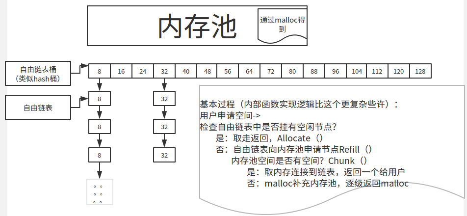
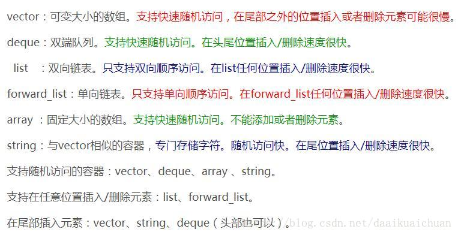
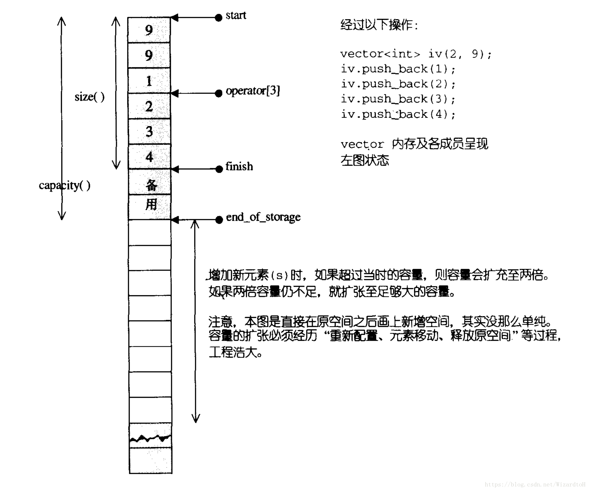
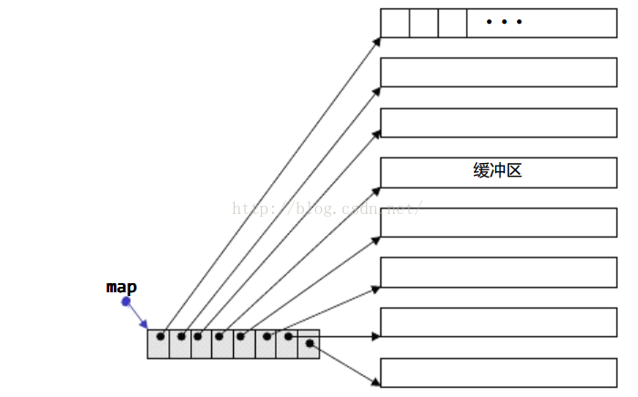
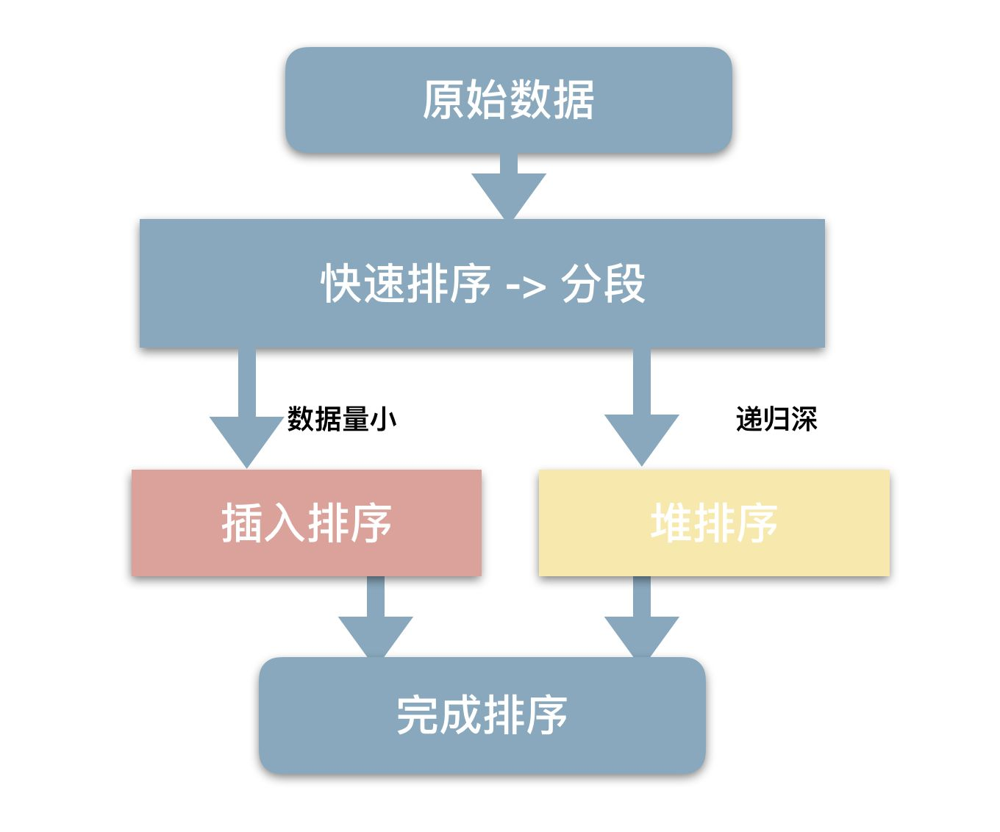

<!-- TOC -->

- [STL的介绍](#stl的介绍)
- [空间配置器详解](#空间配置器详解)
	- [第一级配置器详解](#第一级配置器详解)
	- [第二级空间配置器详解](#第二级空间配置器详解)
	- [空间配置器存在的问题](#空间配置器存在的问题)
- [各种容器的特点和适用情况](#各种容器的特点和适用情况)
- [各种容器的底层机制和常见面试题](#各种容器的底层机制和常见面试题)
	- [vector](#vector)
		- [vector的底层原理](#vector的底层原理)
		- [vector中的reserve和resize的区别](#vector中的reserve和resize的区别)
		- [vector中的size和capacity的区别](#vector中的size和capacity的区别)
		- [vector的元素类型可以是引用吗？](#vector的元素类型可以是引用吗)
		- [vector迭代器失效的情况](#vector迭代器失效的情况)
		- [正确释放vector的内存(clear(), swap(), shrink_to_fit())](#正确释放vector的内存clear-swap-shrink_to_fit)
		- [vector 扩容为什么要以1.5倍或者2倍扩容?](#vector-扩容为什么要以15倍或者2倍扩容)
		- [vector的常用函数](#vector的常用函数)
	- [list](#list)
		- [list的底层原理](#list的底层原理)
		- [list的常用函数](#list的常用函数)
	- [deque](#deque)
		- [deque的底层原理](#deque的底层原理)
		- [什么情况下用vector，什么情况下用list，什么情况下用deque](#什么情况下用vector什么情况下用list什么情况下用deque)
		- [deque的常用函数](#deque的常用函数)
	- [priority_queue](#priority_queue)
		- [priority_queue的底层原理](#priority_queue的底层原理)
		- [priority_queue的常用函数](#priority_queue的常用函数)
	- [map 、set、multiset、multimap](#map-setmultisetmultimap)
		- [map 、set、multiset、multimap的底层原理](#map-setmultisetmultimap的底层原理)
			- [红黑树的特性：](#红黑树的特性)
		- [map 、set、multiset、multimap的特点](#map-setmultisetmultimap的特点)
		- [为何map和set的插入删除效率比其他序列容器高，而且每次insert之后，以前保存的iterator不会失效？](#为何map和set的插入删除效率比其他序列容器高而且每次insert之后以前保存的iterator不会失效)
		- [为何map和set不能像vector一样有个reserve函数来预分配数据?](#为何map和set不能像vector一样有个reserve函数来预分配数据)
		- [map 、set、multiset、multimap的常用函数](#map-setmultisetmultimap的常用函数)
	- [unordered_map、unordered_set](#unordered_mapunordered_set)
		- [unordered_map、unordered_set的底层原理](#unordered_mapunordered_set的底层原理)
		- [哈希表的实现](#哈希表的实现)
		- [unordered_map 与map的区别？使用场景？](#unordered_map-与map的区别使用场景)
		- [unordered_map、unordered_set的常用函数](#unordered_mapunordered_set的常用函数)
- [迭代器](#迭代器)
	- [迭代器的底层机制](#迭代器的底层机制)
	- [迭代器的种类](#迭代器的种类)
	- [迭代器失效的问题](#迭代器失效的问题)
		- [插入操作](#插入操作)
		- [删除操作](#删除操作)
- [STL容器的线程安全性](#stl容器的线程安全性)
	- [线程安全的情况](#线程安全的情况)
	- [线程不安全的情况](#线程不安全的情况)
- [STL算法](#stl算法)
	- [排序算法sort](#排序算法sort)

<!-- /TOC -->
# STL的介绍
Standard Template Library，标准模板库，是C++的标准库之一，一套基于模板的容器类库，还包括许多常用的算法，提高了程序开发效率和复用性。STL包含6大部件：容器、迭代器、算法、仿函数、适配器和空间配置器。
- 容器：容纳一组元素的对象。
- 迭代器：提供一种访问容器中每个元素的方法。
- 函数对象：一个行为类似函数的对象，调用它就像调用函数一样。
- 算法：包括查找算法、排序算法等等。
- 适配器：用来修饰容器等，比如queue和stack，底层借助了deque。
- 空间配置器：负责空间配置和管理。

# 空间配置器详解
对象构造前的空间配置和对象析构后的空间释放，由<stl_alloc.h>负责，SGI对此的设计哲学如下：
- 向system heap要求空间。
- 考虑多线程状态。
- 考虑内存不足时的应变措施。
- 考虑过多“小型区块”可能造成的内存碎片问题。
- 
考虑小型区块造成的内存破碎问题，SGI设计了双层级配置器：
- 第一级直接使用allocate()调用malloc()、deallocate()调用free()，使用类似new_handler机制解决内存不足（抛出异常），配置无法满足的问题（如果在申请动态内存时找不到足够大的内存块，malloc 和new 将返回NULL 指针，宣告内存申请失败）。
- 第二级视情况使用不同的策略，当配置区块大于128bytes时，调用第一级配置器，当配置区块小于128bytes时，采用内存池的整理方式：配置器维护16个（128/8）自由链表，负责16种小型区块的此配置能力。内存池以malloc配置而得，如果内存不足转第一级配置器处理。

## 第一级配置器详解

## 第二级空间配置器详解
第二级空间配置器实际上是一个内存池，维护了16个自由链表。自由链表是一个指针数组，有点类似与hash桶，它的数组大小为16，每个数组元素代表所挂的区块大小，比如free _ list[0]代表下面挂的是8bytes的区块，free _ list[1]代表下面挂的是16bytes的区块…….依次类推，直到free _ list[15]代表下面挂的是128bytes的区块。


## 空间配置器存在的问题
- 自由链表所挂区块都是8的整数倍，因此当我们需要非8倍数的区块，往往会导致浪费。
- 由于配置器的所有方法，成员都是静态的，那么他们就是存放在静态区。释放时机就是程序结束，这样子会导致自由链表一直占用内存，自己进程可以用，其他进程却用不了。

# 各种容器的特点和适用情况


# 各种容器的底层机制和常见面试题
## vector
### vector的底层原理
vector底层是一个动态数组，包含三个迭代器，start和finish之间是已经被使用的空间范围，end_of_storage是整块连续空间包括备用空间的尾部。

当空间不够装下数据（vec.push_back(val)）时，会自动申请另一片更大的空间（1.5倍或者2倍），然后把原来的数据拷贝到新的内存空间，接着释放原来的那片空间【vector内存增长机制】。

当释放或者删除（vec.clear()）里面的数据时，其存储空间不释放，仅仅是清空了里面的数据。

因此，对vector的任何操作一旦引起了空间的重新配置，指向原vector的所有迭代器会都失效了。


### vector中的reserve和resize的区别
reserve是直接扩充到已经确定的大小，可以减少多次开辟、释放空间的问题（优化push_back），就可以提高效率，其次还可以减少多次要拷贝数据的问题。reserve只是保证vector中的空间大小（capacity）最少达到参数所指定的大小n。reserve()只有一个参数。

resize()可以改变有效空间的大小，也有改变默认值的功能。capacity的大小也会随着改变。resize()可以有多个参数。

### vector中的size和capacity的区别
size表示当前vector中有多少个元素（finish - start），而capacity函数则表示它已经分配的内存中可以容纳多少元素（end_of_storage - start）。

### vector的元素类型可以是引用吗？
vector的底层实现要求连续的对象排列，引用并非对象，没有实际地址，因此vector的元素类型不能是引用。

### vector迭代器失效的情况
当插入一个元素到vector中，由于引起了内存重新分配，所以指向原内存的迭代器全部失效。

当删除容器中一个元素后,该迭代器所指向的元素已经被删除，那么也造成迭代器失效。erase方法会返回下一个有效的迭代器，所以当我们要删除某个元素时，需要it=vec.erase(it);。

### 正确释放vector的内存(clear(), swap(), shrink_to_fit())
vec.clear()：清空内容，但是不释放内存。

vector<int>().swap(vec)：清空内容，且释放内存，想得到一个全新的vector。

vec.shrink_to_fit()：请求容器降低其capacity和size匹配。

vec.clear();vec.shrink_to_fit();：清空内容，且释放内存。

### vector 扩容为什么要以1.5倍或者2倍扩容?
根据查阅的资料显示，考虑可能产生的堆空间浪费，成倍增长倍数不能太大，使用较为广泛的扩容方式有两种，以2倍的方式扩容，或者以1.5倍的方式扩容。

以2倍的方式扩容，导致下一次申请的内存必然大于之前分配内存的总和，导致之前分配的内存不能再被使用，所以最好倍增长因子设置为(1,2)之间：

### vector的常用函数
vector<int> vec(10,100);        创建10个元素,每个元素值为100

vec.resize(r,vector<int>(c,0)); 二维数组初始化

reverse(vec.begin(),vec.end())  将元素翻转

sort(vec.begin(),vec.end());    排序，默认升序排列

vec.push_back(val);             尾部插入数字

vec.size();                     向量大小

find(vec.begin(),vec.end(),1);  查找元素

iterator = vec.erase(iterator)  删除元素

## list
### list的底层原理
list的底层是一个双向链表，以结点为单位存放数据，结点的地址在内存中不一定连续，每次插入或删除一个元素，就配置或释放一个元素空间。

list不支持随机存取，如果需要大量的插入和删除，而不关心随即存取

### list的常用函数
list.push_back(elem)	在尾部加入一个数据

list.pop_back()	        删除尾部数据

list.push_front(elem)	在头部插入一个数据

list.pop_front()	    删除头部数据

list.size()	            返回容器中实际数据的个数

list.sort()             排序，默认由小到大 

list.unique()           移除数值相同的连续元素

list.back()             取尾部迭代器

list.erase(iterator)    删除一个元素，参数是迭代器，返回的是删除迭代器的下一个位置
## deque
### deque的底层原理
deque是一个双向开口的连续线性空间（双端队列），在头尾两端进行元素的插入跟删除操作都有理想的时间复杂度。

### 什么情况下用vector，什么情况下用list，什么情况下用deque
vector可以随机存储元素（即可以通过公式直接计算出元素地址，而不需要挨个查找），但在非尾部插入删除数据时，效率很低，适合对象简单，对象数量变化不大，随机访问频繁。除非必要，我们尽可能选择使用vector而非deque，因为deque的迭代器比vector迭代器复杂很多。

list不支持随机存储，适用于对象大，对象数量变化频繁，插入和删除频繁，比如写多读少的场景。

需要从首尾两端进行插入或删除操作的时候需要选择deque。
### deque的常用函数
deque.push_back(elem)	在尾部加入一个数据。

deque.pop_back()	    删除尾部数据。

deque.push_front(elem)	在头部插入一个数据。

deque.pop_front()	    删除头部数据。

deque.size()	        返回容器中实际数据的个数。

deque.at(idx)	        传回索引idx所指的数据，如果idx越界，抛出out_of_range。

## priority_queue
### priority_queue的底层原理
priority_queue：优先队列，其底层是用堆来实现的。在优先队列中，队首元素一定是当前队列中优先级最高的那一个。
### priority_queue的常用函数
priority_queue<int, vector<int>, greater<int>> pq;   最小堆

priority_queue<int, vector<int>, less<int>> pq;      最大堆

pq.empty()   如果队列为空返回真

pq.pop()     删除对顶元素

pq.push(val) 加入一个元素

pq.size()    返回优先队列中拥有的元素个数

pq.top()     返回优先级最高的元素

## map 、set、multiset、multimap
### map 、set、multiset、multimap的底层原理
map 、set、multiset、multimap的底层实现都是红黑树，epoll模型的底层数据结构也是红黑树，linux系统中CFS进程调度算法，也用到红黑树。

#### 红黑树的特性：
1. 每个结点或是红色或是黑色；
2. 根结点是黑色；
3. 每个叶结点是黑的；
4. 如果一个结点是红的，则它的两个儿子均是黑色；
5. 每个结点到其子孙结点的所有路径上包含相同数目的黑色结点。
对于STL里的map容器，count方法与find方法，都可以用来判断一个key是否出现，mp.count(key) > 0统计的是key出现的次数，因此只能为0/1，而mp.find(key) != mp.end()则表示key存在。
### map 、set、multiset、multimap的特点
set和multiset会根据特定的排序准则自动将元素排序，set中元素不允许重复，multiset可以重复。

map和multimap将key和value组成的pair作为元素，根据key的排序准则自动将元素排序（因为红黑树也是二叉搜索树，所以map默认是按key排序的），map中元素的key不允许重复，multimap可以重复。

map和set的增删改查速度为都是logn，是比较高效的。
### 为何map和set的插入删除效率比其他序列容器高，而且每次insert之后，以前保存的iterator不会失效？
因为存储的是结点，不需要内存拷贝和内存移动。

因为插入操作只是结点指针换来换去，结点内存没有改变。而iterator就像指向结点的指针，内存没变，指向内存的指针也不会变。

### 为何map和set不能像vector一样有个reserve函数来预分配数据?
因为在map和set内部存储的已经不是元素本身了，而是包含元素的结点。也就是说map内部使用的Alloc并不是map<Key, Data, Compare, Alloc>声明的时候从参数中传入的Alloc。
### map 、set、multiset、multimap的常用函数
it map.begin()         返回指向容器起始位置的迭代器（iterator） 

it map.end()             返回指向容器末尾位置的迭代器 

bool map.empty()         若容器为空，则返回true，否则false

it map.find(k)           寻找键值为k的元素，并用返回其地址

int map.size()           返回map中已存在元素的数量
```c++
map.insert({int,string}) 插入元素
for (itor = map.begin(); itor != map.end();)
{
    if (itor->second == "target")
        map.erase(itor++) ; // erase之后，令当前迭代器指向其后继。
    else
        ++itor;
}
```
## unordered_map、unordered_set
### unordered_map、unordered_set的底层原理
unordered_map的底层是一个防冗余的哈希表（采用除留余数法）。哈希表最大的优点，就是把数据的存储和查找消耗的时间大大降低，时间复杂度为O(1)；而代价仅仅是消耗比较多的内存。

使用一个下标范围比较大的数组来存储元素。可以设计一个函数（哈希函数（一般使用除留取余法），也叫做散列函数），使得每个元素的key都与一个函数值（即数组下标，hash值）相对应，于是用这个数组单元来存储这个元素；也可以简单的理解为，按照key为每一个元素“分类”，然后将这个元素存储在相应“类”所对应的地方，称为桶。
但是，不能够保证每个元素的key与函数值是一一对应的，因此极有可能出现对于不同的元素，却计算出了相同的函数值，这样就产生了“冲突”，换句话说，就是把不同的元素分在了相同的“类”之中。 一般可采用拉链法解决冲突：

### 哈希表的实现
```c++
#include <iostream>
#include <vector>
#include <list>
#include <random>
#include <ctime>
using namespace std;
const int hashsize = 12;
//定一个节点的结构体
template <typename T, typename U>
struct HashNode 
{
    T _key;
    U _value;
};
//使用拉链法实现哈希表类
template <typename T, typename U>
class HashTable
{
public:
    HashTable() : vec(hashsize) {}//类中的容器需要通过构造函数来指定大小
    ~HashTable() {}
    bool insert_data(const T &key, const U &value);
    int hash(const T &key);
    bool hash_find(const T &key);
private:
    vector<list<HashNode<T, U>>> vec;//将节点存储到容器中
};
//哈希函数（除留取余）
template <typename T, typename U>
int HashTable<T, U>::hash(const T &key)
{
    return key % 13;
}
//哈希查找
template <typename T, typename U>
bool HashTable<T, U>::hash_find(const T &key)
{
    int index = hash(key);//计算哈希值
    for (auto it = vec[index].begin(); it != vec[index].end(); ++it)
    {
        if (key == it -> _key)//如果找到则打印其关联值
        {
            cout << it->_value << endl;//输出数据前应该确认是否包含相应类型
            return true;
        }
    }
    return false;
}
//插入数据
template <typename T, typename U>
bool HashTable<T, U>::insert_data(const T &key, const U &value)
{
    //初始化数据
    HashNode<T, U> node;
    node._key = key;
    node._value = value;
    for (int i = 0; i < hashsize; ++i)
    {
        if (i == hash(key))//如果溢出则把相应的键值添加进链表
        {
            vec[i].push_back(node);
            return true;
        }
    }
}
int main(int argc, char const *argv[])
{
    HashTable<int, int> ht;
    static default_random_engine e;
    static uniform_int_distribution<unsigned> u(0, 100);
    long long int a = 10000000;
    for (long long int i = 0; i < a; ++i)
        ht.insert_data(i, u(e));
    clock_t start_time = clock();
    ht.hash_find(114);
    clock_t end_time = clock();
    cout << "Running time is: " << static_cast<double>(end_time - start_time) / CLOCKS_PER_SEC * 1000 <<
        "ms" << endl;//输出运行时间。
    system("pause");
    system("pause");
    return 0;
}
```
### unordered_map 与map的区别？使用场景？
构造函数：unordered_map 需要hash函数，等于函数;map只需要比较函数(小于函数).
存储结构：unordered_map 采用hash表存储，map一般采用红黑树(RB Tree) 实现。因此其memory数据结构是不一样的。

总体来说，unordered_map 查找速度会比map快，而且查找速度基本和数据数据量大小，属于常数级别;而map的查找速度是log(n)级别。并不一定常数就比log(n)小，hash还有hash函数的耗时，明白了吧，如果你考虑效率，特别是在元素达到一定数量级时，考虑考虑unordered_map 。但若你对内存使用特别严格，希望程序尽可能少消耗内存，那么一定要小心，unordered_map 可能会让你陷入尴尬，特别是当你的unordered_map 对象特别多时，你就更无法控制了，而且unordered_map 的构造速度较慢。

### unordered_map、unordered_set的常用函数
unordered_map.begin()   返回指向容器起始位置的迭代器（iterator） 

unordered_map.end()     返回指向容器末尾位置的迭代器 

unordered_map.cbegin()    返回指向容器起始位置的常迭代器（const_iterator） 

unordered_map.cend()    返回指向容器末尾位置的常迭代器 

unordered_map.size()    返回有效元素个数 

unordered_map.insert(key)  插入元素 

unordered_map.find(key) 查找元素，返回迭代器

unordered_map.count(key) 返回匹配给定主键的元素的个数 

# 迭代器
## 迭代器的底层机制
1、迭代器的底层原理
迭代器是连接容器和算法的一种重要桥梁，通过迭代器可以在不了解容器内部原理的情况下遍历容器。它的底层实现包含两个重要的部分：萃取技术和模板偏特化。

萃取技术（traits）可以进行类型推导，根据不同类型可以执行不同的处理流程，比如容器是vector，那么traits必须推导出其迭代器类型为随机访问迭代器，而list则为双向迭代器。

例如STL算法库中的distance函数，distance函数接受两个迭代器参数，然后计算他们两者之间的距离。显然对于不同的迭代器计算效率差别很大。比如对于vector容器来说，由于内存是连续分配的，因此指针直接相减即可获得两者的距离；而list容器是链式表，内存一般都不是连续分配，因此只能通过一级一级调用next()或其他函数，每调用一次再判断迭代器是否相等来计算距离。vector迭代器计算distance的效率为O(1),而list则为O(n),n为距离的大小。

使用萃取技术（traits）进行类型推导的过程中会使用到模板偏特化。模板偏特化可以用来推导参数，如果我们自定义了多个类型，除非我们把这些自定义类型的特化版本写出来，否则我们只能判断他们是内置类型，并不能判断他们具体属于是个类型。
```c++
template <typename T>
struct TraitsHelper {
     static const bool isPointer = false;
};
template <typename T>
struct TraitsHelper<T*> {
     static const bool isPointer = true;
};
if (TraitsHelper<T>::isPointer)
     ...... // 可以得出当前类型int*为指针类型
else
     ...... // 可以得出当前类型int非指针类型
```
2、一个理解traits的例子
```c++
// 需要在T为int类型时，Compute方法的参数为int，返回类型也为int，
// 当T为float时，Compute方法的参数为float，返回类型为int
template <typename T>
class Test {
public:
     TraitsHelper<T>::ret_type Compute(TraitsHelper<T>::par_type d);
private:
     T mData;
};
template <typename T>
struct TraitsHelper {
     typedef T ret_type;
     typedef T par_type;
};
// 模板偏特化，处理int类型
template <>
struct TraitsHelper<int> {
     typedef int ret_type;
     typedef int par_type;
};
// 模板偏特化，处理float类型
template <>
struct TraitsHelper<float> {
     typedef float ret_type;
     typedef int par_type;
};
```
当函数，类或者一些封装的通用算法中的某些部分会因为数据类型不同而导致处理或逻辑不同时，traits会是一种很好的解决方案。
## 迭代器的种类
- 输入迭代器：是只读迭代器，在每个被遍历的位置上只能读取一次。例如上面find函数参数就是输入迭代器。
- 输出迭代器：是只写迭代器，在每个被遍历的位置上只能被写一次。
- 前向迭代器：兼具输入和输出迭代器的能力，但是它可以对同一个位置重复进行读和写。但它不支持operator–，所以只能向前移动。
- 双向迭代器：很像前向迭代器，只是它向后移动和向前移动同样容易。
- 随机访问迭代器：有双向迭代器的所有功能。而且，它还提供了“迭代器算术”，即在一步内可以向前或向后跳跃任意位置， 包含指针的所有操作，可进行随机访问，随意移动指定的步数。支持前面四种Iterator的所有操作，并另外支持it + n、it - n、it += n、 it -= n、it1 - it2和it[n]等操作。
## 迭代器失效的问题
### 插入操作
- 对于vector和string，如果容器内存被重新分配，iterators,pointers,references失效；如果没有重新分配，那么插入点之前的iterator有效，插入点之后的iterator失效；
- 对于deque，如果插入点位于除front和back的其它位置，iterators,pointers,references失效；当我们插入元素到front和back时，deque的迭代器失效，但reference和pointers有效；
- 对于list和forward_list，所有的iterator,pointer和refercnce有效。
- 对于unordered_map，由于内部实现是哈希表，如果在插入时引起了rehash就会全部失效
- 对于map，底层实现为红黑树，插入时不受影响
  
### 删除操作
- 对于vector和string，删除点之前的iterators,pointers,references有效；off-the-end迭代器总是失效的；
- 对于deque，如果删除点位于除front和back的其它位置，iterators,pointers,references失效；当我们插入元素到front和back时，off-the-end失效，其他的iterators,pointers,references有效；
- 对于list和forward_list，所有的iterator,pointer和refercnce有效。
- 对于关联容器map来说，如果某一个元素已经被删除，那么其对应的迭代器就失效了，不应该再被使用，否则会导致程序无定义的行为，其他迭代器不受影响。

# STL容器的线程安全性
## 线程安全的情况
- 多个读取者是安全的。多线程可能同时读取一个容器的内容，这将正确地执行。当然，在读取时不能 有任何写入者操作这个容器；
- 对不同容器的多个写入者是安全的。多线程可以同时写不同的容器。
## 线程不安全的情况
- 在对同一个容器进行多线程的读写、写操作时；
- 在每次调用容器的成员函数期间都要锁定该容器；
- 在每个容器返回的迭代器（例如通过调用begin或end）的生存期之内都要锁定该容器；
- 在每个在容器上调用的算法执行期间锁定该容器。

# STL算法
## 排序算法sort
STL的sort算法，数据量大时采用QuickSort快排算法，分段归并排序。一旦分段后的数据量小于某个门槛（16），为避免QuickSort快排的递归调用带来过大的额外负荷，就改用Insertion Sort插入排序。如果递归层次过深，还会改用HeapSort堆排序。
