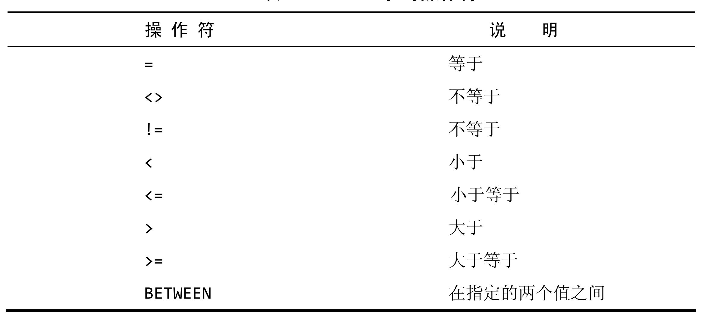
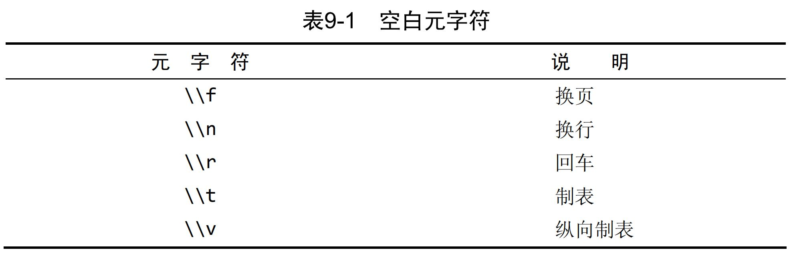
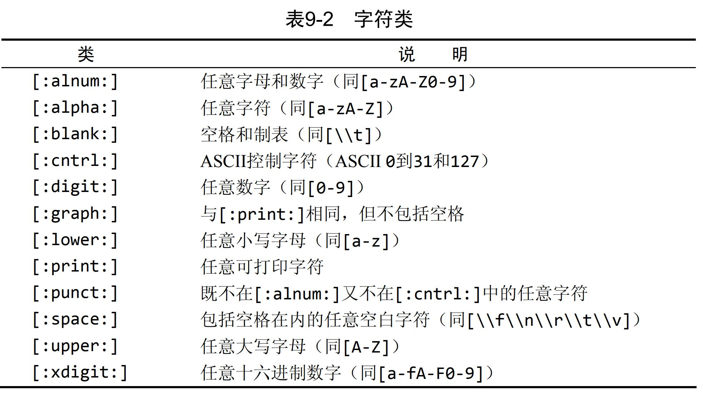
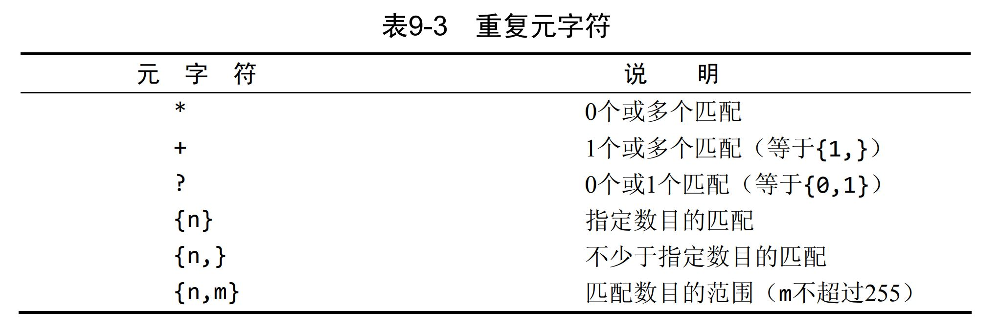
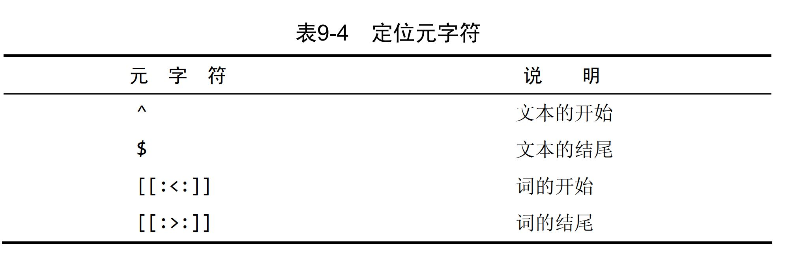
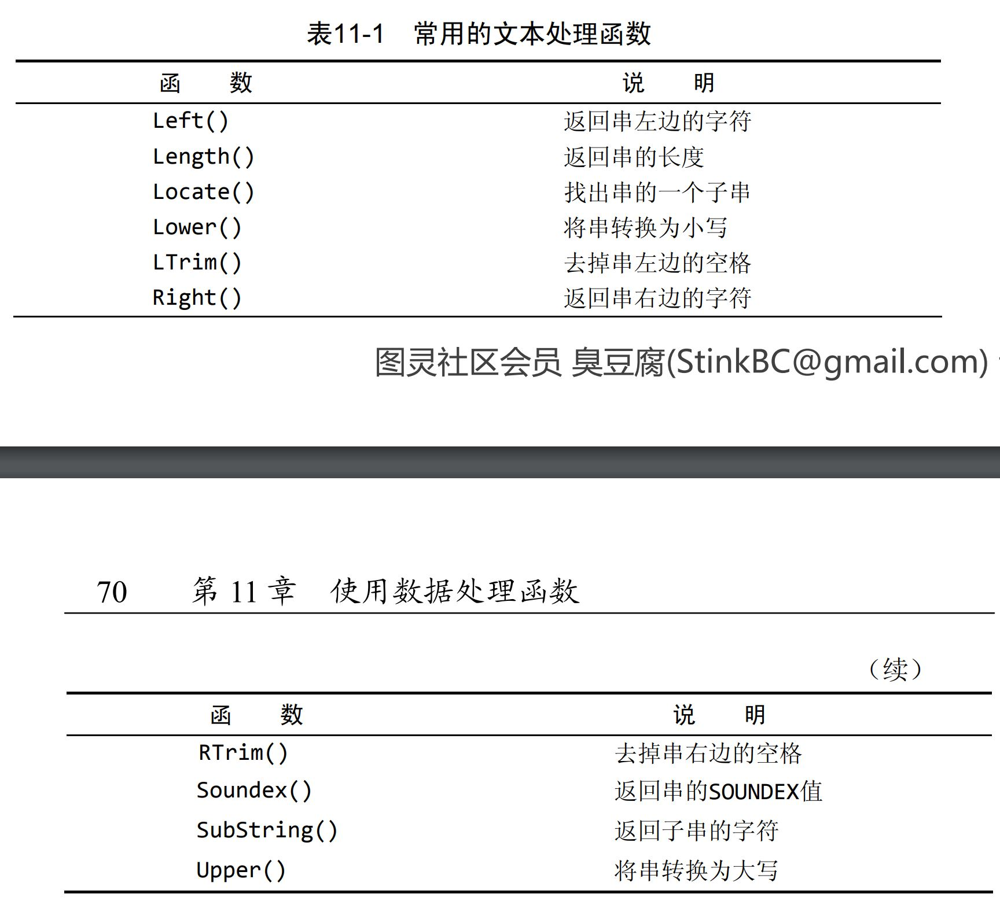
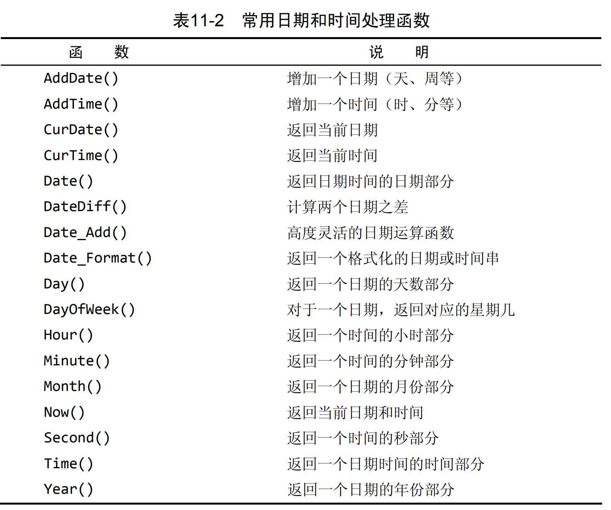
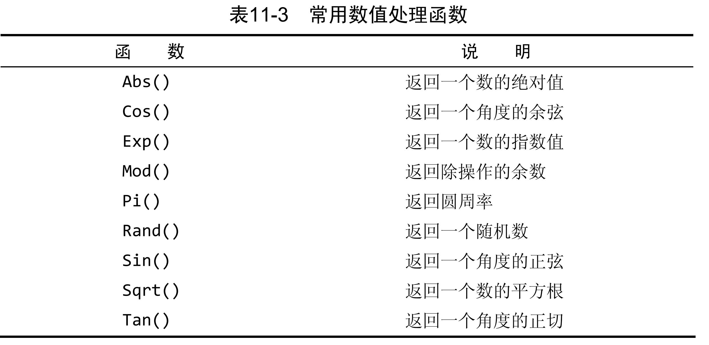
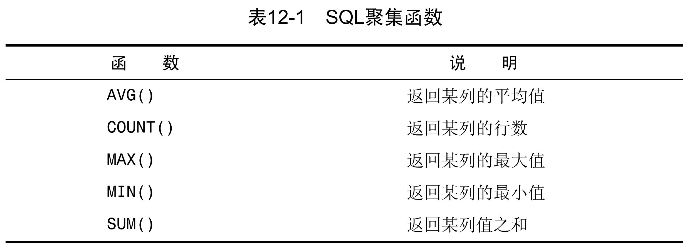
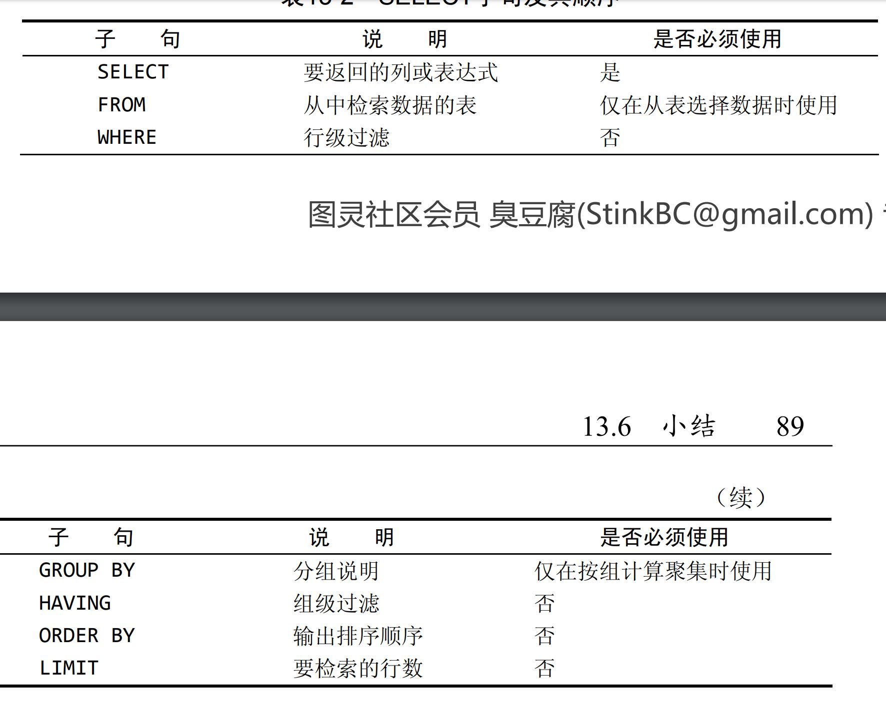

<!--
 * @Author: your name
 * @Date: 2020-06-02 18:57:30
 * @LastEditTime: 2020-06-18 20:30:45
 * @LastEditors: Please set LastEditors
 * @Description: In User Settings Edit
 * @FilePath: \undefinedc:\Users\conan\Desktop\LongTime\StupidBirdFliesFirst\DataBase\MySQL.md
--> 
# SQL基本语句
参考书目：
- 《MySQL必知必会》

## 数据库基础
&emsp;&emsp;数据库是一种以某种有组织的方式存储的数据集合。再简单一点，保存有组织的数据的容器

###
 表
&emsp;&emsp;每一条数据都存在一个文件中，这个文件在数据库领域中称为表。这是一种结构化的文件，可以用来存储特定类型的数据。通俗点来说，就像是excel里的表格。

&emsp;&emsp;表只能存放一类数据，不应该将不同的数据放在一个表中存储。

&emsp;&emsp;每个表有一个表名，同一个数据库中不允许有两个表名相同。

### 模式
&emsp;&emsp;模式表示表中的一些特性，它们定义了在表中该如何存储，可以存什么数据，各部分如何命名等。

### 列
&emsp;&emsp;每个表都是一列一列组成的，跟excel中的列相似，每一列存的都应该是相同的数据类型，另外每个表所能容许的数据类型不一定一样

### 行
&emsp;&emsp;代表每一个个体。

### 主键
&emsp;&emsp;所谓主键就是代表每一行的一个ID，用于唯一标识每行，一般会存在第一列。例如一张表存的是班级里所有学生的联系方式，第一列存的是每个人的名字，这时每个名字就是每一行的主键。

&emsp;&emsp;当然理论上任意一列都可以是主键，只要满足：
- 任意两行主键值都不相同
- 不能有哪个主键值是NULL

也可以把多个列作为主键，上述条件必须应用到构成主键的所有列，所有列值组合必须唯一。

&emsp;&emsp;主键非常重要，所以需要遵循以下几个原则：
- 不更新主键中的值
- 不重用主键中的值
- 不在主键中存将会被更改的值

## MySQL
&emsp;&emsp;数据库的所有存储、检索、管理和处理都是由数据库软件（DBMS）来实现的，MySQL就是其中一种。

&emsp;&emsp;一般来说DBMS分为两类，一种是基于共享文件系统，例如Access，用于桌面用途，不用于高端或者关键应用；另一种是基于客户机-服务器的数据库，例如MySQL，Oracle等。

## SQL基本语句
&emsp;&emsp;SQL是结构化查询语言，是一种专门用来和数据库通信的语言。

### 连接
&emsp;&emsp;数据库的连接与连接服务器相似，需要指定IP地址和端口，以及用户名和密码。

### 选择数据库
&emsp;&emsp;使用USE关键字，例如需要使用一个叫wells的数据库：
```
USE wells
```
这时就将当前数据库切换到了wells，在进行操作之前一定要有这一步。

### 数据库列表
&emsp;&emsp;显示所有的数据库：
```
SHOW DATABASES
```

### 当前数据库内可用的表
```
SHOW TABLES
```
返回当前数据库内所有可用的表。

### 某个表内的列
```
SHOW COLUMNS FROM wellst
```
将会返回wellst这个表中所有的列，并且有它们的类型，是否允许NULL，键信息，默认值等信息。也可以使用：
```
DESCRIBE wellst
```
效果相同。

### SHOW的其他命令
```
SHOW STATUS //显示服务器信息
SHOW CREATE DATABASE
SHOW CREATE TABLE //显示用于创建特定数据库或表的语句
SHOW GRANTS //显示授予用户的权限
SHOW ERRORS
SHOW WARNING //显示服务器错误或者警告
```

### 检索数据
#### 检索单个列
```
SELECT name FROM wells
```
表示利用SELECT语句从wells的表中检索一个叫name的列，这时会返回此列所有的数据。注意这时的数据如果没有明确排序查询结果则乱序排列。另外命令本身可以空行，所以上述命令也可以表示成：
```
SELECT name 
FROM wells
```

#### 检索多个列
```
SELECT name, age, gender
FROM wells
```

#### 检索所有列
```
SELECT *
FROM wells
```
这里使用通配符*来表示wells表中的所有列。

#### 检索数值不同的行
&emsp;&emsp;以上检索都会把整列数据中每一行都显示出来，但是比如说一群人的年龄有很多数值相同的，现在想要返回不同的所有值，可以使用DIDTINCT命令：
```
SELECT DISTINCT age
FROM wells
```
假如DISTINCT后面跟了多个列的话，那么会将所有不同的组合全部列出来。

#### 限制结果
&emsp;&emsp;可以使用LIMIT命令来限制返回的数量：
```
SELECT name 
FROM wells
LIMIT 5
```
表示返回前5行；
```
SELECT name 
FROM wells
LIMIT 5，15
```
表示返回从第5行开始的15行（从第0行开始）。如果超出了总行数不会报错，有多少行返回多少行

#### 使用完全限定的表名
```
SELECT wells.name 
FROM data.wells
```

以上语句中，SELECT是一个主句，FROM是一个子句

### 数据排序
#### 数据排序
&emsp;&emsp;可以使用SELECT的子句ORDER BY命令来给返回的列排序：
```
SELECT name 
FROM wells
ORDER BY name
```
即使用名字的字母顺序排序，可以以其他的列为基准进行排序。

#### 按多个列排序
```
SELECT name, age,id
FROM wells
ORDER BY id,name
```
这里表示查询了多个列，返回之后将先按照id的顺序进行排序，id相同的再按照name的顺序排序，总之排序顺序和语句的顺序是相对应的。

#### 降序排列
&emsp;&emsp;语句的排序默认是升序排列，如果想要降序排列可以使用DESC语句：
```
SELECT name, age,id
FROM wells
ORDER BY id DESC
```
如果想要升序降序混着用，则可以：
```
SELECT name, age,id
FROM wells
ORDER BY id DESC, name
```
这就是先按照id降序排列，然今相同id的再按照name升序排列。DESC只能用于它前面的那个列，如果多个列都要降序排列的话那就必须都写上DESC。

与DESC相反的是ASC，但是它没什么用，因为默认就是升序排列。

以下命令可以找出年龄最大的人：
```
SELECT name, age,id
FROM wells
ORDER BY age DESC
LIMIT 1
```

### 过滤数据
#### 使用WHERE子句
&emsp;&emsp;WHERE子句可以指定搜索条件进行过滤，在表名之后给出：
```
SELECT name, age,id
FROM wells
WHERE age=10
```
即只返回age为10的行。

在同时使用ORDER BY和WHERE子句时，应该让ORDER BY位于WHERE之后，否则将会产生错误。

#### WHERE子句的操作符


#### 空值检查
&emsp;&emsp;空值表示当前位置没有存任何值，它与0、空字符、空格都不一样，是真的什么都没有，用NULL表示：
```
SELECT name
FROM wells
WHERE age IS NULL
```
操作符中的等于和不等于操作符都不会匹配到NULL的值。

#### AND操作符
&emsp;&emsp;WHERE还可以写出很多复杂的查询语句，例如加上逻辑操作符：
```
SELECT name, age,id
FROM wells
WHERE age=10 AND id<10
```
AND就是逻辑与，表示返回age=10且id<10的行。

#### OR操作符
```
SELECT name, age,id
FROM wells
WHERE age=10 OR id<10
```
OR就是逻辑或，表示返回age=10或者id<10的行。

#### 计算次序
&emsp;&emsp;WHRER中可以包含任意数目的AND和OR操作符，但是它们的计算顺序是不一样的，通常sql会先计算AND，再计算OR，所以如果要自己指定先算什么的话要用括号：
```
SELECT name, age,id
FROM wells
WHERE (age=10 OR id<10) AND name='musk' //另外这种查询是否相等的操作符在字符上不区分大小写
```

#### IN操作符
&emsp;&emsp;IN操作符用来指定条件范围，范围中的每个条件都可以进行匹配。IN取合法值的由逗号分隔的清单，全都括在圆括号中：
```
SELECT name, age,id
FROM wells
WHERE id IN (1,2,3)
```
意思就是把id等于1，2和3的行都挑出来，其实跟OR是一样的

#### NOT操作符
&emsp;&emsp;NOT就是逻辑中的非，用来否定后面跟的条件：
```
SELECT name, age,id
FROM wells
WHERE id NOT IN (1,2,3)
```
就是把id不等于1，2和3的行都挑出来

### 通配符过滤
&emsp;&emsp;在搜索子句中使用通配符，必须使用LIKE操作符。LIKE指示MySQL，后跟的搜索模式利用通配符匹配而不是直接相等匹配进行比较。
#### %通配符
&emsp;&emsp;%表示任何字符出现任意次数：
```
SELECT name, age,id
FROM wells
WHERE name LIKE 'Jake%'
```
表示找出所有name以Jake开头的行，%告诉MySQL接受Jake之后的任意字符，不管它有多少字符。

如果只是想找name中带有Jake的，可以在Jake前也加上%：
```
SELECT name, age,id
FROM wells
WHERE name LIKE '%Jake%'
```
表示匹配任何位置包含文本anvil的值，而不论它之前或之后出现什么字符。

另外%不能匹配到NULL

#### _通配符
&emsp;&emsp;作用与%一样，但是_只能匹配单个字符，而%可以匹配多个多个字符

### 正则表达式进行搜索
&emsp;&emsp;正则表达式是用来匹配文本的特殊的串（字符集合）。如果你想从一个文本文件中提取电话号码，可以使用正则表达式。如果你需要查找名字中间有数字的所有文件，可以使用一个正则表达式。如果你想在一个文本块中找到所有重复的单词，可以使用一个正则表达式。如果你想替换一个页面中的所有URL为这些URL的实际HTML链接，也可以使用一个正则表达式（对于最后这个例子，或者是两个正则表达式）。

在WHERE中加入REGEXP表示后面跟的东西作为正则表达式：
```
SELECT name
FROM wells
WHERE name REGEXP '1000'
```
这条语句将返回name列中所有值中带有1000的行。这与上面的LIKE语句非常相似，但是LIKE在加上通配符的基础上才能表示“值中带有这一部分”的含义，而正则表达式则直接写上就可以。

另外还有一种例子：
```
SELECT name
FROM wells
WHERE name REGEXP '.000'
```
这其中的.就是正则表达式中的一个特殊字符，表示匹配任意一个字符，所以这条语句执行的时候值中带有1000或2000或3000的都会被返回。

#### OR匹配
&emsp;&emsp;正则表达式中的OR操作用|来表示：
```
SELECT name
FROM wells
WHERE name REGEXP '1000|2000'
```
这样的正则表达式表示匹配其中之一，所以凡是值中带有1000或者2000的行都会被返回。

#### 匹配几个字符之一
&emsp;&emsp;以上可以知道在正则表达式中可以用.来匹配任意字符，那假如不想匹配任意的，只想匹配几中字符中的一个，可以这样写：
```
SELECT name
FROM wells
WHERE name REGEXP '[123] Ton'
```
这里的[123]定义了一组用来匹配的字符，表示只能匹配里面的1或者2或者3，也就是说最终会返回带有1 Ton或2 Ton或3 Ton的值得行。

这其实也是另一种形式得OR。

#### 匹配范围
&emsp;&emsp;就像上面的例子，可以改写成以下形式：
```
SELECT name
FROM wells
WHERE name REGEXP '[1-3] Ton'
```
这就表示匹配一个1到3的范围，也可以写[a-z]来表示匹配字母的范围。

#### 匹配特殊字符
&emsp;&emsp;以上已经说明了几种特殊字符：.|[]-等，那么假如我们就是想匹配带有这些特殊字符的行，这时需要在特殊符号前面加上\\\：
```
SELECT name
FROM wells
WHERE name REGEXP '\\.'
```
这样就可以返回值中带有.的行。\\\也可以用来引用元字符：


#### 匹配字符类
&emsp;&emsp;在匹配中为了简化，语句中预设了一些字符集，在写正则表达式时可以直接使用：


#### 匹配多个实例
&emsp;&emsp;目前为止使用的所有正则表达式都试图匹配单次出现。如果存在一个匹配，该行被检索出来，如果不存在，检索不出任何行。但有时需要对匹配的数目进行更强的控制。例如，你可能需要寻找所有的数，不管数中包含多少数字，或者你可能想寻找一个单词并且还能够适应一个尾随的s（如果存在），等等。正则表达式中可以使用元字符来完成：

例如：
```
SELECT name
FROM wells
WHERE name REGEXP '\\([0-9] sticks?\\)'
```
返回的结果为:
```
+--------------+
|     name     |
+--------------+
|TNT (1 stick) |
|TNT (5 sticks)|
+--------------+
```

又例如：
```
SELECT name
FROM wells
WHERE name REGEXP '[[:digit:]]{4}'
```
返回结果：
```
+--------------+
|     name     |
+--------------+
|JetPack 1000  |
|JetPack 2000  |
+--------------+
```
这句话中的[:digit:]匹配任意数字，因而它为数字的一个集合。{4}确切地要求它前面的字符（任意数字）出现4次，所以[[:digit:]]{4}匹配连在一起的任意4位数字。

#### 定位符
&emsp;&emsp;目前为止的所有例子都是匹配一个串中任意位置的文本。为了匹配特定位置的文本，需要使用表9-4列出的定位符：

例如，如果你想找出以一个数（包括以小数点开始的数）开始的所有产品，怎么办？简单搜索[0-9\\.]（或[[:digit:]\\.]）不行，因为它将在文本内任意位置查找匹配。解决办法是使用^定位符，如下所示：、
```
SELECT name
FROM wells
WHERE name REGEXP '^[0-9\\.]'
```
这表示只有.或者任意数字出现在值的第一个字符时才返回它们

### 计算字段
&emsp;&emsp;大部分情况下存储在数据库中的数据都不是我们直接想要的，基本都需要经过一些字符串上的处理或者数值上的计算才能用，因此就需要在SQL的命令中写出特定的计算或处理过程。

#### 拼接字段
&emsp;&emsp;例如数据库中的两列存着姓名和国籍，但是用的时候希望它们俩能拼接成一个字符串输出，此时可以这么写：
```
SELECT Concat(name, '(', country, ')')
FROM wells
```
返回值为：
```
+-------------------------------+
|Concat(name, '(', country, ')')|
+-------------------------------+
|ACME(USA)                      |
|Jale(AUS)                      |
|LT(CHA)                        |
+-------------------------------+
```
Concat()可以把多个串连接起来形成一个较长的串。需要一个或多个指定的列明或者字符串，各个串之间用逗号分隔。

#### 使用别名
&emsp;&emsp;以上拼接语句拼接出的结果仅仅能够显示而已，并不能将它作为一个新的列，此时可以利用别名使它变成一个新列：
```
SELECT Concat(name, '(', country, ')') AS title
FROM wells
```
这里就是将拼接之后的值存在了一个叫title的新列中，任何客户机应用都可以按名引用这个列。

#### 执行算术计算
&emsp;&emsp;计算字段的另一常见用途是对检索出的数据进行算术计算：
```
SELECT quantity, item_price, quantity*item_price AS price
FROM wells
```
返回的结果为：
```
+-------------------------------+
|quantity  |item_price  |price  |
+-------------------------------+
|10        |5.99        |59.90  |
|3         |9.99        |29.97  |
+-------------------------------+
```
可以看出同时显示出了两列相乘的结果。

### 使用数据处理函数
&emsp;&emsp;sql中预先定义好了一些用来处理值的函数
#### 文本处理函数
&emsp;&emsp;Upper()函数：
```
SELECT Upper(name) AS uname
FROM wells
```
作用是将字符全部变成大写。

还有其他的文本处理函数，这里不作一一介绍，用法与Upper相同：

SOUNDEX需要做进一步的解释。SOUNDEX是一个将任何文本串转换为描述其语音表示的字母数字模式的算法。SOUNDEX考虑了类似的发音字符和音节，使得能对串进行发音比较而不是字母比较。

#### 日期和时间处理函数
&emsp;&emsp;首先，MySQL的数据库中采用不同的数据类型存储日期或者时间：
|  数据类型   | 存储格式  |
|  ----  | ----  |
| DATA  | yyyy-mm-dd |
| TIME  | HH:MM:SS |
| DATETIME  | YYYY-MM-DD HH:MM:SS |
日期和时间的处理函数可以用来处理这些数据：

例如想要查2005年9月的所有数据，可以这样写：
```
SELECT id, num
FROM wells
WHERE Date(date) BETWEEN '2005-09-01' AND '2005-09-30'
```
其中的BETWEEN操作符可以把后面的两个日期定义为一个要匹配的范围

#### 数值处理函数
&emsp;&emsp;数值处理函数仅处理数值数据。这些函数一般主要用于代数、三角或几何运算，因此没有串或日期—时间处理函数的使用那么频繁。


### 汇总数据
#### 聚集函数
&emsp;&emsp;我们经常需要汇总数据而不用把它们实际检索出来，为此MySQL提供了专门的函数。使用这些函数，MySQL查询可用于检索数据，以便分析和报表生成。这种类型的检索例子有以下几种。
-  确定表中行数（或者满足某个条件或包含某个特定值的行数）
-  获得表中行组的和
-  找出表列（或所有行或某些特定的行）的最大值、最小值和平均值。

上述例子都需要对表中数据（而不是实际数据本身）汇总。为方便这种类型的检索，MySQL给出了5个聚集函数，见表12-1。这些函数能进行上述罗列的检索。

##### 平均值
例如求某列的平均值：
```
SELECT AVG(price) AS avg_price
FROM wells
WHERE id=1
```
这就是返回所有id为1的行的价格的平均值

##### 计数
COUNT()函数进行计数。有两种使用方式：
- 使用COUNT(*)对表中行的数目进行计数，不管列中包含的是空值还是非空值
- 使用COUNT(column)对特定列中具有值的行进行计数

#### 据集不同值
&emsp;&emsp;MySQL5之后的版本中，使用DISTINCT可以在函数计算的时候只考虑不同的值：
```
SELECT AVG(DISTINCT price) AS avg_price
FROM wells
WHERE id=1
```

#### 组合聚集函数
&emsp;&emsp;可以根据需要包含多个聚集函数：
```
SELECT AVG(DISTINCT price) AS avg_price,
       MAX(price) AS max_price
FROM wells 
WHERE id=1
```

### 分组数据
#### 数据分组
&emsp;&emsp;以上的聚合可以进行一些统计功能，但是只能返回某一列或者某几列的统计数据。假如现在想要这种统计：每一种不同的id分别都有多少行，如果需要这种数据，可以这么写：
```
SELECT id, COUNT(*) AS nums
FROM wells
GROUP BY id
```
GROUP BY子句指示MySQL按id排序并分组数据，id相同的就是一组。这使得对每个id进行统计而不是对整个表计算一次。

GROUP BY的一些规定：
- GROUP BY子句可以包含任意数目的列。这使得能对分组进行嵌套，为数据分组提供更细致的控制。
- 如果在GROUP BY子句中嵌套了分组，数据将在最后规定的分组上进行汇总。换句话说，在建立分组时，指定的所有列都一起计算（所以不能从个别的列取回数据）。
- GROUP BY子句中列出的每个列都必须是检索列或有效的表达式（但不能是聚集函数）。如果在SELECT中使用表达式，则必须在GROUP BY子句中指定相同的表达式。不能使用别名。
- 除聚集计算语句外，SELECT语句中的每个列都必须在GROUP BY子句中给出。
- 如果分组列中具有NULL值，则NULL将作为一个分组返回。如果列中有多行NULL值，它们将分为一组。
- GROUP BY子句必须出现在WHERE子句之后，ORDER BY子句之前。

#### 过滤分组
&emsp;&emsp;除了能用GROUP BY分组数据外，MySQL还允许过滤分组，规定包括哪些分组，排除哪些分组。这里使用HAVING语句：
```
SELECT id, COUNT(*) AS nums
FROM wells
GROUP BY id
HAVING COUNT(*)>=2
```
这时将会只返回总行数大于等于2的分组。

这里的HAVING和WHERE是有去别的，HAVING作用于不同的组，而WHERE作用于行。

### 子查询
子查询中只能返回一个字段的数据。

可以将子查询的结果作为 WHRER 语句的过滤条件：
```
SELECT *
FROM mytable1
WHERE col1 IN (SELECT col2
               FROM mytable2);
```
下面的语句可以检索出客户的订单数量，为了执行这个操作，遵循下面的步骤。
- 从customers表中检索客户列表。
- 对于检索出的每个客户，统计其在orders表中的订单数目。
正如前两章所述，可使用SELECT COUNT(*)对表中的行进行计数，并且通过提供一条WHERE子句来过滤某个特定的客户ID，可仅对该客户的订单进行计数。例如，下面的代码对客户10001的订单进行计数：
```
SELECT COUNT(*)
FROM Orders
WHERE cust_id=10001
```
为了对每个客户执行COUNT(\*)计算，应该将COUNT*)作为一个子查询。请看下面的代码：
```
SELECT cust_name, (SELECT COUNT(*)
                   FROM Orders
                   WHERE Orders.cust_id = Customers.cust_id)
                   AS orders_num
FROM Customers
ORDER BY cust_name;
```
这条SELECT语句对customers表中每个客户返回3列：cust_name、cust_state和orders。orders是一个计算字段，它是由圆括号中的子查询建立的。该子查询对检索出的每个客户执行一次。

#### SELECT子句的顺序
&emsp;&emsp;SELECT所有的子句顺序遵循如下规定：


### 联结表
#### 关系表
&emsp;&emsp;所谓关系表是一种数据存储的方法，例如商铺的发货单，这类数据库中肯定会记载每次发货的商品、时间、收件人等信息，但是每种商品又肯定有很多信息很多属性需要存储，因此应该建立两种表来存储信息，且这两张表是有关系的，所以称之为关系表。

其中的商品表的主键可以存储在发货表中的一列，称之为发货表的外键，这个外键是构建两张表关系的桥梁。

#### 联结
&emsp;&emsp;因为多种数据存储在不同的表中，为了使用单条SELECT语句都能给检索出来，所以要用联结来进行检索。所谓联结就是多个表返回一组输出

#### 创建联结
```
SELECT name,  price
FROM wells, jake
WHERE wells.id=jake.id
```
这里的name和price分别来自wells和jake两张表中（如果重名的话就要用全名称写），WHERE中指定了两张表中的id这一列建立联结，这样一来返回的就是同一表，且wells中的name和jake中的price都是通过id一一对应的。

此外还可以这么写：
```
SELECT name,  price
FROM wells INNER JOIN jake
  ON wells.id=jake.id
```
这里的ON也是FROM的一部分。FROM中的语句表示两个表有联结，ON后面表示这个联结的具体条件。

#### 联结多个表
理论上可以联结的数量没有限制，可以写很多：
```
SELECT name,  price, gender
FROM wells, jake, tom
WHERE wells.id=jake.id
  AND jake.school=gender.school
```

#### 自联结
例如这种情况：你发现某物品（id为DTNTR）存在问题，想知道它的供应商，以及其生产的其他物品是否也存在问题。因此优先需要查到id为DTNTR的物品的所有供应商，再查这些供应商供应的所有物品，可以直接这样写：
```
SELECT prod_id, prod_name
FROM wells
WHERE vend_id=(SELECT vend_id
             FROM wells
             WHERE prod_id='DTNTR')
```
这种方法称为子查询方法，用内部生成的检索结果来确定外部检索的条件。

也可以使用联结查询：
```
SELECT p1.prod_id, p1.prod_name
FROM wells AS p1, wells AS p2
WHERE p1.vend_id=p2.vend_idwells
  AND p2.prod_id='DTNTR'
```
这种情况被称之为自联结，因为此查询中需要的两个表实际上是相同的表。因此wells表在FROM子句中出现了两次。虽然这是完全合法的，但对wells的引用具有二义性，因为MySQL不知道你引用的是wells表中的哪个实例。为解决此问题，使用了表别名。wells的第一次出现为别名p1，第二次出现为别名p2。现在可以将这些别名用作表名。例如，SELECT语句使用p1前缀明确地给出所需列的全名。如果不这样，MySQL将返回错误，因为分别存在两个名为prod_id、prod_name的列。MySQL不知道想要的是哪一个列（即使它们事实上是同一个列）。WHERE（通过匹配p1中的vend_id和p2中的vend_id）首先联结两个表，然后按第二个表中的prod_id过滤数据，返回所需的数据。

#### 自然联结
自然连接是把同名列通过等值测试连接起来的，同名列可以有多个。

内连接和自然连接的区别：内连接提供连接的列，而自然连接自动连接所有同名列。
```
SELECT A.value, B.value
FROM tablea AS A NATURAL JOIN tableb AS B;
```

#### 外部联结
上面使用INNER JOIN的被称为内部联结，它可以匹配所有的关联项，但是像那些没有关联项的是不会返回的，如果想返回非关联项，可以使用外部联结：
```
SELECT name,  price
FROM wells LEFT OUTER JOIN jake
  ON wells.id=jake.id
```
OUTER JOIN表示外部联结，但是前面还需有LEFT或者RIGHT指定包括所有行的表，例如这里写的是LEFT，就是说wells.id的表无论有没有关联项都会显示出来，而在jake.id中与之对应的会显示NULL。

### 组合查询
UNION 基本和WHERE的功能一样

使用 UNION 来组合两个查询，如果第一个查询返回 M 行，第二个查询返回 N 行，那么组合查询的结果一般为 M+N 行。

每个查询必须包含相同的列、表达式和聚集函数。

默认会去除相同行，如果需要保留相同行，使用 UNION ALL。

只能包含一个 ORDER BY 子句，并且必须位于语句的最后。
```
SELECT col
FROM mytable
WHERE col = 1
UNION
SELECT col
FROM mytable
WHERE col =2;
```

### 全文本搜索
在索引之后，SELECT可与Match()和Against()一起使用以实际执行搜索。需要在创建的时候就允许全文本搜索：
```
CREATE TABLE table_name
(
...
  FULLTEXT(column_name)//指定列，可以是多个列
)
```
为了进行全文本搜索，MySQL根据子句FULLTEXT(column_name)的指示对它进行索引。这里的FULLTEXT索引单个列，如果需要也可以指定多个列。

在进行全文本搜索时，使用Against()和Match()执行全文本搜索，其中Match()指定被搜索的列，Against()指定要使用的搜索表达式：
```
SELECT note_text
FROM productnotes
WHERE Match(note_text) Against('rabbit')
```
此时所有包含rabbit的行都将会返回。

### 插入数据
#### 插入完整一行
```
INSERT INTO wells
VALUES(
  NULL,
  'wells',
  '100',
  NULL
)
```
这里提供的每一个值都将会按照顺序存在wells表的每一列中。因此这种写法必须非常清楚表的每一列内容，写错一列后面就全错了，不是非常安全，所以也可以有如下这种写法：
```
INSERT INTO wells(
  address,
  name,
  price,
  zip,
)
VALUES(
  NULL,
  'wells',
  '100',
  NULL
)
```
也就是说提前指定好该往哪个列中插入数据，然后也是按照指定的顺序写入值。这种时候，没有指定的列（即被认为是不需要插入数据的列）可以省略，但是有条件：
- 该列允许NULL值
- 在表定义中给出默认值。
满足以上任一条件才能省略。

数据库经常被多个客户访问，对处理什么请求以及用什么次序处理进行管理是MySQL的任务。INSERT操作可能很耗时（特别是有很多索引需要更新时），而且它可能降低等待处理的SELECT语句的性能。如果数据检索是最重要的（通常是这样），则你可以通过在INSERT和INTO之间添加关键字LOW_PRIORITY，指示MySQL降低INSERT语句的优先级，如下所示：顺便说一下，这也适用于下一章介绍的UPDATE和DELETE语句。

#### 插入多行
```
INSERT INTO wells(
  name,
  price,
)
VALUES(
  'wells',
  '100'
)
(
  'jake',
  '50;
)
```

#### 插入检索出的数据
```
INSERT INTO wells(
  name,
  price,
)
SELECT name,
      price
FROM jake
```
这种命令的作用其实是在表之间进行迁移，将jake表中的name和price列移到了wells表中。这里两张表的列名不一定非得一样，转移的时候也是按照写的顺序转移的。

#### 将一个表的内同插入到新表
```
CREATE TABLE newtable AS
SELECT * FROM mytable;
```

### 更新和删除数据
#### 更新
```
UPDATE wells
SET email='conan@163.com'
WHERE id=100
```
UPDATE语句总是以要更新的表的名字开始。在此例子中，要更新的表的名字为wells。SET命令用来将新值赋给被更新的列。UPDATE语句以WHERE子句结束，它告诉MySQL更新哪一行。没有WHERE子句，MySQL将会用这个电子邮件地址更新customers表中所有行。

#### 删除
```
DELETE FROM wells
WHERE id=10
```

### 创建表
```
CREATE TABLE mytable (
  # int 类型，不为空，自增
  id INT NOT NULL AUTO_INCREMENT,
  # int 类型，不可为空，默认值为 1，不为空
  col1 INT NOT NULL DEFAULT 1,
  # 变长字符串类型，最长为 45 个字符，可以为空
  col2 VARCHAR(45) NULL,
  # 日期类型，可为空
  col3 DATE NULL,
  # 设置主键为 id
  PRIMARY KEY (`id`));
```
### 修改表
添加列
```
ALTER TABLE mytable
ADD col CHAR(20);
```
删除列
```
ALTER TABLE mytable
DROP COLUMN col;
```
删除表
```
DROP TABLE mytable;
```

### 视图
视图是一种虚拟的表，本身不包含数据，它存在的意义是可以从几张表中提取有用的列并组合在一起，但是这种组合的方式比较像“链表”，只存指针，本身并不包含数据，也不能对进行索引操作。也可以说其本质就是对一张或几张表进行一个特定的SELECT操作。

对视图的操作和对普通表的操作一样。

视图具有如下好处：
- 简化复杂的 SQL 操作，比如复杂的连接；
- 只使用实际表的一部分数据；
- 通过只给用户访问视图的权限，保证数据的安全性；
- 更改数据格式和表示。

创建视图：
```
CREATE VIEW myview AS
SELECT Concat(col1, col2) AS concat_col, col3*col4 AS compute_col
FROM mytable
WHERE col5 = val;
```

#### 更新视图
迄今为止的所有视图都是和SELECT语句使用的。然而，视图的数据能否更新？答案视情况而定。

通常，视图是可更新的（即，可以对它们使用INSERT、UPDATE和DELETE）。更新一个视图将更新其基表（可以回忆一下，视图本身没有数据）。如果你对视图增加或删除行，实际上是对其基表增加或删除行。

但是，并非所有视图都是可更新的。基本上可以说，如果MySQL不能正确地确定被更新的基数据，则不允许更新（包括插入和删除）。这实际上意味着，如果视图定义中有以下操作，则不能进行视图的更新：
- 分组（使用GROUP BY和HAVING）；
- 联结
- 子查询
- 并
- 聚集函数（Min，Count，Sum等）
- DISTINCT；
- 导出（计算）列

换句话说，本章许多例子中的视图都是不可更新的。这听上去好像是一个严重的限制，但实际上不是，因为视图主要用于数据检索。

### 使用存储过程
之前的所有的SQL语句都是针对一个或几个表的单条语句，但是很多时候可能一个操作需要很多条语句才能完成，这时可以把很多句语句写到一个存储过程中，这样就能通过一个语句直接运行它。

从以上描述来说存储过程其实和编程语言中的函数差不多，与前面讲过SQL语言中的函数相比，本质上他们也没区别。只是函数只能返回一个变量的限制；而存储过程可以返回多个。函数是可以嵌入在sql中使用的,可以在select中调用，而存储过程不行。函数限制比较多，如不能用临时表，只能用表变量等，而存储过程的限制相对就比较少。此外：
1. 一般来说，存储过程实现的功能要复杂一点，而函数的实现的功能针对性比较强。
2. 当对数据库进行复杂操作时(如对多个表进行Update、Insert、Query、Delete时），可将此复杂操作用存储过程封装起来与数据库提供的事务处理结合一起使用。存储过程可以从自己的存储过程内引用其它存储过程，这可以简化一系列复杂语句.  
3. 存储过程一般是作为一个独立的部分来执行，而函数可以作为查询语句的一个部分来调用，由于函数可以返回一个表对象，因此它可以在查询语句中位于FROM关键字的后面。
4. 存储过程只在创造时进行编译，以后每次执行存储过程都不需再重新编译，而一般SQL语句每执行一次就编译一次,所以使用存储过程可提高数据库执行速度。
5. 存储过程可以接受参数、输出参数、返回单个或多个结果集以及返回值，可以向程序返回错误原因。但函数只能返回一个特定类型的值或者表对象。
6. 存储过程中的CRUD的操作会影响数据库状态，但函数却不能。

使用存储过程的好处有：
- 代码封装，保证了一定的安全性；
- 代码复用
- 由于是预先编译，因此具有很高的性能。

包含 in、out 和 inout 三种参数。

给变量赋值都需要用 select into 语句。

每次只能给一个变量赋值，不支持集合的操作。

#### 创建存储过程和使用
```
CREATE PROCEDURE myprocedure( OUT ret int )
    BEGIN
        DECLARE y int;
        SELECT sum(col1)
        FROM mytable INTO y;
        SELECT y*y INTO ret;
    END 
```
```
CALL myprocedure(@ret);
SELECT @ret;
```

注意，如果是在MySQL的命令行中写命令的话，因为命令行中创建存储过程需要自定义分隔符，而命令行是以 ; 为结束符，而存储过程中也包含了分号，因此会错误把这部分分号当成是结束符，造成语法错误。解决办法是临时更改命令行实用程序的语句分隔符，如下所示：
```
DELIMITER //

CREATE PROCEDURE myprocedure( OUT ret int )
    BEGIN
        DECLARE y int;
        SELECT sum(col1)
        FROM mytable INTO y;
        SELECT y*y INTO ret;
    END //

DELIMITER;
```
其中，DELIMITER //告诉命令行实用程序使用//作为新的语句结束分隔符，可以看到标志存储过程结束的END定义为END//而不是END;。这样，存储过程体内的;仍然保持不动，并且正确地传递给数据库引擎。最后，为恢复为原来的语句分隔符。

#### 删除存储过程
```
DROP PROCEDURE myprocedure;
```

#### 使用参数
可以像编程语言中的函数一样为存储过程设计参数（包括传入和传出），就想前面的OUT ret int，就是声明了一个ret变量，它的类型为int，设定为传出参数，也就是最后的结果。如果想传入参数，可以使用IN，如果想要传入进去然后进行修改再传出，可以使用INOUT（就像c++里的&）。z

在使用传递过程时必须使用在变量前加@，后面在使用这些变量的时候也必须加@。

### 游标
游标比较类似STL中的迭代器，可以对某一组结果集中的每一行进行遍历。

使用游标有四个步骤：
1. 声明游标，这个过程没有实际检索出数据；
2. 打开游标；
3. 取出数据
4. 关闭游标

游标只能在存储过程中使用。

#### 创建游标
游标用DECLARE语句创建：
```
CREATE PROCEDURE processorders()
BEGIN
  DECLARE ordernumbers CURSOR
  FOR
  SELECT order_num FROM orders;
END;
```
DECLARE语句定义了一个叫ordernumbers的游标，并将其用于order_num这个列中。

#### 打开关闭游标
游标用OPEN CURSOR语句来打开：
```
OPEN ordernumbers
```
游标处理完成后需要关闭：
```
CLOSE ordernumbers
```

#### 使用游标数据
在一个游标被打开后，可以使用FETCH语句分别访问它的每一行。FETCH指定检索什么数据（所需的列），检索出来的数据存储在什么地方。它还向前移动游标中的内部行指针，使下一条FETCH语句检索下一行（不重复读取同一行）。

第一个例子从游标中检索单个行（第一行）：
```
CREATE PROCEDURE processorders()
BEGIN
  DECLARE o INT;

  DECLARE ordernumbers CURSOR
  FOR
  SELECT order_num FROM orders;

  OPEN ordernumbers;

  FETCH ordernumbers INTO o;

  CLOSE ordernumbers;
END;
```
其中FETCH用来检索当前行的order_num列（将自动从第一行开始）到一个名为o的局部声明的变量中。对检索出的数据不做任何处理。

在下一个例子中，循环检索数据，从第一行到最后一行：
```
CREATE PROCEDURE processorders()
BEGIN
  DECLARE done BOOLEAN DEFAULT 0;
  DECLARE o INT;

  DECLARE ordernumbers CURSOR
  FOR
  SELECT order_num FROM orders;

  DECLARE CONTINUE HANDLER FOR SQLSTATE '02000' SET done=1;

  OPEN ordernumbers;
  REPEAT

    FETCH ordernumbers INTO o;

  UNTIL done END REPEAT;

  CLOSE ordernumbers
END;
```
与前一个例子一样，这个例子使用FETCH检索当前order_num到声明的名为o的变量中。但与前一个例子不一样的是，这个例子中的FETCH是在REPEAT内，因此它反复执行直到done为真（由UNTILdone END REPEAT;规定）。为使它起作用，用一个DEFAULT 0（假，不结束）定义变量done。那么，done怎样才能在结束时被设置为真呢？答案是用以下语句：
```
DECLARE CONTINUE HANDLER FOR SQLSTATE '02000' SET done=1;
```
这条语句定义了一个CONTINUE HANDLER，它是在条件出现时被执行的代码。这里，它指出当SQLSTATE '02000'出现时，SET done=1。SQLSTATE '02000'是一个未找到条件，或者说是MySQL中定义的一个错误代码，当REPEAT由于没有更多的行供循环而不能继续时，出现这个条件。

### 触发器
触发器就像编程语言中的条件语句（if），当某一个条件达成时就会触发某一个命令。

触发器是MySQL响应以下任意语句而自动执行的一条MySQL语句（或位于BEGIN和END语句之间的一组语句）：
- DELETE；
- INSERT；
- UPDATE。

其他MySQL语句不支持触发器。

#### 创建触发器
触发器用CREATE TRIGGER语句创建。下面是一个简单的例子：
```
CREATE TRIGGER newproduct AFTER INSERT ON products
FOR EACH ROW SELECT 'Product added';
```
这里CREATE TRIGGER用来创建名为newproduct的新触发器。触发器可在一个操作发生之前或之后执行，这里给出了AFTER INSERT，所以此触发器将在INSERT语句成功执行后执行（在前使用BEFORE）。这个触发器还指定FOR EACH ROW，因此代码对每个插入行执行。在这个例子中，文本Product added将对每个插入的行显示一次。

仅支持表 只有表才支持触发器，视图不支持（临时表也不支持）。

触发器按每个表每个事件每次地定义，每个表每个事件每次只允许一个触发器。因此，每个表最多支持6个触发器（每条INSERT、UPDATE和DELETE的之前和之后）。单一触发器不能与多个事件或多个表关联，所以，如果你需要一个对INSERT和UPDATE操作执行的触发器，则应该定义两个触发器。

BEFORE 用于数据验证和净化，AFTER 用于审计跟踪，将修改记录到另外一张表中。

INSERT 触发器包含一个名为 NEW 的虚拟表。
```
CREATE TRIGGER mytrigger AFTER INSERT ON mytable
FOR EACH ROW SELECT NEW.col into @result;

SELECT @result; -- 获取结果
```
DELETE 触发器包含一个名为 OLD 的虚拟表，并且是只读的。

UPDATE 触发器包含一个名为 NEW 和一个名为 OLD 的虚拟表，其中 NEW 是可以被修改的，而 OLD 是只读的。

MySQL 不允许在触发器中使用 CALL 语句，也就是不能调用存储过程。

### 事务管理
所谓事务就是指一组SQL语句，但是他跟存储过程不一样。例如现在有两张表，一张存所有的订单，另一张存每一种商品的信息，两张表应该是有关联的，例如增加订单数据的时候，应该也必须检测商品信息，然后把商品的主键存在订单表中。这几步操作必须全部做完才算完成了一个数据添加过程，万一中间被中断了就会出现问题。所以事务的作用就是保证这一系列的操作全部都能做完，万一出故障了中间哪一步没有完成，也能让整个数据库回退到之前的状态。

在使用事务和事务处理时，有几个关键词汇反复出现。下面是关于事务处理需要知道的几个术语：
- 事务（transaction）指一组SQL语句；
- 回退（rollback）指撤销指定SQL语句的过程；
- 提交（commit）指将未存储的SQL语句结果写入数据库表；
- 保留点（savepoint）指事务处理中设置的临时占位符（placeholder），你可以对它发布回退（与回退整个事务处理不同）。

#### 控制事务处理
MySQL使用下面的语句来标识事务的开始：
```
START TRANSACTION
```

##### ROLLBACK
MySQL的ROLLBACK命令用来回退（撤销）MySQL语句，请看下面的语句：
```
SELECT * FROM ordertotals;
START TRANSACTION;
DELETE FROM ordertotals;
ROLLBACK;
SELECT * FROM ordertotals;
```
这个例子从显示ordertotals表的内容开始。首先执行一条SELECT以显示该表不为空。然后开始一个事务处理，用一条DELETE语句删除ordertotals中的所有行。这时用一条ROLLBACK语句回退START TRANSACTION之后的所有语句，最后一条SELECT语句显示该表不为空。

显然，ROLLBACK只能在一个事务处理内使用（在执行一条START TRANSACTION命令之后）。

##### COMMIT
一般的MySQL语句都是直接针对数据库表执行和编写的。这就是所谓的隐含提交（implicit commit），即提交（写或保存）操作是自动进行的。

但是，在事务处理块中，提交不会隐含地进行。为进行明确的提交，使用COMMIT语句，如下所示：
```
START TRANSACTION;
DELETE FROM orderitems WHERE order_num=20010;
DELETE FROM orders WHERE order_num=20010;
COMMIT;
```
在这个例子中，从系统中完全删除订单20010。因为涉及更新两个数据库表orders和orderItems，所以使用事务处理块来保证订单不被部分删除。最后的COMMIT语句仅在不出错时写出更改。如果第一条DELETE起作用，但第二条失败，则DELETE不会提交（实际上，它是被自动撤销的）。

##### SAVEPOINT
简单的ROLLBACK和COMMIT语句就可以写入或撤销整个事务处理。但是，只是对简单的事务处理才能这样做，更复杂的事务处理可能需要部分提交或回退。

为了支持回退部分事务处理，必须能在事务处理块中合适的位置放置占位符。这样，如果需要回退，可以回退到某个占位符。这些占位符称为保留点。为了创建占位符，可如下使用SAVEPOINT语句：
```
SAVEPOINT deletel;
```
每个保留点都取标识它的唯一名字，以便在回退时，MySQL知道要回退到何处。为了回退到本例给出的保留点，可如下进行：
```
ROLLBACK TO deletel;
```

##### 更改默认的提交行为
正如所述，默认的MySQL行为是自动提交所有更改。换句话说，任何时候你执行一条MySQL语句，该语句实际上都是针对表执行的，而且所做的更改立即生效。为指示MySQL不自动提交更改，需要使用以下语句：
```
SET autocommit=0;
```
autocommit标志决定是否自动提交更改，不管有没有COMMIT语句。设置autocommit为0（假）指示MySQL不自动提交更改（直到autocommit被设置为真为止）。

autocommit标志是针对每个连接而不是服务器的。

### 字符集

基本术语：

- 字符集为字母和符号的集合；
- 编码为某个字符集成员的内部表示；
- 校对字符指定如何比较，主要用于排序和分组。

除了给表指定字符集和校对外，也可以给列指定：

```sql
CREATE TABLE mytable
(col VARCHAR(10) CHARACTER SET latin COLLATE latin1_general_ci )
DEFAULT CHARACTER SET hebrew COLLATE hebrew_general_ci;
```

可以在排序、分组时指定校对：

```sql
SELECT *
FROM mytable
ORDER BY col COLLATE latin1_general_ci;
```

### 权限管理

MySQL 的账户信息保存在 mysql 这个数据库中。

```sql
USE mysql;
SELECT user FROM user;
```

**创建账户**  

新创建的账户没有任何权限。

```sql
CREATE USER myuser IDENTIFIED BY 'mypassword';
```

**修改账户名**  

```sql
RENAME USER myuser TO newuser;
```

**删除账户**  

```sql
DROP USER myuser;
```

**查看权限**  

```sql
SHOW GRANTS FOR myuser;
```

**授予权限**  

账户用 username@host 的形式定义，username@% 使用的是默认主机名。

```sql
GRANT SELECT, INSERT ON mydatabase.* TO myuser;
```

**删除权限**  

GRANT 和 REVOKE 可在几个层次上控制访问权限：

- 整个服务器，使用 GRANT ALL 和 REVOKE ALL；
- 整个数据库，使用 ON database.\*；
- 特定的表，使用 ON database.table；
- 特定的列；
- 特定的存储过程。

```sql
REVOKE SELECT, INSERT ON mydatabase.* FROM myuser;
```

**更改密码**  

必须使用 Password() 函数进行加密。

```sql
SET PASSWROD FOR myuser = Password('new_password');
```