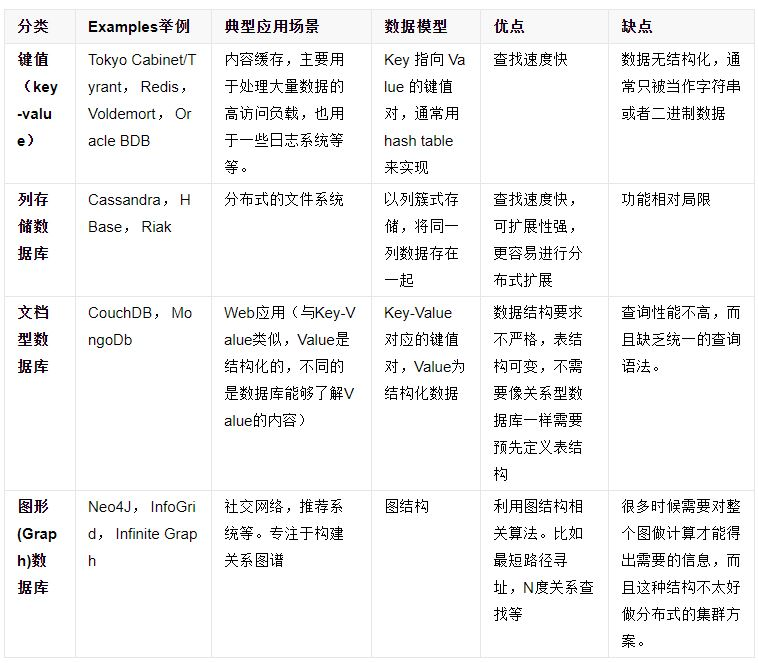

<!--
 * @Author: your name
 * @Date: 2020-05-25 10:30:16
 * @LastEditTime: 2020-05-25 13:18:56
 * @LastEditors: Please set LastEditors
 * @Description: In User Settings Edit
 * @FilePath: \undefinedc:\Users\conan\Desktop\LongTime\StupidBirdFliesFirst\DataBase\redis.md
--> 
# 关系型数据库和非关系型数据库
## 并行与并发
&emsp;&emsp;并行就是有好几个任务，可以同时干，但是是以时分复用的方式去干，并不是真的同时在干，而是在不断地切换。并行则是真正意义上的同时在干。

## 关系型数据库
&emsp;&emsp;关系型数据库指采用了关系模型来组织数据的数据库。关系模型指的就是二维表格模型，而一个关系型数据库就是由二维表及其之间的联系所组成的一个数据组织。

&emsp;&emsp;关系模型中常用的概念：
- 关系：一张二维表，每个关系都具有一个关系名，也就是表名
- 元组：二维表中的一行，在数据库中被称为记录
- 属性：二维表中的一列，在数据库中被称为字段
- 域：属性的取值范围，也就是数据库中某一列的取值限制
- 关键字：一组可以唯一标识元组的属性，数据库中常称为主键，由一个或多个列组成
- 关系模式：指对关系的描述。其格式为：关系名(属性1，属性2， ... ... ，属性N)，在数据库中成为表结构

### 关系型数据库的优点
1. 容易理解：二维表结构是非常贴近逻辑世界的一个概念，关系模型相对网状、层次等其他模型来说更容易理解
2. 使用方便：通用的SQL语言使得操作关系型数据库非常方便
3. 易于维护：丰富的完整性(实体完整性、参照完整性和用户定义的完整性)大大减低了数据冗余和数据不一致的概率

### 关系型数据库的缺点
1. 数据库存在硬盘里，并发性高时，硬盘I/O是一个很大的瓶颈
2. 查询效率低
3. 很难进行扩展。当需要对数据库系统进行升级和扩展时，往往需要停机维护和数据迁移。
4. 性能欠佳。在关系型数据库中，导致性能欠佳的最主要原因是多表的关联查询，以及复杂的数据分析类型的复杂SQL报表查询。为了保证数据库的ACID特性，必须尽量按照其要求的范式进行设计，关系型数据库中的表都是存储一个格式化的数据结构。

|  | 名称 | 描述 |
| ------ | ------ | ------ |
| A | Atomicity(原子性) | 一个事务中的所有操作，要么全部完成，要么全部不完成，不会在中间某个环节结束。事务在执行过程中发生错误，会被回滚到事务开始前的状态，就像这个事务从来没有执行过一样。 |
| C | Consistency一致性 | 在事务开始之前和事务结束以后，数据库数据的一致性约束没有被破坏。 |
| I | Isolation隔离性 | 数据库允许多个并发事务同时对数据进行读写和修改的能力。隔离性可以防止多个事务并发执行时由于交叉执行而导致数据的不一致。|
| D | Durability持久性 | 事务处理结束后，对数据的修改就是永久的，即便系统故障也不会丢失。 |

## 非关系型数据库
&emsp;&emsp;通常写作NoSQL，它的出现了很多关系型数据库的问题，例如由于数据之间无关系，因此易于扩展，同时用于很高的读写性能，总体来说，与关系型数据库相比，它们在架构和数据模型方量面做了“减法”，而在扩展和并发等方面做了“加法”。

### 非关系型数据库的优点
- 扩展方便：例如Cassandra，由于其架构是类似于经典的P2P，所以能通过轻松地添加新的节点来扩展这个集群;
- 快速读写：例如Redis，由于其逻辑简单，而且纯内存操作，使得其性能非常出色，单节点每秒可以处理超过10万次读写操作;
- 查询速度更快
- 成本低，部署简单，基本都是开源软件。

### 非关系型数据库的缺点
- 不提供sql支持，学习和使用成本较高；
- 不能用于持久储存；
- 无事务处理；
- 数据结构相对复杂，复杂查询方面稍欠。

### 非关系型数据库的分类
