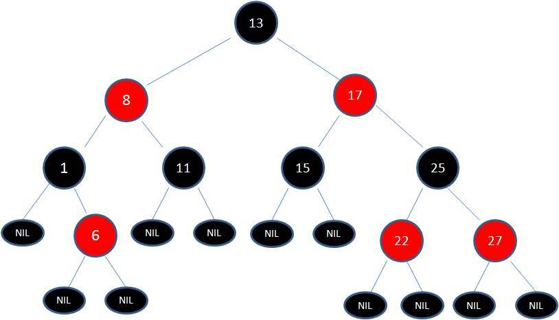
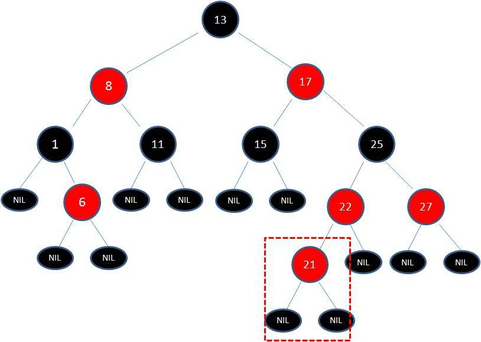
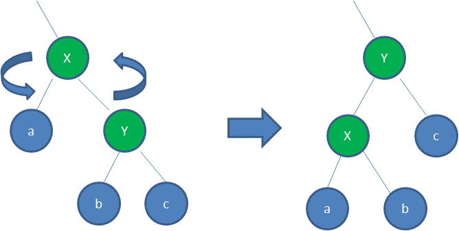
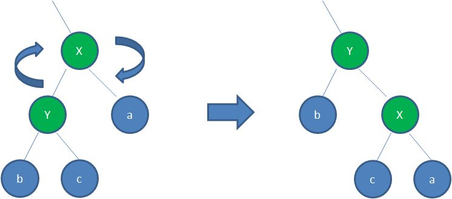
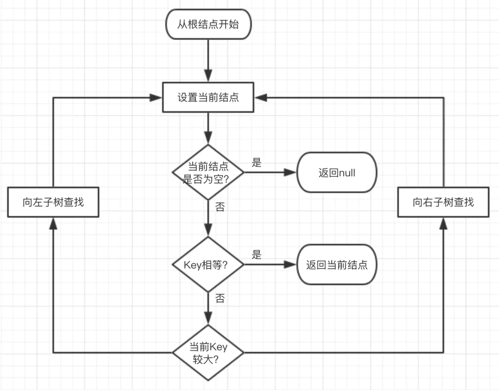
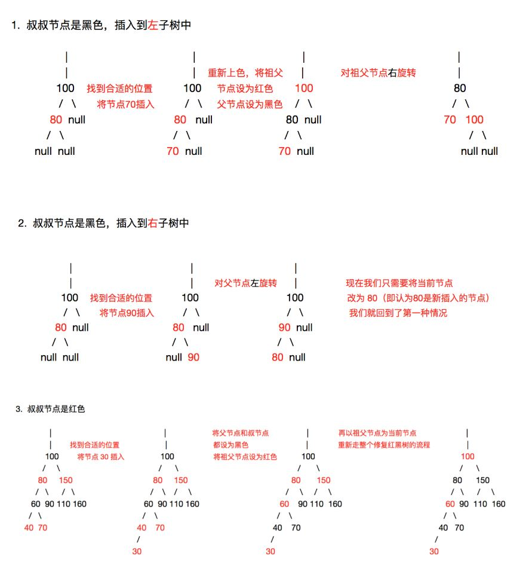
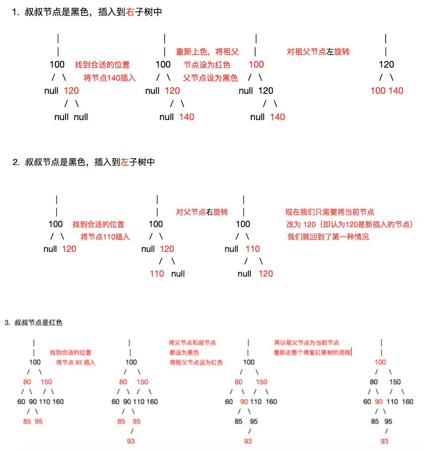
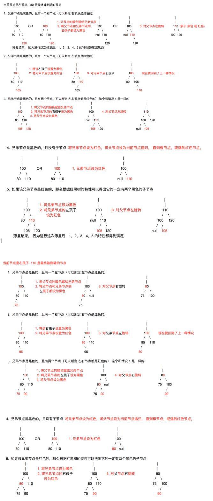

<!-- TOC -->

- [1. 二叉树](#1-二叉树)
  - [1.1. 斜二叉树](#11-斜二叉树)
  - [1.2. 完美二叉树](#12-完美二叉树)
  - [1.3. 完全二叉树](#13-完全二叉树)
  - [1.4. 二叉搜索树](#14-二叉搜索树)
  - [1.5. 堆](#15-堆)
  - [1.6. 霍夫曼树](#16-霍夫曼树)
  - [1.7. 红黑树](#17-红黑树)
  - [1.8. 红黑树的查找](#18-红黑树的查找)
  - [1.9. 红黑树的插入](#19-红黑树的插入)
  - [1.10. 红黑树的删除](#110-红黑树的删除)
- [2. 出度树](#2-出度树)
  - [2.1. B树 B+树](#21-b树-b树)

<!-- /TOC -->

树在数据结构中属于一种非线性结构，每个元素可以有多个前驱和后继，它有如下定义：
树是n(n≥0)个元素的集合：
- n = 0 时，成为空树
- 树只有一个特殊的没有前驱的元素，称为数的根Root
- 树中除了根节点外，其余元素只能有一个前驱，可以有零个或者多个后继

树中各种名词的含义：
|名称|含义|
|----|----|
|节点|数中的数据元素|
|数的度	|树内各节点的度的最大值
|节点的度(degree)	|节点拥有的子树的数目成为度，记作d(v)
|叶子节点	|节点的度数为0，成为叶子节点leaf、终端节点、末端节点
|分支节点	|节点度数不为0，成为非终端节点或分支节点
|分支	|节点之间的关系
|内部节点	|除根节点外的分支节点，当然也不包括叶子节点
|孩子(儿子Child)节点	|节点的子树的根节点成为该节点的孩子
|双亲(父Parent)节点	|一个节点是它各个树的根节点的双亲
|兄弟(Sibling)节点	|具有相同双亲节点的节点
|祖先节点	|从根节点到该节点所经分支上所有的节点。
|子孙节点	|节点的所有子树上的节点都成为该节点的子孙。
|节点的层次(Level)	|根节点为第一层，根的孩子为第二层，依次类推记作(Lv)
|树的深度(高度Depth)	|树的层次的最大值
|堂兄弟	|双亲在同一层的节点
|有序树	|结点的子树是有顺序的(兄弟有大小，有先后次序)，不能交换
|无序数	|结点的子树是无序的，可以交换
|路径	|树中的k个节点n1、n2、...nk，满足ni是n(i+1)的双亲，成为n1到nk的一条路径。就是一条线串下来的，前一个都是后一个父(前驱)节点。
|森林	|m(m≥0)课不相交的树的集合，对于节点而言，其子树的集合就是森林。

树的特点：
1. 唯一的根
2. 子树不相交
3. 除了根以外，每个元素只能有一个前驱，可以有零个或多个后继
4. 根节点没有双亲节点(前驱)，叶子节点没有孩子节点(后继)
5. vi是vj的双亲，则L(vi) = L(vj) - 1 ，也就是说双亲比孩子节点的层次小1

# 1. 二叉树
## 1.1. 斜二叉树
只有左子节点或只有右子节点的二叉树称为斜二叉树；

## 1.2. 完美二叉树
完美二叉树又叫满二叉树有如下特点：
1. 一课二叉树的所有分支结构都存在左子树和右子树，并且所有叶子节点只存在在最下面一层。
2. 同样深度二叉树中，满二叉树的节点最多
3. K为深度(1≤k≤n),则节点总数为2^k - 1
4. 下面是一个深度为4的15个节点的满二叉树 
   

## 1.3. 完全二叉树
完全二叉树的特点：
1. 叶子结点只能出现在最下两层；
2. 最下层的叶子结点一定集中在左边并且连续；
3. 若结点度为1，则该节点只有左子节点；
4. 满二叉树一定是完全二叉树，而完全二叉树不一定是满二叉树；

## 1.4. 二叉搜索树
它或者是一棵空树，或者是具有下列性质的二叉树： 若它的左子树不空，则左子树上所有结点的值均小于它的根结点的值； 若它的右子树不空，则右子树上所有结点的值均大于它的根结点的值； 它的左、右子树也分别为二叉排序树。

## 1.5. 堆
堆(heap)又被为优先队列(priority queue)。尽管名为优先队列，但堆并不是队列。因为队列中允许的操作是先进先出（FIFO），在队尾插入元素，在队头取出元素。而堆虽然在堆底插入元素，在堆顶取出元素，但是堆中元素的排列不是按照到来的先后顺序，而是按照一定的优先顺序排列的。

堆的特性：
- 必须是完全二叉树
- 任一结点的值是其子树所有结点的最大值或最小值
  - 最大值时，称为“最大堆”，也称大顶堆；
  - 最小值时，称为“最小堆”，也称小顶堆。

堆的排出过程一定是先排出根节点的数值，即最大或者最小的值，之后先由最末的节点补在根节点，然后用堆排序的算法为这个堆排序，即可得到一个新的堆。

堆的插入过程也相似，就是先插入在最后的位置，然后再做堆排序。

## 1.6. 霍夫曼树
给定n权值作为n个叶子节点，构造一棵二叉树，若这棵二叉树的带权路径长度达到最小，则称这样的二叉树为最优二叉树，也称为Huffman树。

树的带权路径长度指的是所有叶子节点的带权路径长度之和。

节点的带权路径长度指的是从根节点到该节点之间的路径长度与该节点权的乘积：如对于1节点的带权路径长度为：2。

路径长度指的是路径上分支的数目

节点的权指的是为树中的每一个节点赋予的一个非负的值，如上图中每一个节点中的值。

## 1.7. 红黑树
红黑树也是一种二叉搜索树。因为搜索树在搜索过程中，很有可能因为插入的顺序而变成一个瘸腿的二叉树：

一般来说二叉树的查询次数最大为二叉树的层数，但是一旦出现这种瘸腿的情况就会大幅降低性能，为了应对这种不平衡的状况，红黑树便应运而生。

红黑树是一种自平衡二叉树，主要有以下特点：
1. 节点是红色或黑色。
2. 根节点是黑色。
3. 每个叶子节点都是黑色的空节点（NIL节点）。
4. 每个红色节点的两个子节点都是黑色。(从每个叶子到根的所有路径上不能有两个连续的红色节点)
5. 从任一节点到其每个叶子的所有路径都包含相同数目的黑色节点。

以上规则保证红黑树的自平衡，红黑树从根到叶子的最长路径不会超过最短路径的两倍。

每一次新加入的节点都可能会打破以上的规则，比如在原有的红黑树上加一个节点21：

由于父节点22是红色节点，因此这种情况打破了红黑树的规则4（每个红色节点的两个子节点都是黑色），必须进行调整，使之重新符合红黑树的规则。

调整的方法有两种，一个是变色，另一个是旋转，其中选装又分为左旋和右旋

变色就是为了使新树重新符合红黑树的规则，将红色节点变为黑色，将黑色节点变为红色。

左旋转就是逆时针旋转红黑树的两个节点，使得父节点被自己的右孩子取代，而自己成为自己的左孩子。说起来很怪异，大家看下图：

图中，身为右孩子的Y取代了X的位置，而X变成了自己的左孩子。此为左旋转。

右旋就是顺时针旋转红黑树的两个节点，使得父节点被自己的左孩子取代，而自己成为自己的右孩子。大家看下图：

## 1.8. 红黑树的查找

## 1.9. 红黑树的插入
插入一个节点分为以下几个步骤：

1. 新建一个红色节点（为什么是红色节点呢？看下面的操作我们就明白，用红色节点操作更简单）
2. 和普通的二叉排序树一样，找到插入的位置插入
3. 通过旋转，重新着色操作使它重新成为一颗红黑树

我们发现关键在于第三步，第三步比较复杂可以分为两种大的情况讨论，

第一，准备插入点的父节点是左子树，对于这种情况又可以分为以下3种小的情况考虑

第二，父节点是右子树，对于这种情况也可以分为以下3种小的情况考虑

新插入的节点一定是红色。

## 1.10. 红黑树的删除
下面我们开始讨论修复操作（下面的叶子节点都是指非NULL的叶子节点）：

A. 删除的是叶子节点且该叶子节点是红色的 ---> 无需修复，因为它不会破坏红黑树的5个特性

B. 删除的是叶子节点且该叶子节点是黑色的 ---> 很明显会破坏特性5，需要修复。

C. 删除的节点（为了便于叙述我们将其称为P）下面有一个子节点 S，对于这种情况我们通过 将P和S的值交换的方式，巧妙的将删除P变为删除S，S是叶子节点，这样C这种情况就会转 换为A, B这两种情况：

C1： P为黑色，S为红色 ---> 对应 A 这种情况

C2: P为黑色或红色，S为黑色 --- > 对应 B 这种情况

D. 删除的节点有两个子节点，对于这种情况，我们通过将P和它的后继节点N的值交换的方 式，将删除节点P转换为删除后继节点N，而后继节点只可能是以下两种情况：

D1: N是叶子节点 --- > 对应情况 A 或 B

D2: N有一个子节点 ---- > 对应情况 C

所以通过上面的分析我们发现，红黑树节点删除后的修复操作都可以转换为 A 或 B这两种情况，而A不需要修复，所以我们只需要研究B这种情况如何修复就行了。

下面我们讨论如何修复B中情况：

# 2. 出度树

## 2.1. B树 B+树
-[参考数据库的索引部分](../DataBase/index.md)