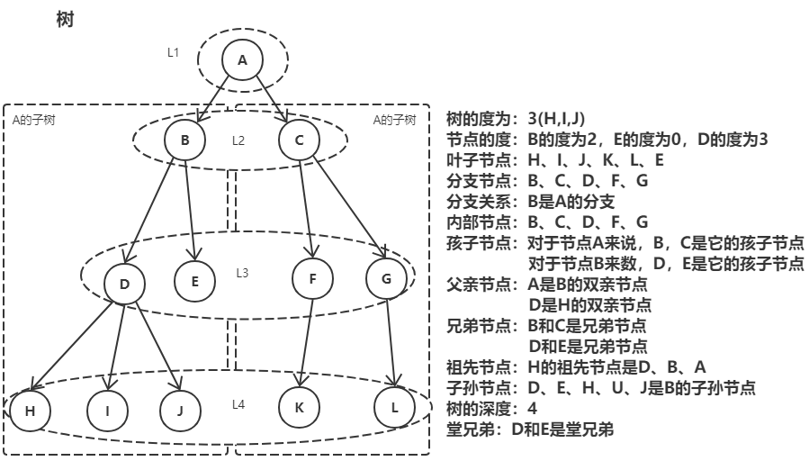
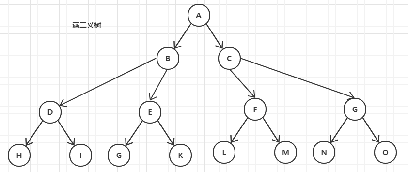
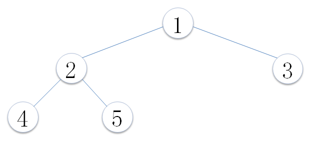
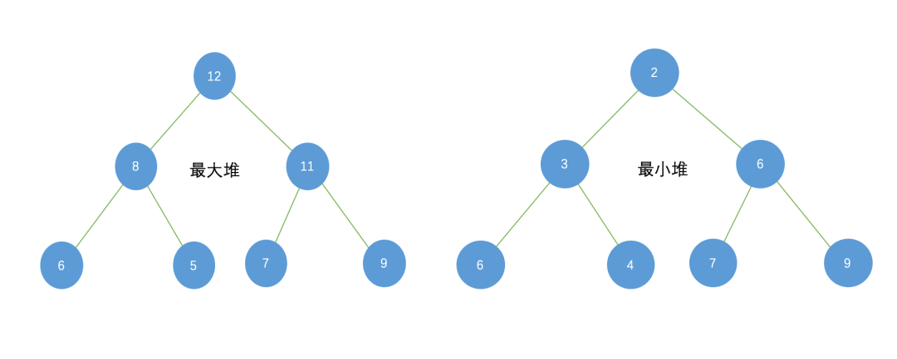

<!--
 * @Author: your name
 * @Date: 2020-06-26 22:42:25
 * @LastEditTime: 2020-06-27 23:06:38
 * @LastEditors: Please set LastEditors
 * @Description: In User Settings Edit
 * @FilePath: \undefinedc:\Users\conan\Desktop\LongTime\StupidBirdFliesFirst\DataStructure\tree.md
--> 
# 树
树在数据结构中属于一种非线性结构，每个元素可以有多个前驱和后继，它有如下定义：
树是n(n≥0)个元素的集合：
- n = 0 时，成为空树
- 树只有一个特殊的没有前驱的元素，称为数的根Root
- 树中除了根节点外，其余元素只能有一个前驱，可以有零个或者多个后继

树中各种名词的含义：
|名称|含义|
|----|----|
|节点|数中的数据元素|
|数的度	|树内各节点的度的最大值
|节点的度(degree)	|节点拥有的子树的数目成为度，记作d(v)
|叶子节点	|节点的度数为0，成为叶子节点leaf、终端节点、末端节点
|分支节点	|节点度数不为0，成为非终端节点或分支节点
|分支	|节点之间的关系
|内部节点	|除根节点外的分支节点，当然也不包括叶子节点
|孩子(儿子Child)节点	|节点的子树的根节点成为该节点的孩子
|双亲(父Parent)节点	|一个节点是它各个树的根节点的双亲
|兄弟(Sibling)节点	|具有相同双亲节点的节点
|祖先节点	|从根节点到该节点所经分支上所有的节点。
|子孙节点	|节点的所有子树上的节点都成为该节点的子孙。
|节点的层次(Level)	|根节点为第一层，根的孩子为第二层，依次类推记作(Lv)
|树的深度(高度Depth)	|树的层次的最大值
|堂兄弟	|双亲在同一层的节点
|有序树	|结点的子树是有顺序的(兄弟有大小，有先后次序)，不能交换
|无序数	|结点的子树是无序的，可以交换
|路径	|树中的k个节点n1、n2、...nk，满足ni是n(i+1)的双亲，成为n1到nk的一条路径。就是一条线串下来的，前一个都是后一个父(前驱)节点。
|森林	|m(m≥0)课不相交的树的集合，对于节点而言，其子树的集合就是森林。

树的特点：
1. 唯一的根
2. 子树不相交
3. 除了根以外，每个元素只能有一个前驱，可以有零个或多个后继
4. 根节点没有双亲节点(前驱)，叶子节点没有孩子节点(后继)
5. vi是vj的双亲，则L(vi) = L(vj) - 1 ，也就是说双亲比孩子节点的层次小1

## 二叉树
### 斜二叉树
只有左子节点或只有右子节点的二叉树称为斜二叉树；

### 完美二叉树
完美二叉树又叫满二叉树有如下特点：
1. 一课二叉树的所有分支结构都存在左子树和右子树，并且所有叶子节点只存在在最下面一层。
2. 同样深度二叉树中，满二叉树的节点最多
3. K为深度(1≤k≤n),则节点总数为2^k - 1
4. 下面是一个深度为4的15个节点的满二叉树 
   

### 完全二叉树
完全二叉树的特点：
1. 叶子结点只能出现在最下两层；
2. 最下层的叶子结点一定集中在左边并且连续；
3. 若结点度为1，则该节点只有左子节点；
4. 满二叉树一定是完全二叉树，而完全二叉树不一定是满二叉树；

### 二叉搜索树
它或者是一棵空树，或者是具有下列性质的二叉树： 若它的左子树不空，则左子树上所有结点的值均小于它的根结点的值； 若它的右子树不空，则右子树上所有结点的值均大于它的根结点的值； 它的左、右子树也分别为二叉排序树。

### 堆
堆(heap)又被为优先队列(priority queue)。尽管名为优先队列，但堆并不是队列。因为队列中允许的操作是先进先出（FIFO），在队尾插入元素，在队头取出元素。而堆虽然在堆底插入元素，在堆顶取出元素，但是堆中元素的排列不是按照到来的先后顺序，而是按照一定的优先顺序排列的。

堆的特性：
- 必须是完全二叉树
- 任一结点的值是其子树所有结点的最大值或最小值
  - 最大值时，称为“最大堆”，也称大顶堆；
  - 最小值时，称为“最小堆”，也称小顶堆。

堆的排出过程一定是先排出根节点的数值，即最大或者最小的值，之后先由最末的节点补在根节点，然后用堆排序的算法为这个堆排序，即可得到一个新的堆。

堆的插入过程也相似，就是先插入在最后的位置，然后再做堆排序。

### 霍夫曼树
给定n权值作为n个叶子节点，构造一棵二叉树，若这棵二叉树的带权路径长度达到最小，则称这样的二叉树为最优二叉树，也称为Huffman树。

树的带权路径长度指的是所有叶子节点的带权路径长度之和。

节点的带权路径长度指的是从根节点到该节点之间的路径长度与该节点权的乘积：如对于1节点的带权路径长度为：2。

路径长度指的是路径上分支的数目

节点的权指的是为树中的每一个节点赋予的一个非负的值，如上图中每一个节点中的值。

### 红黑树
## 出度树
### B树
### B+树