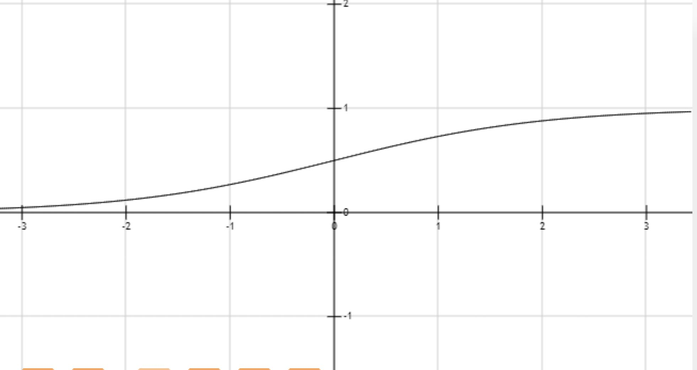
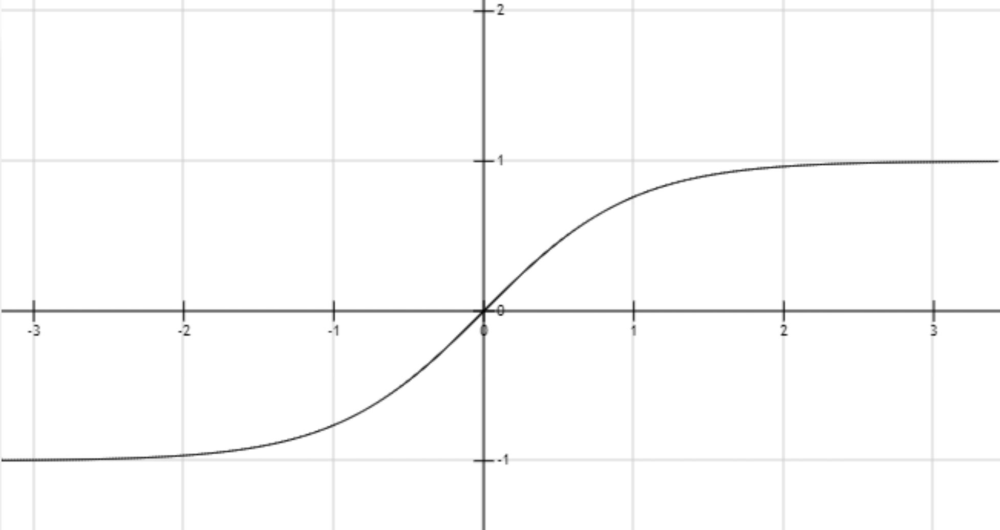

<!--
 * @Author: your name
 * @Date: 2020-05-09 19:10:45
 * @LastEditTime: 2020-05-09 21:01:46
 * @LastEditors: Please set LastEditors
 * @Description: In User Settings Edit
 * @FilePath: \undefinedc:\Users\conan\Desktop\LongTime\StupidBirdFliesFirst\MachineLearning\ActivationFunction\ActivationFunction.md
 -->
# 激活函数
## 基本知识
&emsp;&emsp;激活函数是一个非线性变换，一般在进行卷积之后加上它，它决定了当前神经元是否被激活，这个神经元接受的信息是否有用，是否应该被留下或者抛弃等。
## 作用
- 一般的卷积也只是一种线性变换，多层之后依然是个线性变换，这样的话就限制了网络的可用范围，因此加一个非线性的激活函数使之表征范围更大。
- 反向传播算法的需要。反向传播要求神经元的激活函数可微。
- 防止输出数值的膨胀（主要为了输出一个概率）

可以用线性激活函数的地方一般会是输出层

## 主要的激活函数
### sigmoid函数
$$
g(z)=\frac{1}{1+e^{-z}}
$$

$$
g'(z)=\frac{e^{-z}}{(1+e^{-z})^2}=g(z)(1-g(z))
$$
该函数可以将所有的数映射到0到1之间，不过本身也不经常用，因为：
- 当 z 值非常大或者非常小时，通过上图我们可以看到，sigmoid函数的导数 g′(z) 将接近0 。这会导致权重W的梯度将接近0，使得梯度更新十分缓慢，即梯度消失。
- 函数的输出不是以0为均值，将不便于下层的计算。sigmoid函数可用在网络最后一层，作为输出层进行二分类，尽量不要使用在隐藏层。

### tanh函数
$$
g(z)=\frac{e^z-e^{-z}}{e^z+e^{-z}}
$$

$$
g'(z)=\frac{4}{(e^z+e^{-z})^2}=1-g(z)^2
$$
tanh函数可以将所有值映射到-1到1之间，使得函数均值为0。主要缺点和sigmoid一样，当z很大或很小时，g′(z)接近于0，会导致梯度很小，权重更新非常缓慢，即梯度消失问题。

### ReLU函数
$$
g(z)=\left\{
\begin{aligned}
z , if z>0 \\
0 , if z<0
\end{aligned}
\right.
$$
$$
g'(z)=\left\{
\begin{aligned}
1 , if z>0 \\
0 , if z<0
\end{aligned}
\right.
$$
ReLU函数又称为修正线性单元（Rectified Linear Unit），多用于隐层输出是一种分段线性函数，其弥补了sigmoid函数以及tanh函数的梯度消失问题。ReLU函数的优点是：
- 在输入为正数的时候（对于大多数输入 zz 空间来说），不存在梯度消失问题。
- 计算速度要快很多。ReLU函数只有线性关系，不管是前向传播还是反向传播，都比sigmod和tanh要快很多。（sigmod和tanh要计算指数，计算速度会比较慢）

缺点是当输入为负时，梯度为0，会产生梯度消失问题。

### Leaky ReLU函数
$$
g(z)=\left\{
\begin{aligned}
z , if z>0 \\
az , if z<0
\end{aligned}
\right.
$$
$$
g'(z)=\left\{
\begin{aligned}
1 , if z>0 \\
a , if z<0a
\end{aligned}
\right.
$$
Leaky ReLU函数解决了ReLU函数在输入为负的情况下产生的梯度消失问题。

### Softmax
$$
g(z)=\frac{e^z}{\sum_ie^i}
$$
Softmax函数把输出映射成区间在(0,1)的值，并且做了归一化，所有元素的和累加起来等于1。可以直接当作概率对待，选取概率最大的分类作为预测的目标，所以这种激活函数通常用在多分类问题最后的输出。

它最大的优点就是使用了指数，这样可以让大的值更大，让小的更小，增加了区分对比度，学习效率更高。第二个是因为softmax是连续可导的，消除了拐点。