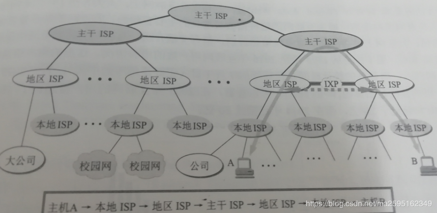

<!-- TOC -->

- [1. 基本知识](#1-基本知识)
- [2. ISP](#2-isp)
- [3. 主机之间的通信方式](#3-主机之间的通信方式)
- [4. 同步和异步](#4-同步和异步)
  - [4.1. 同步通信原理](#41-同步通信原理)
  - [4.2. 异步通信原理](#42-异步通信原理)
  - [4.3. 同步通信与异步通信区别：](#43-同步通信与异步通信区别)
- [5. 电路交换与分组交换](#5-电路交换与分组交换)
  - [5.1. 电路交换](#51-电路交换)
  - [5.2. 分组交换](#52-分组交换)
- [6. 时延](#6-时延)
  - [6.1. 排队时延](#61-排队时延)
  - [6.2. 处理时延](#62-处理时延)
  - [6.3. 传输时延](#63-传输时延)
  - [6.4. 传播时延](#64-传播时延)
- [7. 共享资源](#7-共享资源)
- [8. 计算机网络体系结构](#8-计算机网络体系结构)
  - [8.1. 五层协议](#81-五层协议)
  - [8.2. OSI](#82-osi)
  - [8.3. TCP/IP](#83-tcpip)
  - [8.4. 数据在各层之间的传递过程](#84-数据在各层之间的传递过程)
- [9. 详细解释各层的作用](#9-详细解释各层的作用)
- [10. 各层的设备](#10-各层的设备)
  - [10.1. 物理层：](#101-物理层)
  - [10.2. 数据链路层：](#102-数据链路层)
  - [10.3. 网络层：](#103-网络层)
  - [10.4. 传输层：](#104-传输层)

<!-- /TOC -->

# 1. 基本知识

网络把主机连接起来，而互连网（internet）是把多种不同的网络连接起来，因此互连网是网络的网络。而互联网（Internet）是全球范围的互连网。

# 2. ISP

ISP(internet service provider)译为互联网服务提供商，类似中国电信，中国移动，中国联通就是国内有名的ISP。ISP可以从互联网管理机构申请到很多IP地址，然后一些机构和个人从某个ISP获取IP地址的使用权，并可通过该ISP连接到互联网。ISP可以从互联网管理机构获得许多IP地址，同时拥有通信线路以及路由器等联网设备，个人或机构向 ISP 缴纳一定的费用就可以接入互联网。

目前的互联网是一种多层次ISP结构，三层ISP结构分为主干ISP，地区ISP，本地ISP。本地ISP给用户提供最直接的服务，本地ISP可以连接到地区ISP，也可以连接到主干ISP。从原理上讲。只要每一个本地ISP都安装了路由器连接到某个地区ISP，而每一个地区ISP也有路由器连接到主干ISP，那么在这些相互连接的ISP的共同作用下，就可以完成互联网中的所有的分组转发任务。

互联网交换点(IXP)：为了更快地转发分组，IXP允许两个网络直接连接并交换分组，而不需要通过第三个网络来转发分组。例如上图中，主机A和主机B通过2个地区ISP连接起来了，就不必经过最上层的的主干ISP来转发分组。典型的IXP由一个或多个网络交换机组成。

# 3. 主机之间的通信方式

- 客户-服务器（C/S）：客户是服务的请求方，服务器是服务的提供方。

- 对等（P2P）：不区分客户和服务器。

# 4. 同步和异步
## 4.1. 同步通信原理

同步通信是一种连续串行传送数据的通信方式，一次通信只传送一帧信息。这里的信息帧与异步通信中的字符帧不同，通常含有若干个数据字符。

采用同步通信时，将许多字符组成一个信息组，这样，字符可以一个接一个地传输，但是，在每组信息（通常称为帧）的开始要加上同步字符，在没有信息要传输时，要填上空字符，因为同步传输不允许有间隙。在同步传输过程中，一个字符可以对应5～8位。当然，对同一个传输过程，所有字符对应同样的数位，比如说n位。这样，传输时，按每n位划分为一个时间片，发送端在一个时间片中发送一个字符，接收端则在一个时间片中接收一个字符。

同步传输时，一个信息帧中包含许多字符，每个信息帧用同步字符作为开始，一般将同步字符和空字符用同一个代码。在整个系统中，由一个统一的时钟控制发送端的发送和空字符用同一个代码。接收端当然是应该能识别同步字符的，当检测到有一串数位和同步字符相匹配时，就认为开始一个信息帧，于是，把此后的数位作为实际传输信息来处理。

## 4.2. 异步通信原理

异步通信是一种很常用的通信方式。异步通信在发送字符时，所发送的字符之间的时间间隔可以是任意的。当然，接收端必须时刻做好接收的准备。发送端可以在任意时刻开始发送字符，因此必须在每一个字符的开始和结束的地方加上标志，即加上开始位和停止位，以便使接收端能够正确地将每一个字符接收下来。异步通信的好处是通信设备简单、便宜，但传输效率较低（因为开始位和停止位的开销所占比例较大）。

## 4.3. 同步通信与异步通信区别：

1. 同步通信要求接收端时钟频率和发送端时钟频率一致，发送端发送连续的比特流；异步通信时不要求接收端时钟和发送端时钟同步，发送端发送完一个字节后，可经过任意长的时间间隔再发送下一个字节。
2. 同步通信效率高；异步通信效率较低。
3. 同步通信较复杂，双方时钟的允许误差较小；异步通信简单，双方时钟可允许一定误差。
4. 同步通信可用于点对多点；异步通信只适用于点对点。

# 5. 电路交换与分组交换

## 5.1. 电路交换

电路交换用于电话通信系统，两个用户要通信之前需要建立一条专用的物理链路，并且在整个通信过程中始终占用该链路。由于通信的过程中不可能一直在使用传输线路，因此电路交换对线路的利用率很低，往往不到 10%。

## 5.2. 分组交换

每个分组都有首部和尾部，包含了源地址和目的地址等控制信息，在同一个传输线路上同时传输多个分组互相不会影响，因此在同一条传输线路上允许同时传输多个分组，也就是说分组交换不需要占用传输线路。

在一个邮局通信系统中，邮局收到一份邮件之后，先存储下来，然后把相同目的地的邮件一起转发到下一个目的地，这个过程就是存储转发过程，分组交换也使用了存储转发过程。

# 6. 时延

总时延 = 排队时延 + 处理时延 + 传输时延 + 传播时延

发送时延=分组长度/信道宽度

传播时延=信道长度/电磁波在信道上的传播速率

## 6.1. 排队时延

分组在路由器的输入队列和输出队列中排队等待的时间，取决于网络当前的通信量。

## 6.2. 处理时延

主机或路由器收到分组时进行处理所需要的时间，例如分析首部、从分组中提取数据、进行差错检验或查找适当的路由等。

## 6.3. 传输时延

主机或路由器传输数据帧所需要的时间。

  

<!-- 
  
  -->

其中 l 表示数据帧的长度，v 表示传输速率。

## 6.4. 传播时延

电磁波在信道中传播所需要花费的时间，电磁波传播的速度接近光速。

  

<!-- 
  
  -->

其中 l 表示信道长度，v 表示电磁波在信道上的传播速度。

处理时延抖动：例如音频，可通过在发送方为每个块规定一个序号或时间戳，在接收方延迟播放音频块来消除。

# 7. 共享资源
计算机网络中的共享资源是指使同一个计算机网络上的其他计算机可使用的某台计算机的计算机资源的行为。换而言之，是使计算机上的一种设备或某些信息可通过另一台计算机以局域网或内部网进行远程访问，且过程透明，就像资源位于本地计算机一般。网络共享可能通过网络上的进程间通信实现。包括软件、硬件、数据和通信信道。

# 8. 计算机网络体系结构

## 8.1. 五层协议

-   **应用层**  ：为特定应用程序提供数据传输服务，例如 HTTP、DNS 等协议。数据单位为报文。

-   **传输层**  ：为进程提供通用数据传输服务。由于应用层协议很多，定义通用的传输层协议就可以支持不断增多的应用层协议。运输层包括两种协议：传输控制协议 TCP，提供面向连接、可靠的数据传输服务，数据单位为报文段；用户数据报协议 UDP，提供无连接、尽最大努力的数据传输服务，数据单位为用户数据报。TCP 主要提供完整性服务，UDP 主要提供及时性服务。

-   **网络层**  ：为主机提供数据传输服务。而传输层协议是为主机中的进程提供数据传输服务。网络层把传输层传递下来的报文段或者用户数据报封装成分组。

-   **数据链路层**  ：网络层针对的还是主机之间的数据传输服务，而主机之间可以有很多链路，链路层协议就是为同一链路的主机提供数据传输服务。数据链路层把网络层传下来的分组封装成帧。

-   **物理层**  ：考虑的是怎样在传输媒体上传输数据比特流，而不是指具体的传输媒体。物理层的作用是尽可能屏蔽传输媒体和通信手段的差异，使数据链路层感觉不到这些差异。

## 8.2. OSI

其中表示层和会话层用途如下：

-   **表示层**  ：数据压缩、加密以及数据描述，这使得应用程序不必关心在各台主机中数据内部格式不同的问题。例如各种图像的格式TIFF,GIF,JPEG,PICT等处理都属于表示层。

-   **会话层**  ：建立及管理会话。

五层协议没有表示层和会话层，而是将这些功能留给应用程序开发者处理。

## 8.3. TCP/IP

它只有四层，相当于五层协议中数据链路层和物理层合并为网络接口层。

TCP/IP 体系结构不严格遵循 OSI 分层概念，应用层可能会直接使用 IP 层或者网络接口层。

在TCP/IP协议体系中，将网络结构自上而下划分为四层，即应用层、传输层、网络层、网络接口，工作时发送方从上层向下层传输数据，每经过一层附加协议控制信息

## 8.4. 数据在各层之间的传递过程

在向下的过程中，需要添加下层协议所需要的首部或者尾部，而在向上的过程中不断拆开首部和尾部。

路由器只有下面三层协议，因为路由器位于网络核心中，不需要为进程或者应用程序提供服务，因此也就不需要传输层和应用层。

# 9. 详细解释各层的作用

**应用层(application layer)**：是体系结构中的最高。直接为用户的应用进程（例如电子邮件、文件传输和终端仿真）提供服务。在因特网中的应用层协议很多，如支持万维网应用的HTTP协议，支持电子邮件的SMTP协议，支持文件传送的FTP协议，DNS，POP3，SNMP，Telnet等等。

应用层共同的特点就是都是应用程序，所以他们的通信都是进程之间的通信。

**运输层(transport layer)**：承接应用层，负责向两个主机中进程之间的通信提供服务。由于一个主机可同时运行多个进程，因此运输层有复用和分用的功能

复用，就是多个应用层进程可同时使用下面运输层的服务。

分用，就是把收到的信息分别交付给上面应用层中相应的进程。

运输层主要使用以下两种协议： 
1. 传输控制协议TCP(Transmission Control Protocol)：面向连接的，数据传输的单位是报文段，能够提供可靠的交付。 
2. 用户数据包协议UDP(User Datagram Protocol)：无连接的，数据传输的单位是用户数据报，不保证提供可靠的交付，只能提供“尽最大努力交付”。

传输层负责两个进程之间的通信，而进程都是运行在设备上的。

**网络层(network layer)**，通过路由选择算法，为报文或分组通过通信子网选择最适当的路径。承接传输层，网络层负责解决两个不同设备之间的通信问题，主要包括以下两个任务：
1. 负责为分组交换网上的不同主机提供通信服务。在发送数据时，网络层把运输层产生的报文段或用户数据报封装成分组或包进行传送。在TCP/IP体系中，由于网络层使用IP协议，因此分组也叫做IP数据报，或简称为数据报。
2. 选中合适的路由，使源主机运输层所传下来的分组，能够通过网络中的路由器找到目的主机。
协议：IP,ICMP,IGMP,ARP,RARP（网络物理地址转换为IP地址的协议）

**数据链路层(data link layer)**：通过各种控制协议，将有差错的物理信道变为无差错的、能可靠传输数据帧的数据链路。常简称为链路层，我们知道，两个主机之间的数据传输，总是在一段一段的链路上传送的，也就是说，在两个相邻结点之间传送数据是直接传送的(点对点)，这时就需要使用专门的链路层的协议。

在两个相邻结点之间传送数据时，数据链路层将网络层交下来的IP数据报组装成帧(framing)，在两个相邻结点之间的链路上“透明”地传送帧中的数据。

每一帧包括数据和必要的控制信息(如同步信息、地址信息、差错控制等)。典型的帧长是几百字节到一千多字节。

**物理层(physical layer)**：在物理层上所传数据的单位是比特。物理层的任务就是透明地传送比特流。利用传输介质为数据链路层提供物理连接，实现比特流的透明传输。

# 10. 各层的设备
## 10.1. 物理层：
中继器，集线器，双绞线 

## 10.2. 数据链路层： 
网桥，以太网交换机，网卡（一半物理层，一半数据链路层） 

## 10.3. 网络层： 
路由器，三层交换机 

## 10.4. 传输层： 
四层交换机（常用作负载均衡），网关：对高层协议（包括传输层及更高层次）进行转换的网间连接器