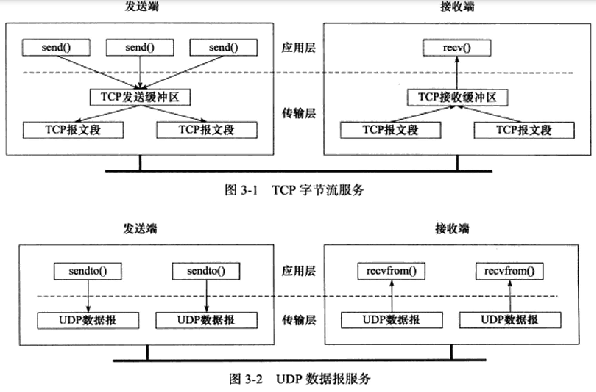
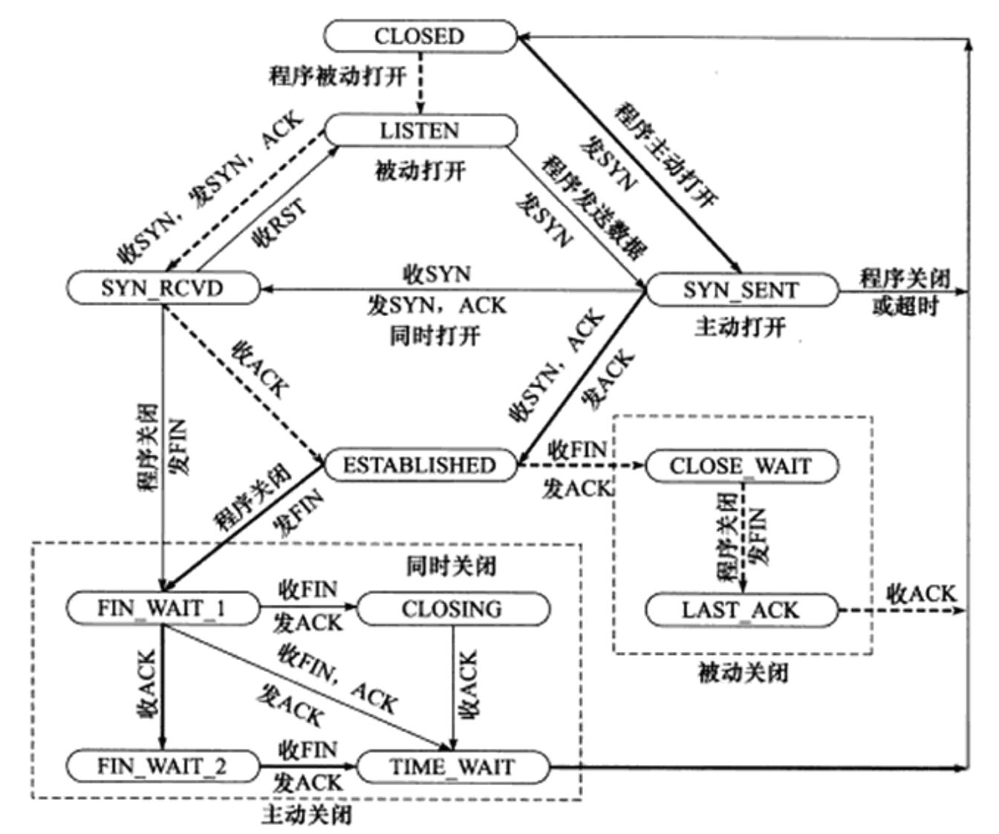

网络层只把分组发送到目的主机，但是真正通信的并不是主机而是主机中的进程。传输层提供了进程间的逻辑通信，传输层向高层用户屏蔽了下面网络层的核心细节，使应用程序看起来像是在两个传输层实体之间有一条端到端的逻辑通信信道。

<!-- TOC -->

- [UDP 和 TCP 的特点](#udp-和-tcp-的特点)
- [UDP和TCP区别](#udp和tcp区别)
- [UDP 首部格式](#udp-首部格式)
- [TCP 首部格式](#tcp-首部格式)
- [TCP 的三次握手和四次挥手](#tcp-的三次握手和四次挥手)
  - [TCP状态转移](#tcp状态转移)
  - [TIME_WAIT状态](#time_wait状态)
- [TCP 可靠传输](#tcp-可靠传输)
- [TCP 滑动窗口](#tcp-滑动窗口)
- [TCP 流量控制](#tcp-流量控制)
- [TCP 拥塞控制](#tcp-拥塞控制)
  - [1. 慢开始与拥塞避免](#1-慢开始与拥塞避免)
  - [2. 快重传与快恢复](#2-快重传与快恢复)

<!-- /TOC -->

# UDP 和 TCP 的特点

- 用户数据报协议 UDP（User Datagram Protocol）是无连接的（使用UDP协议的发送者和接受者之间不必存在任何长期的关系。 它们没有建立连接过程，整个消息传输过程简单来说就是“发送即结束”），尽最大可能交付，没有拥塞控制，面向报文（对于应用程序传下来的报文不合并也不拆分，只是添加UDP首部），支持一对一、一对多、多对一和多对多的交互通信。UDP的发送端应用程序没执行一次写操作，UDP模块就将其封装成一个UDP数据报并发送，接收端必须及时针对每一个UDP数据报执行读操作，否则就会丢包，且如果用户没有指定足够的应用程序缓冲区来读取UDP数据，UDP数据就会被截断。

- 传输控制协议TCP（Transmission Control Protocol）
  - 面向连接
    1. 使用TCP连接的双方必须建立连接，双方必须为连接分配必要的内核资源，以管理连接状态和连接上的数据传输。
    2. TCP连接时全双工的
    3. 完成数据交换以后通信双方需要断开连接以释放系统资源
    4. TCP连接是一对一的，所以广播和多播不用使用TCP（可以用UDP）
  - 字节流
    字节流其实就是在写入数据时，TCP模块先将数据放入TCP发送缓冲区中，当TCP模块真正开始发送数据时，发送缓冲区再将这些数据封装成多个TCP报文段发出。所以TCP模块发送的TCP报文段的个数和应用程序执行的写操作次数之间没有固定的数量关系。接收端收到一个或多个TCP报文段后，TCP将他们按照报文段的序号依次放入TCP接受的缓冲区中，并通知应用程序读取数据。接收端可以一次性将缓冲区的数据全部读出，也可以分多次，这取决于用户指定的应用程序读缓冲区的大小。所以发送端的写次数和接收端的读次数没有关系，也就是字节流的概念：**应用程序与数据的发送和接受是没有边界的**。
  - 可靠传输
    TCP协议采用发送应答机制，每发送一个都需要得到对方的应答。其次会采用超时重传，发送端在发送一个TCP报文后启动定时器，如果在定时时间内未收到应答，就会重新发送报文段。并且在接收端会依据TCP报文段的序号进行排序再交付给应用层。（之所以会乱，主要还是因为TCP报文段需要以IP数据报的形式发送，IP数据报到接受端可能会乱）

# UDP和TCP区别

|     | TCP | UDP |
|  ----  | ----  | ----|
| 是否连接  | 面向连接 | 面向报文|
| 传输可靠性  | 可靠 | 不可靠 |
|应用场合| 传输大量数据| 传输少量数据|
|速度|慢|快|

# UDP 首部格式

首部字段只有 8 个字节，包括源端口、目的端口、长度、检验和。12 字节的伪首部是为了计算检验和临时添加的。

# TCP 首部格式

-   **源端口和目的端口**告知主机报文段来自哪里以及要传给哪个上层协议或应用程序。一般来说客户端使用系统自动选择的临时端口号，服务器使用知名服务端口号，定义在/etc/services中。

-   **序号**   ：用于对字节流进行编号，例如序号为 301，表示第一个字节的编号为 301，如果携带的数据长度为 100 字节，那么下一个报文段的序号应为 401。注意，一个序号指的是同一方向上字节流的编号，返回的序号与发送的序号没有关系。

-   **确认号**   ：期望收到的下一个报文段的序号。例如 B 正确收到 A 发送来的一个报文段，序号为 501，携带的数据长度为 200 字节，因此 B 期望下一个报文段的序号为 701，B 发送给 A 的确认报文段中确认号就为 701。

-   **数据偏移**   ：指的是数据部分距离报文段起始处的偏移量，实际上指的是首部的长度。这里具体来说表示的是TCP头部有多少个32bit（4字节），因为4位最多能表示15，所以TCP头部最长是60字节。

-   **确认 ACK**   ：我们称携带ACK标志的TCP报文段为确认报文段，当 ACK=1 时确认号字段有效，否则无效。TCP 规定，在连接建立后所有传送的报文段都必须把ACK置 1。
-   **PSH** ：提示接收端应用程序应该立即从TCP接收缓冲区读走数据，为接受后续数据腾出空间（如果这时不将数据读走，他就会一直留在缓冲区中）
-   **复位 RST**：表示要求对方重新建立连接。
-   **同步 SYN**   ：在连接建立时用来同步序号。当 SYN=1，ACK=0 时表示这是一个连接请求报文段。若对方同意建立连接，则响应报文中 SYN=1，ACK=1。

-   **终止 FIN**   ：用来释放一个连接，当 FIN=1 时，表示此报文段的发送方的数据已发送完毕，并要求释放连接。

-   **窗口**   ：窗口值作为接收方让发送方设置其发送窗口的依据。之所以要有这个限制，是因为接收方的数据缓存空间是有限的。告诉对方本端的TCP接收缓冲区还能容纳多少字节的数据，以控制对方的发送速度。
-   **TCP头部选项**   ：可变长的可选信息，这部分最多包含40字节，因为前面已经有20字节的固定部分了，而总长度是60字节。

# TCP 的三次握手和四次挥手
[请查看](TCPConnect.md)
## TCP状态转移

粗虚线表示典型的服务端连接的状态转移，粗实线表示典型的客户端连接的状态转移。
## TIME_WAIT状态
TIME_WAIT这个状态存在的原因有两点：
1. 可靠地终止TCP连接。假设客户端发给服务器的最后一段报文丢失，那么服务器将会重发结束报文段，因此客户端需要停留在一个状态以处理服务器可能发过来的重复的报文段。
2. 保证让迟来的TCP报文段有足够的时间被识别或丢弃。这是因为在linux上一个TCP端口不能被同时打开两次以上，当一个TCP连接处于TIME_WAIT状态时，我们就无法使用这个被占用的端口来建立一个新连接。假设没有这个TIME_WAIT状态，那一个新连接进来就可以被立即创建，这个新连接与之前的拥有相同的IP和端口号，所以称它为原来的连接的化身。但是由于没有TIME_WAIT状态，所以新的化身可能收到原连接发送过来的信息，这肯定是不行的。所以必须有一个TIME_WAIT状态来让旧连接的信息要么被及时收到，要么超过TCP报文存在时间被丢弃，绝对不能让它影响到下一个连接。由于TCP报文段的最大生存时间是MSL，所以TIME_WAIT状态的持续时间就是2MSL，这样能保证没能收到的报文就能自动消失，不会影响后面的连接。

# TCP 可靠传输

TCP 使用超时重传来实现可靠传输：如果一个已经发送的报文段在超时时间内没有收到确认，那么就重传这个报文段。

一个报文段从发送再到接收到确认所经过的时间称为往返时间 RTT，加权平均往返时间 RTTs 计算如下：

  
其中，0 ≤ a ＜ 1，RTTs 随着 a 的增加更容易受到 RTT 的影响。

超时时间 RTO 应该略大于 RTTs，TCP 使用的超时时间计算如下：

  
其中 RTTd 为偏差的加权平均值。

# TCP 滑动窗口

窗口是缓存的一部分，用来暂时存放字节流。发送方和接收方各有一个窗口，接收方通过 TCP 报文段中的窗口字段告诉发送方自己的窗口大小，发送方根据这个值和其它信息设置自己的窗口大小。

发送窗口内的字节都允许被发送，接收窗口内的字节都允许被接收。如果发送窗口左部的字节已经发送并且收到了确认，那么就将发送窗口向右滑动一定距离，直到左部第一个字节不是已发送并且已确认的状态；接收窗口的滑动类似，接收窗口左部字节已经发送确认并交付主机，就向右滑动接收窗口。

接收窗口只会对窗口内最后一个按序到达的字节进行确认，例如接收窗口已经收到的字节为 {31, 34, 35}，其中 {31} 按序到达，而 {34, 35} 就不是，因此只对字节 31 进行确认。发送方得到一个字节的确认之后，就知道这个字节之前的所有字节都已经被接收。

# TCP 流量控制

流量控制是为了控制发送方发送速率，保证接收方来得及接收。

接收方发送的确认报文中的窗口字段可以用来控制发送方窗口大小，从而影响发送方的发送速率。将窗口字段设置为 0，则发送方不能发送数据。

# TCP 拥塞控制

如果网络出现拥塞，分组将会丢失，此时发送方会继续重传，从而导致网络拥塞程度更高。因此当出现拥塞时，应当控制发送方的速率。这一点和流量控制很像，但是出发点不同。流量控制是为了让接收方能来得及接收，而拥塞控制是为了降低整个网络的拥塞程度。

TCP 主要通过四个算法来进行拥塞控制：慢开始、拥塞避免、快重传、快恢复。

发送方需要维护一个叫做拥塞窗口（cwnd）的状态变量，注意拥塞窗口与发送方窗口的区别：拥塞窗口只是一个状态变量，实际决定发送方能发送多少数据的是发送方窗口。

为了便于讨论，做如下假设：

- 接收方有足够大的接收缓存，因此不会发生流量控制；
- 虽然 TCP 的窗口基于字节，但是这里设窗口的大小单位为报文段。

## 1. 慢开始与拥塞避免

发送的最初执行慢开始，令 cwnd = 1，发送方只能发送 1 个报文段；当收到确认后，将 cwnd 加倍，因此之后发送方能够发送的报文段数量为：2、4、8 ...

注意到慢开始每个轮次都将 cwnd 加倍，这样会让 cwnd 增长速度非常快，从而使得发送方发送的速度增长速度过快，网络拥塞的可能性也就更高。设置一个慢开始门限 ssthresh，当 cwnd >= ssthresh 时，进入拥塞避免，每个轮次只将 cwnd 加 1。

如果出现了超时，则令 ssthresh = cwnd / 2，然后重新执行慢开始。

## 2. 快重传与快恢复

在接收方，要求每次接收到报文段都应该对最后一个已收到的有序报文段进行确认。例如已经接收到 M1 和 M2，此时收到 M4，应当发送对 M2 的确认。

在发送方，如果收到三个重复确认，那么可以知道下一个报文段丢失，此时执行快重传，立即重传下一个报文段。例如收到三个 M2，则 M3 丢失，立即重传 M3。

在这种情况下，只是丢失个别报文段，而不是网络拥塞。因此执行快恢复，令 ssthresh = cwnd / 2 ，cwnd = ssthresh，注意到此时直接进入拥塞避免。

慢开始和快恢复的快慢指的是 cwnd 的设定值，而不是 cwnd 的增长速率。慢开始 cwnd 设定为 1，而快恢复 cwnd 设定为 ssthresh。

