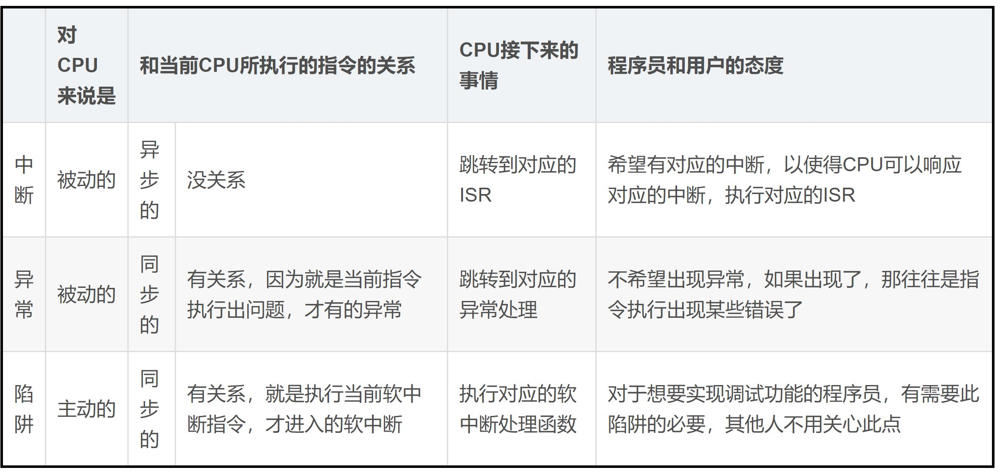
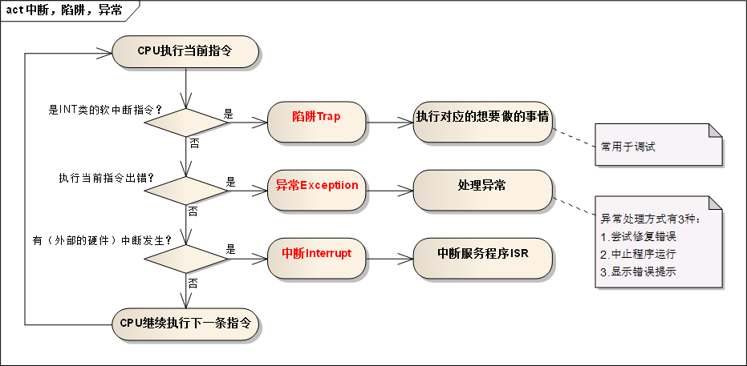

<!--
 * @Author: your name
 * @Date: 2020-06-21 21:37:02
 * @LastEditTime: 2020-06-22 11:20:11
 * @LastEditors: Please set LastEditors
 * @Description: In User Settings Edit
 * @FilePath: \undefinedc:\Users\conan\Desktop\LongTime\StupidBirdFliesFirst\OperationSystem\Fundamental.md
--> 

<!-- TOC -->

- [基本概念](#基本概念)
  - [并发和并行](#并发和并行)
  - [用户态和内核态](#用户态和内核态)
    - [系统调用](#系统调用)
    - [库函数](#库函数)
    - [shell](#shell)
    - [用户态到内核态的切换](#用户态到内核态的切换)
  - [中断、异常和陷阱](#中断异常和陷阱)
    - [中断](#中断)
    - [异常](#异常)
    - [陷阱](#陷阱)

<!-- /TOC -->

# 基本概念
## 并发和并行
并发是指宏观上在一段时间内能同时运行多个程序，而并行则指同一时刻能运行多个指令。

并发更像是时分复用，多个任务交替运行，只是在逻辑上是同时发生的。

并行需要硬件支持，如多流水线、多核处理器或者分布式计算系统，它是真的在物理上同时发生的。

操作系统通过引入进程和线程，使得程序能够并发运行。

## 用户态和内核态
以linux的整体架构为例：

从图上我们可以看出来通过系统调用将Linux整个体系分为用户态和内核态（或者说内核空间和用户空间）。内核态从本质上说就是我们所说的内核，它是一种特殊的软件程序，它能控制计算机的硬件资源，例如协调CPU资源，分配内存资源，并且提供稳定的环境供应用程序运行。

用户态就是提供应用程序运行的空间，为了使应用程序访问到内核管理的资源例如CPU，内存，I/O。内核必须提供一组通用的访问接口，这些接口就叫系统调用。

### 系统调用
系统调用时操作系统的最小功能单位。根据不同的应用场景，不同的Linux发行版本提供的系统调用数量也不尽相同，大致在240-350之间。这些系统调用组成了用户态跟内核态交互的基本接口，例如：用户态想要申请一块20K大小的动态内存，就需要brk系统调用，将数据段指针向下偏移，如果用户态多处申请20K动态内存，同时又释放呢？这个内存的管理就变得非常的复杂。

### 库函数
库函数就是屏蔽这些复杂的底层实现细节，减轻程序员的负担，从而更加关注上层的逻辑实现。它对系统调用进行封装，提供简单的基本接口给用户，这样增强了程序的灵活性，当然对于简单的接口，也可以直接使用系统调用访问资源，例如：open（），write（），read（）等等。库函数根据不同的标准也有不同的版本，例如：glibc库，posix库等。

### shell
shell顾名思义，就是外壳的意思。就好像把内核包裹起来的外壳。它是一种特殊的应用程序，俗称命令行。为了方便用户和系统交互，一般一个shell对应一个终端，呈现给用户交互窗口。当然shell也是编程的，它有标准的shell语法，符合其语法的文本叫shell脚本。很多人都会用shell脚本实现一些常用的功能，可以提高工作效率。

### 用户态到内核态的切换
往往我们的系统的资源是固定的，例如内存2G，CPU固定，磁盘2TB，网络接口固定。所以就需要操作系统对资源进行有效的利用。假设某个应用程序过分的访问这些资源，就会导致整个系统的资源被占用，如果不对这种行为进行限制和区分，就会导致资源访问的冲突。所以，Linux的设计的初衷：给不同的操作给与不同的“权限”。Linux操作系统就将权限等级分为了2个等级，分别就是内核态和用户态。

所以用户态和内核态最本质的区别就是权限不同。用户态的进程能够访问的资源受到了极大的控制，而运行在内核态的进程可以“为所欲为”。一个进程可以运行在用户态也可以运行在内核态，那它们之间肯定存在用户态和内核态切换的过程。打一个比方：C库接口malloc申请动态内存，malloc的实现内部最终还是会调用brk（）或者mmap（）系统调用来分配内存。

从用户态到内核态切换可以通过三种方式：
1. 系统调用，这个上面已经讲解过了。其实系统调用本身就是中断，但是是软件中断，跟硬中断不同。
2. 异常：如果当前进程运行在用户态，如果这个时候发生了异常事件，就会触发切换。例如：缺页异常。
3. 外设中断：当外围设备完成用户请求的操作后，会向CPU发出相应的中断信号，这时CPU会暂停执行下一条即将要执行的指令转而去执行与中断信号对应的处理程序，如果先前执行的指令是用户态下的程序，那么这个转换的过程自然也就发生了由用户态到内核态的切换。比如硬盘读写操作完成，系统会切换到硬盘读写的中断处理程序中执行后续操作等。

这3种方式是系统在运行时由用户态转到内核态的最主要方式，其中系统调用可以认为是用户进程主动发起的，异常和外围设备中断则是被动的。

## 中断、异常和陷阱
### 中断
由 CPU 执行指令以外的事件引起，如 I/O 完成中断，表示设备输入/输出处理已经完成，处理器能够发送下一个输入/输出请求。此外还有时钟中断、控制台中断等。

linux的系统调用由中断实现

### 异常
由 CPU 执行指令的内部事件引起，如非法操作码、地址越界、算术溢出等。

### 陷阱
陷阱指令可以使执行流程从用户态陷入内核（这也就是为什么叫做陷阱，而不是捕猎的陷阱）并把控制权转移给操作系统，使得用户程序可以调用内核函数和使用硬件从而获得操作系统所提供的服务，比如用视频软件放一个电影，视频软件就发出陷阱使用显示器和声卡从而访问硬件。

操作系统有很多系统调用接口供用程序调用。陷阱的发生时间是固定的，比如第一次用视频软件时，在加载视频时软件会向操作系统发送陷阱指令，第二次播放时，软件仍然会在同样的时刻发送陷阱指令。这一点是和中断的明显的差别之一。

