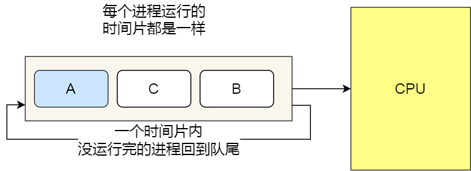
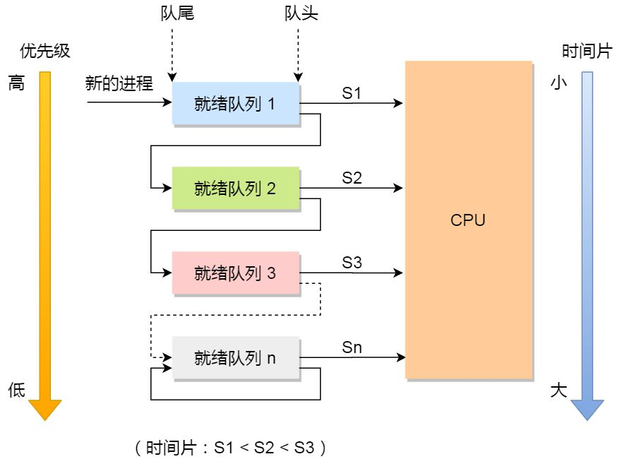

<!-- TOC -->

- [1. 进程](#1-进程)
  - [1.1. 进程的基本概念](#11-进程的基本概念)
  - [1.2. 进程的创建](#12-进程的创建)
  - [1.3. 进程的切换](#13-进程的切换)
    - [1.3.1. 进程有三种状态](#131-进程有三种状态)
    - [1.3.2. 进程之间的切换](#132-进程之间的切换)
- [2. 线程](#2-线程)
  - [2.1. 线程的基本概念](#21-线程的基本概念)
  - [2.2. 线程的创建](#22-线程的创建)
  - [2.3. 线程安全](#23-线程安全)
- [3. 进程和线程的区别](#3-进程和线程的区别)
- [4. 线程和进程的选择](#4-线程和进程的选择)
  - [4.1. 需要频繁创建销毁的优先用线程（进程的创建和销毁开销过大）](#41-需要频繁创建销毁的优先用线程进程的创建和销毁开销过大)
  - [4.2. 需要进行大量计算的优先使用线程（CPU频繁切换）](#42-需要进行大量计算的优先使用线程cpu频繁切换)
  - [4.3. 强相关的处理用线程，弱相关的处理用进程](#43-强相关的处理用线程弱相关的处理用进程)
  - [4.4. 可能要扩展到多机分布的用进程，多核分布的用线程](#44-可能要扩展到多机分布的用进程多核分布的用线程)
  - [4.5. 都满足需求的情况下，用你最熟悉、最拿手的方式](#45-都满足需求的情况下用你最熟悉最拿手的方式)
- [5. 进程同步](#5-进程同步)
  - [5.1. 信号量](#51-信号量)
  - [5.2. 临界区](#52-临界区)
  - [5.3. 同步锁](#53-同步锁)
    - [5.3.1. 互斥锁](#531-互斥锁)
    - [5.3.2. 条件锁](#532-条件锁)
    - [5.3.3. 读写锁](#533-读写锁)
    - [5.3.4. 自旋锁](#534-自旋锁)
    - [5.3.5. 文件锁](#535-文件锁)
  - [5.4. 管程](#54-管程)
  - [5.5. 事件](#55-事件)
- [6. 进程通信](#6-进程通信)
  - [6.1. 管道](#61-管道)
  - [6.2. FIFO](#62-fifo)
  - [6.3. 消息队列](#63-消息队列)
  - [6.4. 信号量](#64-信号量)
  - [6.5. 共享存储](#65-共享存储)
  - [6.6. 套接字](#66-套接字)
- [7. 进程调度](#7-进程调度)
  - [7.1. 先来先服务调度算法](#71-先来先服务调度算法)
  - [7.2. 最短作业优先调度算法](#72-最短作业优先调度算法)
  - [7.3. 高响应比优先调度算法](#73-高响应比优先调度算法)
  - [7.4. 时间片轮转调度算法](#74-时间片轮转调度算法)
  - [7.5. 最高优先级调度算法](#75-最高优先级调度算法)
  - [7.6. 多级反馈队列调度算法](#76-多级反馈队列调度算法)

<!-- /TOC -->
# 1. 进程
## 1.1. 进程的基本概念
进程是资源分配的基本单位。

操作系统用进程来管理一个程序运行期间的资源，比如内存空间，进程里的线程，等等。同时进程也作为资源的边界，来隔离不同的程序，以免它们互相干扰。必要的时候，操作系统也提供了进程间通讯的接口。

## 1.2. 进程的创建
linux下的进程都是使用fork函数创建的。在Linux中创建的进程会创建页表和进程描述符，并且遵从写时复制原则。除了fork以外还有exec函数，可以启动参数指定的程序来代替当前进程。这也是创建进程并执行程序的关键。

## 1.3. 进程的切换
### 1.3.1. 进程有三种状态
- 就绪状态（ready）：等待被调度
- 运行状态（running）
- 阻塞状态（waiting）：等待资源


应该注意以下内容：
- 只有就绪态和运行态可以相互转换，其它的都是单向转换。就绪状态的进程通过调度算法从而获得CPU时间，转为运行状态；而运行状态的进程，在分配给它的CPU时间片用完之后就会转为就绪状态，等待下一次调度。
- 阻塞状态是缺少需要的资源从而由运行状态转换而来，但是该资源不包括CPU时间，缺少CPU时间会从运行态转换为就绪态。

### 1.3.2. 进程之间的切换
现在先来说一下进程之间具体的切换发生了什么。内核中每一个进程中所有维护的东西都可以被称为一个上下文，上下文就是内核重新启动一个被抢占的进程所需的状态。包括一下内容：
- 通用目的寄存器
- 浮点寄存器
- 程序计数器
- 用户栈
- 状态寄存器
- 内核栈
- 各种内核数据结构：比如描绘虚拟地址的页表，包含有关当前进程信息的进程表，以及包含进程已打开文件的信息的文件表。

进程之间的切换就是当操作系统决定要把控制权（CPU时间）从当前进程转移到某个新进程时所进行的上下文切换，即保存当前进程的上下文，当前进程进入ready状态，恢复新进程的上下文，新进程由ready进入running，然后将控制权传递到新进程，新进程就会从上次停止的地方开始。

# 2. 线程
## 2.1. 线程的基本概念
线程是独立调度的基本单位。

一个进程中可以有多个线程，它们共享进程资源。

QQ和浏览器是两个进程，浏览器进程里面有很多线程，例如HTTP请求线程、事件响应线程、渲染线程等等，线程的并发执行使得在浏览器中点击一个新链接从而发起HTTP请求时，浏览器还可以响应用户的其它事件。

## 2.2. 线程的创建
linux中本质上没有线程。进程创建的函数fork和线程创建的函数pthread_create都会调用do_fork函数，区别就在于传入的参数不同。线程创建时会用参数去指定在多个进程间去共享某些资源，并且独有函数调用栈或者寄存器。

但是在其它提供了专门线程支持的系统中，则会在进程控制块（PCB）中增加一个包含指向该进程所有线程的指针，然后再每个线程中再去包含自己独占的资源。这算是非常正统的实现方式了，比如Windows就是这样干的。

## 2.3. 线程安全
线程安全是程式设计中的术语，指某个函数、函数库在多线程环境中被调用时，能够正确地处理多个线程之间的共享变量，使程序功能正确完成。

# 3. 进程和线程的区别
- 拥有资源
  
  进程是资源分配的基本单位，但是线程不拥有资源，线程可以访问隶属进程的资源。

- 切换

  线程是独立调度的基本单位，在同一进程中，线程的切换不会引起进程切换，从一个进程中的线程切换到另一个进程中的线程时，会引起进程切换。

  这里关于进程和线程的切换还需要说明一下，因为线程与线程之间共享虚拟内存（也就是共享页表），所以切换的时候并不用切换页表，但是进程与进程之间切换就需要切换页表了，这里其实是很耗时的。因为把虚拟内存地址转换为物理地址需要查找页表，但是页表查找是一个很慢的过程，因此通常使用Cache来缓存常用的地址映射，这样可以加速页表查找，这个cache就是TLB（translation Lookaside Buffer，我们不需要关心这个名字只需要知道TLB本质上就是一个cache，是用来加速页表查找的）。由于每个进程都有自己的虚拟地址空间，那么显然每个进程都有自己的页表，那么当进程切换后页表也要进行切换，页表切换后TLB就失效了，cache失效导致命中率降低，那么虚拟地址转换为物理地址就会变慢，表现出来的就是程序运行会变慢，而线程切换则不会导致TLB失效，因为线程线程无需切换地址空间，因此我们通常说线程切换要比较进程切换块，原因就在这里。

- 系统开销
  
  由于创建或撤销进程时，系统都要为之分配或回收资源，如内存空间、I/O 设备等，所付出的开销远大于创建或撤销线程时的开销。类似地，在进行进程切换时，涉及当前执行进程 CPU 环境的保存及新调度进程 CPU 环境的设置，而线程切换时只需保存和设置少量寄存器内容，开销很小。

- 通信方面

  线程间可以通过直接读写同一进程中的数据进行通信，但是进程通信需要借助IPC。因为每个进程各自有不同的用户地址空间，任何一个进程的全局变量在另一个进程中都看不到，所以进程之间要交换数据必须通过内核，在内核中开辟一块缓冲区，进程1把数据从用户空间拷到内核缓冲区，进程2再从内核缓冲区把数据读走，内核提供的这种机制称为进程间通信（IPC，InterProcess Communication）
# 4. 线程和进程的选择
## 4.1. 需要频繁创建销毁的优先用线程（进程的创建和销毁开销过大）
这种原则最常见的应用就是Web服务器了，来一个连接建立一个线程，断了就销毁线程，要是用进程，创建和销毁的代价是很难承受的

## 4.2. 需要进行大量计算的优先使用线程（CPU频繁切换）
所谓大量计算，当然就是要耗费很多CPU，切换频繁了，这种情况下线程是最合适的。
这种原则最常见的是图像处理、算法处理。

## 4.3. 强相关的处理用线程，弱相关的处理用进程
什么叫强相关、弱相关？理论上很难定义，给个简单的例子就明白了。
一般的Server需要完成如下任务：消息收发、消息处理。“消息收发”和“消息处理”就是弱相关的任务，而“消息处理”里面可能又分为“消息解码”、“业务处理”，这两个任务相对来说相关性就要强多了。因此“消息收发”和“消息处理”可以分进程设计，“消息解码”、“业务处理”可以分线程设计。
当然这种划分方式不是一成不变的，也可以根据实际情况进行调整。

## 4.4. 可能要扩展到多机分布的用进程，多核分布的用线程

## 4.5. 都满足需求的情况下，用你最熟悉、最拿手的方式
至于“数据共享、同步”、“编程、调试”、“可靠性”这几个维度的所谓的“复杂、简单”应该怎么取舍，我只能说：没有明确的选择方法。但我可以告诉你一个选择原则：如果多进程和多线程都能够满足要求，那么选择你最熟悉、最拿手的那个。

# 5. 进程同步
首先，互斥也是一种特殊的同步，从这个角度来说，所有实现进程间互斥的方法也同样可以被视为同步的方法。

## 5.1. 信号量
信号量(Semaphore)，有时被称为信号灯，是在多线程环境下使用的一种设施，是可以用来保证两个或多个关键代码段不被并发调用。 在进入一个关键代码段之前，线程必须获取一个信号量；一旦该关键代码段完成了，那么该线程必须释放信号量。 其它想进入该关键代码段的线程必须等待直到第一个线程释放信号量。

信号量就是在一个叫做互斥区的门口放一个盒子，盒子里面装着固定数量的小球，每个线程过来的时候，都从盒子里面摸走一个小球，然后去互斥区里面浪（？），浪开心了出来的时候，再把小球放回盒子里。如果一个线程走过来一摸盒子，得，一个球都没了，不拿球不让进啊，那就只能站在门口等一个线程出来放回来一个球，再进去。这样由于小球的数量是固定的，那么互斥区里面的最大线程数量就是固定的，不会出现一下进去太多线程把互斥区给挤爆了的情况。这是用信号量做并发量限制。

另外一些情况下，小球是一次性的，线程拿走一个进了门，就把小球扔掉了，这样用着用着小球就没了，不过有另外一些线程（一般叫做生产者）会时不时过来往盒子里再放几个球，这样就可以有新的线程（一般叫做消费者）进去了，放一个球进一个线程，这是信号量做同步功能。你截图里的例子就是这个情况，主线程是生产者，通过sem_post往盒子里放小球（信号量加一），而其他线程是消费者，通过sem_wait从盒子里拿小球（信号量减一），如果遇到盒子里一个小球都没有（信号量为0），就会开始等待信号量不为0，然后拿走一个小球（信号量减一）再继续。本质上来说信号量就是那个盒子，以及“摸不到球就不让进”这个机制。

所以信号量本质上还只是个整型变量，每一个进程可以对它进行操作，这种操作称为up和down操作：
- down : 如果信号量大于 0 ，执行 -1 操作；如果信号量等于 0，进程睡眠，等待信号量大于 0；
- up ：对信号量执行 +1 操作，唤醒睡眠的进程让其完成 down 操作。

如果信号量的取值只能为 0 或者 1，那么就成为了 互斥量（Mutex） ，0 表示临界区已经加锁，1 表示临界区解锁。
## 5.2. 临界区
通过对多进程的串行化来访问公共资源或一段代码，速度快，适合控制数据访问。 

## 5.3. 同步锁
### 5.3.1. 互斥锁
也叫互斥量(mutex)，在访问共享资源前对互斥量进行设置(加锁)。在访问完成后释放(解锁)互斥量，对互斥量进行加锁以后，任何其他试图再次对互斥量加锁的线程都会被阻塞直到当前线程释放该互斥锁。如果释放互斥量时有一个以上的线程阻塞，那么所有该锁上的阻塞线程都会变成可运行状态，第一个变为运行的线程就可以对互斥量加锁，其他线程就会看到互斥量依然是锁着的，只能回去再次等待它重新变为可用。在这种方式下，每次只有一个线程可以向前执行。

### 5.3.2. 条件锁
也叫条件变量。与互斥量不同，条件变量的作用并不是保证在同一时刻仅有一个线程访问某一个共享数据，而是在对应的共享数据的状态发生变化时，通知其他因此而被阻塞的线程。条件变量总是与互斥量组合使用。互斥量为共享数据的访问提供互斥支持，而条件变量可以就共享数据的状态的变化向相关线程发出通知。

### 5.3.3. 读写锁
读写锁可以使用互斥锁、条件变量、信号量等进行实现。互斥量只有加锁和不加锁两种状态，对于试图进入已经加锁的临界区的线程都进行阻塞，然而读写锁会视当前进入临界区的线程和请求进入临界区的线程的属性来判断是否允许线程进入。读写锁有三种状态：读模式下的加锁，写模式下的加锁，不加锁。

读写锁的使用规则：
- 只要没有写模式下的加锁，任意线程都可以进行读模式下的加锁；
- 只有读写锁处于不加锁状态时，才能进行写模式下的加锁；

读写锁非常适合读数据的频率远大于写数据的频率从的应用中。这样可以在任何时刻运行多个读线程并发的执行，给程序带来了更高的并发度。

### 5.3.4. 自旋锁
自旋锁使得线程反复检查锁变量是否可用。与互斥锁的相比，在获取锁失败的时候不会使得线程阻塞而是一直自旋尝试获取锁。当线程等待自旋锁的时候，CPU不能做其他事情，而是一直处于轮询忙等的状态。自旋锁主要适用于被持有时间短，线程不希望在重新调度上花过多时间的情况。

### 5.3.5. 文件锁
文件锁（也叫记录锁）的作用是，当一个进程读写文件的某部分时，其他进程就无法修改同一文件区域。

## 5.4. 管程
信号量机制的缺点：进程自备同步操作，P(S)和V(S)操作大量分散在各个进程中，不易管理，易发生死锁（死锁是指两个或两个以上的进程在执行过程中，由于竞争资源或者由于彼此通信而造成的一种阻塞的现象，若无外力作用，它们都将无法推进下去。 此时称系统处于死锁状态或系统产生了死锁，这些永远在互相等待的进程称为死锁进程）。1974年和1977年，Hore和Hansen提出了管程。

管程特点：管程封装了同步操作，对进程隐蔽了同步细节，简化了同步功能的调用界面。用户编写并发程序如同编写顺序(串行)程序。

引入管程机制的目的：1、把分散在各进程中的临界区集中起来进行管理；2、防止进程有意或无意的违法同步操作；3、便于用高级语言来书写程序，也便于程序正确性验证。

管程有一个重要特性：在一个时刻只能有一个进程使用管程。进程在无法继续执行的时候不能一直占用管程，否则其它进程永远不能使用管程。

管程引入了 条件变量 以及相关的操作：wait() 和 signal() 来实现同步操作。对条件变量执行 wait() 操作会导致调用进程阻塞，把管程让出来给另一个进程持有。signal() 操作用于唤醒被阻塞的进程。

注意，**线程同步的方法中没有管程，管程只能给进程用**

## 5.5. 事件
用来通知线程有一些事件已发生，从而启动后继任务的开始。并且可以实现不同进程中的线程同步操作。 

所以总体来说就是一个线程之间的同步操作。

# 6. 进程通信
每个进程各自有不同的用户地址空间，任何一个进程的全局变量在另一个进程中都看不到，所以进程之间要交换数据必须通过内核，在内核中开辟一块缓冲区，进程1把数据从用户空间拷到内核缓冲区，进程2再从内核缓冲区把数据读走，内核提供的这种机制称为进程间通信（IPC，InterProcess Communication）

进程同步与进程通信很容易混淆，它们的区别在于：
- 进程同步：控制多个进程按一定顺序执行；
- 进程通信：进程间传输信息。

进程通信是一种手段，而进程同步是一种目的。也可以说，为了能够达到进程同步的目的，需要让进程进行通信，传输一些进程同步所需要的信息。

进程通信主要有以下几种方法：
## 6.1. 管道
管道是一种古老的IPC通信形式。它有两个特点：
- 半双工，即不能同时在两个方向上传输数据。有的系统可能支持全双工。
- 只能在父子进程间。经典的形式就是管道由父进程创建，进程fork子进程之后，就可以在父子进程之间使用了。


使用popen函数和pclose函数结合来执行系统命令，就用到了管道，它们声明如下：
```c++
FILE *popen(const char *command,const char *type);
int pclose(FILE *stream);
```

## 6.2. FIFO
FIFO也被称为命名管道，与管道不同的是，不相关的进程也能够进行数据交换。涉及FIFO操作主要函数为：
```c++
int mkfifo(const char *path, mode_t mode);
```
而FIFO也常常有以下两个用途：

- 无需创建中间临时文件，复制输出流
- 多客户-服务进程应用中，通过FIFO作为汇聚点，传输客户进程和服务进程之间的数据

## 6.3. 消息队列
消息队列可以认为是一个消息链表，存储在内核中，进程可以从中读写数据。与管道和FIFO不同，进程可以在没有另外一个进程等待读的情况下进行写。另外一方面，管道和FIFO一旦相关进程都关闭并退出后，里面的数据也就没有了，但是对于消息队列，一个进程往消息队列中写入数据后退出，另外一个进程仍然可以打开并读取消息。消息队列与后面介绍的UNIX域套接字相比，在速度上没有多少优势。

相比于 FIFO，消息队列具有以下优点：
- 消息队列可以独立于读写进程存在，从而避免了 FIFO 中同步管道的打开和关闭时可能产生的困难；
- 避免了 FIFO 的同步阻塞问题，不需要进程自己提供同步方法；
- 读进程可以根据消息类型有选择地接收消息，而不像 FIFO 那样只能默认地接收。

## 6.4. 信号量
信号量是一个计数器，它主要用在多个进程需要对共享数据进行访问的时候。考虑这一的情况，不能同时有两个进程对同一数据进行访问，那么借助信号量就可以完成这样的事情。

的主要流程如下：

- 检查控制该资源的信号量
- 如果信号量值大于0，则资源可用，并且将其减1，表示当前已被使用
- 如果信号量值为0，则进程休眠直至信号量值大于0

也就是说，它实际上是提供了一个不同进程或者进程的不同线程之间访问同步的手段。

## 6.5. 共享存储
允许多个进程共享一个给定的存储区。因为数据不需要在进程之间复制，所以这是最快的一种 IPC。

需要使用信号量用来同步对共享存储的访问。

多个进程可以将同一个文件映射到它们的地址空间从而实现共享内存。另外 XSI 共享内存不是使用文件，而是使用内存的匿名段。

## 6.6. 套接字
与其它通信机制不同的是，它可用于不同机器间的进程通信。

# 7. 进程调度
进程调度算法也称CPU调度算法，其宗旨是获得CPU计算时间。

当CPU空闲时，操作系统就选择内存中的某个「就绪状态」的进程，并给其分配 CPU。

什么时候会发生 CPU 调度呢？通常有以下情况：

- 当进程从运行状态转到等待状态；
- 当进程从运行状态转到就绪状态；
- 当进程从等待状态转到就绪状态；
- 当进程从运行状态转到终止状态；

其中发生在 1 和 4 两种情况下的调度称为「非抢占式调度」，2 和 3 两种情况下发生的调度称为「抢占式调度」。

非抢占式的意思就是，当进程正在运行时，它就会一直运行，直到该进程完成或发生某个事件而被阻塞时，才会把 CPU 让给其他进程。

而抢占式调度，顾名思义就是进程正在运行的时，可以被打断，使其把 CPU 让给其他进程。那抢占的原则一般有三种，分别是时间片原则、优先权原则、短作业优先原则。

你可能会好奇为什么第 3 种情况也会发生 CPU 调度呢？假设有一个进程是处于等待状态的，但是它的优先级比较高，如果该进程等待的事件发生了，它就会转到就绪状态，一旦它转到就绪状态，如果我们的调度算法是以优先级来进行调度的，那么它就会立马抢占正在运行的进程，所以这个时候就会发生 CPU 调度。

那第 2 种状态通常是时间片到的情况，因为时间片到了就会发生中断，于是就会抢占正在运行的进程，从而占用 CPU。

调度算法影响的是等待时间（进程在就绪队列中等待调度的时间总和），而不能影响进程真在使用 CPU 的时间和 I/O 时间。

接下来，说说常见的调度算法：

## 7.1. 先来先服务调度算法
最简单的一个调度算法，就是非抢占式的先来先服务（First Come First Severd, FCFS）算法了。顾名思义，先来后到，每次从就绪队列选择最先进入队列的进程，然后一直运行，直到进程退出或被阻塞，才会继续从队列中选择第一个进程接着运行。

这似乎很公平，但是当一个长作业先运行了，那么后面的短作业等待的时间就会很长，不利于短作业。

FCFS 对长作业有利，适用于 CPU 繁忙型作业的系统，而不适用于 I/O 繁忙型作业的系统。

## 7.2. 最短作业优先调度算法
最短作业优先（Shortest Job First, SJF）调度算法同样也是顾名思义，它会优先选择运行时间最短的进程来运行，这有助于提高系统的吞吐量。

这显然对长作业不利，很容易造成一种极端现象。

比如，一个长作业在就绪队列等待运行，而这个就绪队列有非常多的短作业，那么就会使得长作业不断的往后推，周转时间变长，致使长作业长期不会被运行。

## 7.3. 高响应比优先调度算法
前面的「先来先服务调度算法」和「最短作业优先调度算法」都没有很好的权衡短作业和长作业。

那么，高响应比优先 （Highest Response Ratio Next, HRRN）调度算法主要是权衡了短作业和长作业。

每次进行进程调度时，先计算「响应比优先级」，然后把「响应比优先级」最高的进程投入运行，「响应比优先级」的计算公式：

从上面的公式，可以发现：

- 如果两个进程的「等待时间」相同时，「要求的服务时间」越短，「响应比」就越高，这样短作业的进程容易被选中运行；
- 如果两个进程「要求的服务时间」相同时，「等待时间」越长，「响应比」就越高，这就兼顾到了长作业进程，因为进程的响应比可以随时间等待的增加而提高，当其等待时间足够长时，其响应比便可以升到很高，从而获得运行的机会；

## 7.4. 时间片轮转调度算法
最古老、最简单、最公平且使用最广的算法就是时间片轮转（Round Robin, RR）调度算法。
。

每个进程被分配一个时间段，称为时间片（Quantum），即允许该进程在该时间段中运行。

- 如果时间片用完，进程还在运行，那么将会把此进程从 CPU 释放出来，并把 CPU 分配另外一个进程；
- 如果该进程在时间片结束前阻塞或结束，则 CPU 立即进行切换；

另外，时间片的长度就是一个很关键的点：

- 如果时间片设得太短会导致过多的进程上下文切换，降低了 CPU 效率；
- 如果设得太长又可能引起对短作业进程的响应时间变长。将

通常时间片设为 20ms~50ms 通常是一个比较合理的折中值。

## 7.5. 最高优先级调度算法
前面的「时间片轮转算法」做了个假设，即让所有的进程同等重要，也不偏袒谁，大家的运行时间都一样。

但是，对于多用户计算机系统就有不同的看法了，它们希望调度是有优先级的，即希望调度程序能从就绪队列中选择最高优先级的进程进行运行，这称为最高优先级（Highest Priority First，HPF）调度算法。

进程的优先级可以分为，静态优先级或动态优先级：

- 静态优先级：创建进程时候，就已经确定了优先级了，然后整个运行时间优先级都不会变化；
- 动态优先级：根据进程的动态变化调整优先级，比如如果进程运行时间增加，则降低其优先级，如果进程等待时间（就绪队列的等待时间）增加，则升高其优先级，也就是随着时间的推移增加等待进程的优先级。
  
该算法也有两种处理优先级高的方法，非抢占式和抢占式：

- 非抢占式：当就绪队列中出现优先级高的进程，运行完当前进程，再选择优先级高的进程。
- 抢占式：当就绪队列中出现优先级高的进程，当前进程挂起，调度优先级高的进程运行。
  
但是依然有缺点，可能会导致低优先级的进程永远不会运行。

## 7.6. 多级反馈队列调度算法
多级反馈队列（Multilevel Feedback Queue）调度算法是「时间片轮转算法」和「最高优先级算法」的综合和发展。

顾名思义：

- 「多级」表示有多个队列，每个队列优先级从高到低，同时优先级越高时间片越短。
- 「反馈」表示如果有新的进程加入优先级高的队列时，立刻停止当前正在运行的进程，转而去运行优先级高的队列；


来看看，它是如何工作的：

- 设置了多个队列，赋予每个队列不同的优先级，每个队列优先级从高到低，同时优先级越高时间片越短；
- 新的进程会被放入到第一级队列的末尾，按先来先服务的原则排队等待被调度，如果在第一级队列规定的时间片没运行完成，则将其转入到第二级队列的末尾，以此类推，直至完成；
- 当较高优先级的队列为空，才调度较低优先级的队列中的进程运行。如果进程运行时，有新进程进入较高优先级的队列，则停止当前运行的进程并将其移入到原队列末尾，接着让较高优先级的进程运行；
  
可以发现，对于短作业可能可以在第一级队列很快被处理完。对于长作业，如果在第一级队列处理不完，可以移入下次队列等待被执行，虽然等待的时间变长了，但是运行时间也会更长了，所以该算法很好的兼顾了长短作业，同时有较好的响应时间。