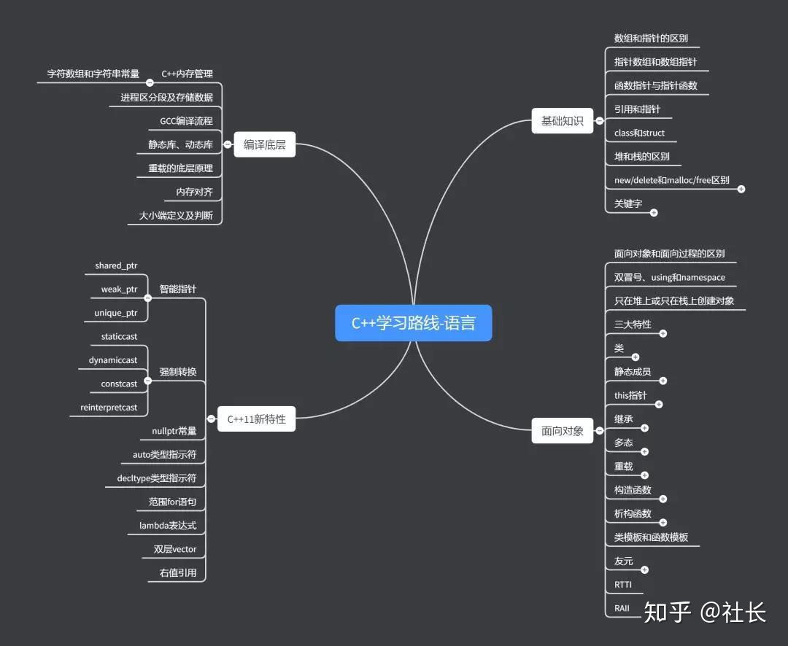
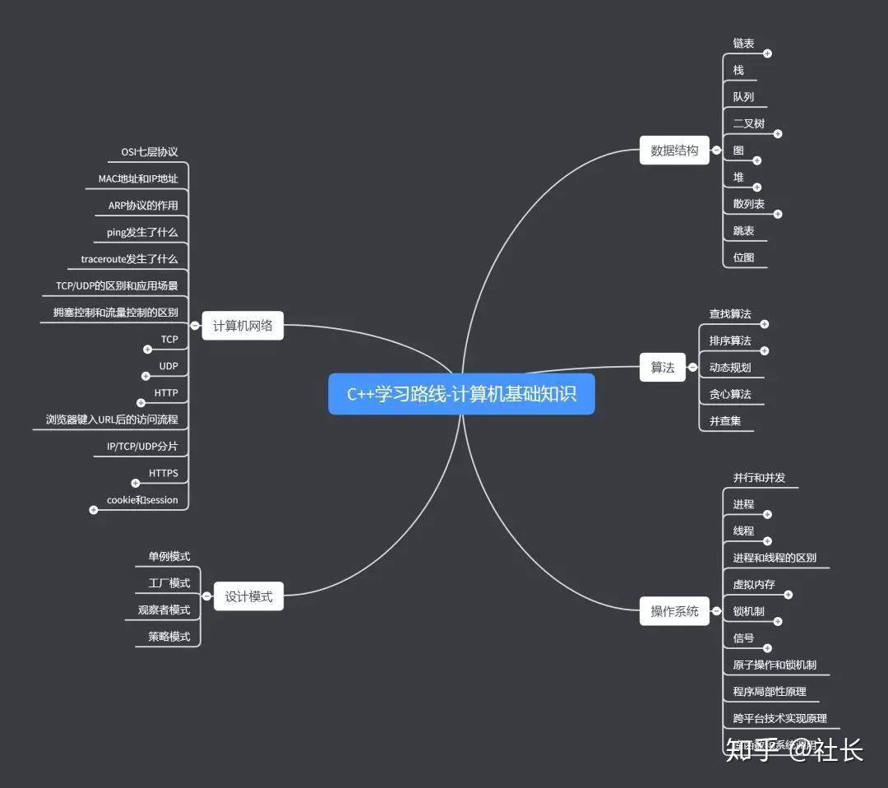
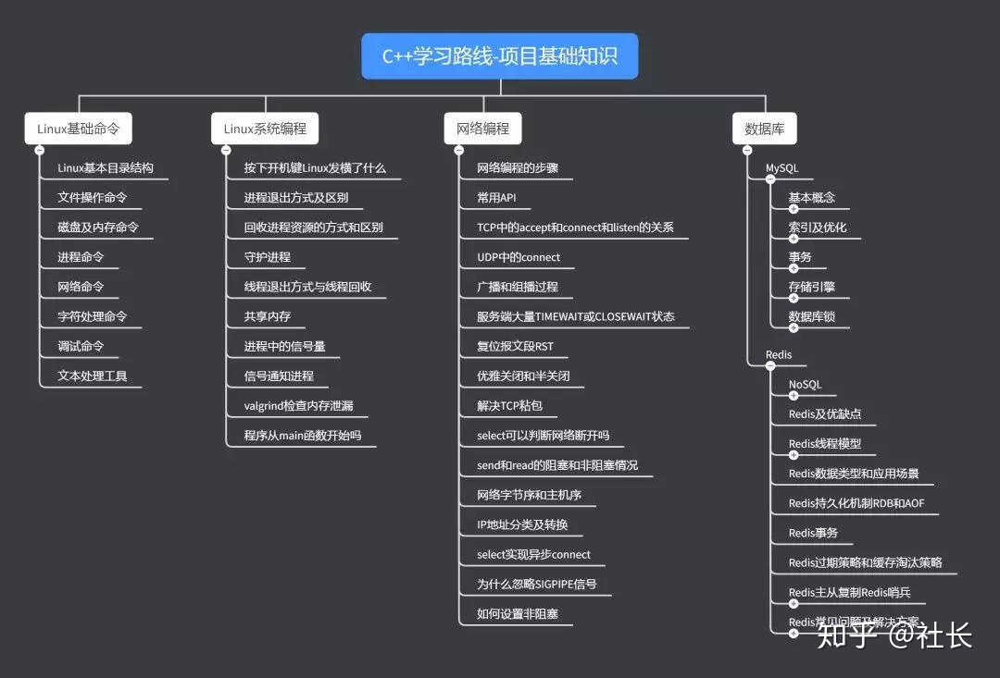

<!--
 * @Author: your name
 * @Date: 2020-05-03 18:36:27
 * @LastEditTime: 2020-06-03 00:03:55
 * @LastEditors: Please set LastEditors
 * @Description: In User Settings Edit
 * @FilePath: \StupidBirdFliesFirst\README.md
 -->
# 笨鸟先飞——CS知识库
本项目旨在总结个人学习中的所见所想，也适用于所有想要入门编程或算法的同学，目前保持每日更新，欢迎大家的加入和指正！

公式无法显示的可以尝试下载chrome插件[MathJax Plugin for Github](https://chrome.google.com/webstore/detail/mathjax-plugin-for-github/ioemnmodlmafdkllaclgeombjnmnbima/related)
- [C++基础知识](https://github.com/wells-wei-wei/StupidBirdFliesFirst/blob/master/C%2B%2BFundamental/C%2B%2BFundamental.md)
- 数据库
  - [MySQL](https://github.com/wells-wei-wei/StupidBirdFliesFirst/blob/master/DataBase/MySQL.md)
  - [关系型数据库和非关系型数据库](https://github.com/wells-wei-wei/StupidBirdFliesFirst/blob/master/DataBase/SQLAndNoSQL.md)
  - [Redis](https://github.com/wells-wei-wei/StupidBirdFliesFirst/blob/master/DataBase/Redis.md)
- 机器学习基础知识
  - [感知机](https://github.com/wells-wei-wei/StupidBirdFliesFirst/blob/master/MachineLearning/DeepLearning/Perceptron.pdf)
  - [多层感知机（反向传播）](https://github.com/wells-wei-wei/StupidBirdFliesFirst/blob/master/MachineLearning/DeepLearning/BP.pdf)
  - [激活函数](https://github.com/wells-wei-wei/StupidBirdFliesFirst/blob/master/MachineLearning/ActivationFunction/ActivationFunction.md)
  - [梯度下降](https://github.com/wells-wei-wei/StupidBirdFliesFirst/blob/master/MachineLearning/DeepLearning/GD.pdf)
  - [U-net](https://github.com/wells-wei-wei/StupidBirdFliesFirst/blob/master/MachineLearning/DeepLearning/U-net/U-net.md)
- 各种命令行命令
  - [git](https://github.com/wells-wei-wei/StupidBirdFliesFirst/blob/master/Command/git.md)
  - [tmux](https://github.com/wells-wei-wei/StupidBirdFliesFirst/blob/master/Command/tmux.md)
  - [OpenposeDemo_in_Windows](https://github.com/wells-wei-wei/StupidBirdFliesFirst/blob/master/Command/openposedemo_win.md)
<!--

 -->
