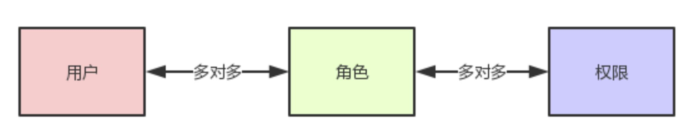
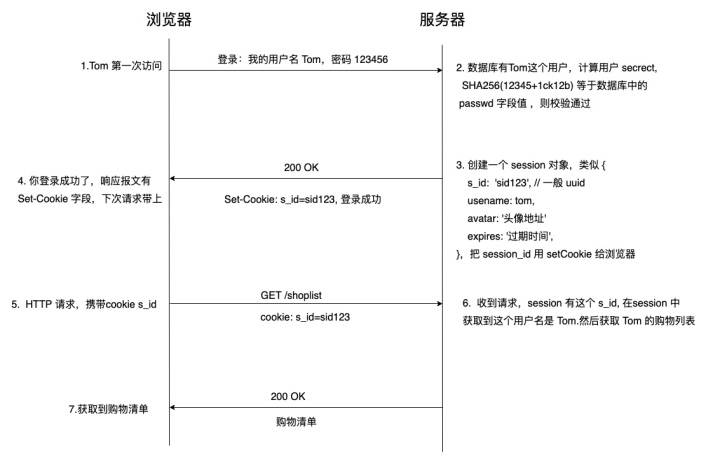
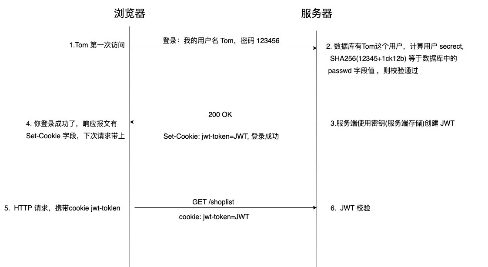

# 鉴权系统
## 权限模型
目前最普及的权限设计模型是RBAC（Role-Based Access Control）模型。
### RBAC0模型

这是权限最基础也是最核心的模型,它包括用户/角色/权限,其中用户和角色是多对多的关系,角色和权限也是多对多的关系。

用户是发起操作的主体,每个用户拥有不同的权限。在用户基数较小的系统中，管理员可以直接把用户和权限相关联，但是当用户数量庞大时，其中很多的权限都是相同的，这时对于管理员来说工作量过大。因此引入一个“角色”概念。一个角色拥有多种权限，相当于是给权限进行分组，而对于管理员来说只要给不同用户赋予不同的角色，就可以使得他具有这个角色的所有权限。

RBAC0是最基础的用户权限模型，这种情况下如果权限和角色数量较少且一般变动不大，可以直接在鉴权过程中写成判断语句，但是假如权限多样且可能时常有变化，则需要使用数据库。

RBAC0模型至少需要设计五张表：

### RBAC1模型

此模型引入了角色继承(Hierarchical Role)概念,即角色具有上下级的关系,角色间的继承关系可分为一般继承关系和受限继承关系。

一般继承关系仅要求角色继承关系是一个绝对偏序关系，允许角色间的多继承。而受限继承关系则进一步要求角色继承关系是一个树结构，实现角色间的单继承。

这种设计本质上是给角色进行分层，此时在数据库的设计上需要在角色表上再加一列上级id来表示继承关系：

### RBAC2模型
RBAC2主要是对角色进行了约束，主要包括以下两种约束：
- 互斥角色: 指各自权限互相制约的两个角色。比如财务部有会计和审核员两个角色,他们是互斥角色,那么用户不能同时拥有这两个角色,体现了职责分离原则

- 基数约束: 一个角色被分配的用户数量受限；一个用户可拥有的角色数目受限；同样一个角色对应的访问权限数目也应受限，以控制高级权限在系统中的分配

### RBAC3模型
即最全面的权限管理,它是基于RBAC0,将RBAC1和RBAC2进行了整合

### 用户组
当平台用户基数增大，角色类型增多时，而且有一部分人具有相同的属性,比如财务部的所有员工,如果直接给用户分配角色，管理员的工作量就会很大,如果把相同属性的用户归类到某用户组,那么管理员直接给用户组分配角色,

用户组里的每个用户即可拥有该角色,以后其他用户加入用户组后,即可自动获取用户组的所有角色,退出用户组,同时也撤销了用户组下的角色,无须管理员手动管理角色。

根据用户组是否有上下级关系,可以分为有上下级的用户组和普通用户组:

- 具有上下级关系的用户组: 比如淘宝网的商家是一种用户组,商家自身也有一套组织架构,比如采购部,销售部,客服部,后勤部等,有些人拥有客服权限,有些人拥有上架权限等等,所以用户组是可以拓展的

- 普通用户组: 即没有上下级关系,和组织架构,职位都没有关系,也就是说可以跨部门,跨职位,举个例子,某电商后台管理系统,有拼团活动管理角色,我们可以设置一个拼团用户组,该组可以包括研发部的后台开发人员,运营部的运营人员,采购部的人员等等。

### 职位和组织
职位和组织本质上和用户组是相似的，假设某一个财务部的职位如下所示：

每个组织部门下都会有多个职位,比如财务部有总监,会计,出纳等职位,虽然都在同一部门,但是每个职位的权限是不同的,职位高的拥有更多的权限。总监拥有所有权限,会计和出纳拥有部分权限。特殊情况下,一个人可能身兼多职。

## 鉴权流程
权限的鉴定主要有cookies、cookies+session、token三种方式。cookies安全性较差，因此主要说后两种方法。

### cookies+session
session 是另一种记录服务器和客户端会话状态的机制。每次用户登录后会在服务端创建会话，并回复一个sessionID，以后客户端的请求报文只要携带sessionID即可获取登录状态。

### token
token以jwt为代表，无需在服务端创建会话，而是将状态存入token，每次随着请求报文一起发来。
